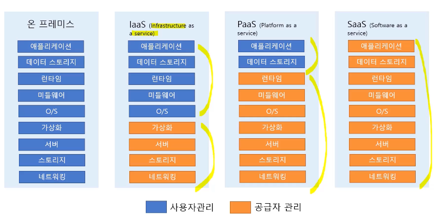

## 클라우드 배포 모델

### Public Cloud

* 공용 인터넷을 통해 서비스를 제공한다.
* 누구에게나 서비스를 제공한다. 
* Azure, AWS, GCP 서비스가 대표적이다.
* 관리 비용이 낮다.

### Private Cloud

* 개별 기업이 독점적으로 사용한다.
* 클라우드 인프라가 온-프레미스(온사이트)데이터 센터에 있다.
* 기업의 데이터센터에 가상머신을 사용하여 시스템을 운영한다.
* 관리 비용이 높다.

### Hybrid Cloud

* Public Cloud와 Private Cloud(온프레미스 데이터센터)를 네트워크로 연결한다.
* AWS VPN, AWS Direct Connect, Public Internet 연결 서비스를 사용한다.

## 클라우드 컴퓨팅 모델 - 공급자와 사용자 관리

### 온 프레미스
* 사용자가 전부 관리

### Infrastructure as a service(IaaS)
* 물리적인 부분은 공급자가 관리한다.
* 사용자는 운영체제, 스토리지, 애플리케이션을 관리한다.
* `Amazon EC2`가 대표적인 IaaS Service이다.

### Platform as a service(PaaS)
* 물리적인 부분, OS 등 공급자가 모든 플랫폼을 관리한다.
* 사용자는 데이터와 애플리케이션만 관리한다.
* 사용자는 애플리케이션 개발에만 집중 가능하다.
* `AWS Elastic Beanstalk`이 대표적인 서비스이다.

### Software as a service(SaaS)
* 모든 부분을 공급자가 관리
* 사용자는 서비스를 사용만 하면 됨
* `Google Gmail` 등이 대표적인 서비스이다.

## AWS 인터페이스 소개

### AWS Management Console
* https://console.aws.amazon.com
* 웹 브라우저로 접속
* ID, Password와 MFA를 사용해 로그인한다.

### 명령줄 인터페이스(CLI)
* Command Line Interface
* Windows, Mac, Linux 명령어를 사용하여 서비스를 제어한다.
* Access Key를 사용해 AWS 서비스에 접속한다.
* Windows Powershell, Mac/Linux Terminal, Putty SSH 등의 도구를 사용한다.

### Software Development Kit(SDK)

* 프로그래밍 코드를 사용해서 서비스를 제어한다.
* Access Key를 사용해 AWS 서비스에 접속한다.
* 애플리케이션 개발에 사용한다.

## Reference
* [AWS Certified Cloud Practitioner 자격증 준비하기](https://www.inflearn.com/course/aws-%EC%9E%90%EA%B2%A9%EC%A6%9D-%ED%81%B4%EB%9D%BC%EC%9A%B0%EB%93%9C-%EA%B8%B0%EC%B4%88/dashboard)

