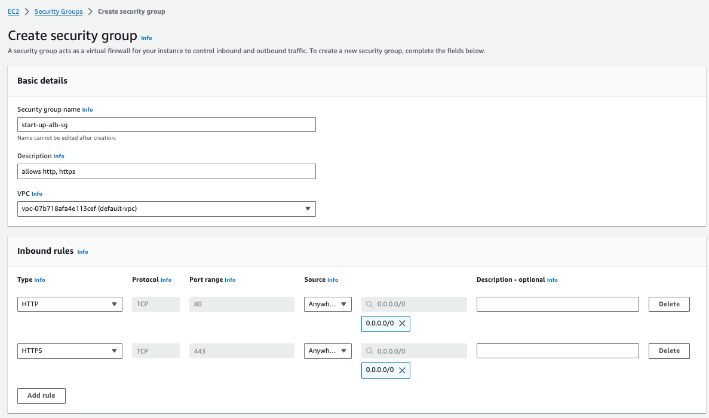
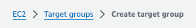
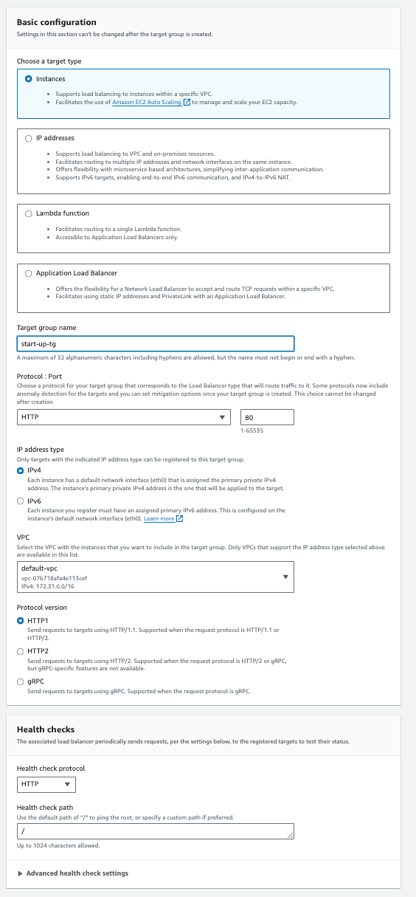
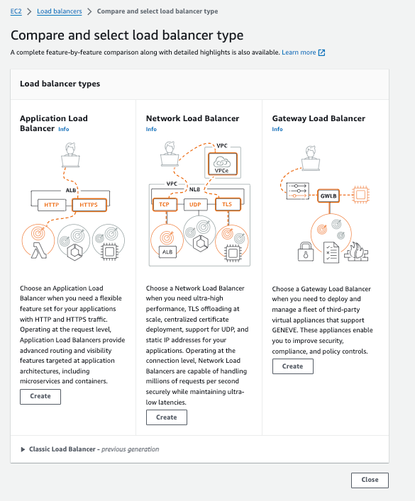
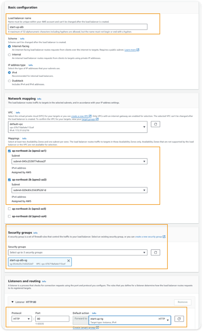
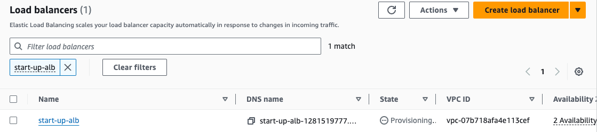

# Application Load Balancer

## 실제 구성해 보기

Application Load Balancer, 줄여서 ALB라고 부르겠다.

### 1. ALB의 Security Group 생성한다.

HTTP와 HTTPS에 대해 들어오는 트래픽을 허용한다.

### 2.Target Group을 생성한다.

어떤 인스턴스에게 부하를 분산해줄 것인지를 그룹핑해주는 역할을 한다.

위의 이미지의 경로로 이동한다.

위의 이미지와 같이 셋팅을 해준다. 

여기서 target type은 instance에 그룹핑을 해줄 것이기 때문에 instances로 설정한다.
이후에 나오는 페이지에서는  Auto Scaling을 적용시킬 것이기 때문에 instance를 선택하지 않고 create target group을 클릭한다.

### 3. Load Balancer를 생성하자.

위의 이미지 경로로 이동한 후에 Http와 Https에 대해 Load Balancing을 할 것이기 때문에  `Application Load Balancer`를 선택한다.

그리고 셋팅은 위의 이미지 처럼 적용후 생성 버튼을 클릭한다.

여기서 주의 깊게 봐야할 부분은 Network mapping 부분이다.  
가용 영역에 대해서 2군데를 설정했다. `ap-northeast-2a`와 `ap-northeast-2b`이다.

가용영역은 데이터 센터를 1개 이상 가지고 있는 논리적 그룹을 의미하는데,  
이 가용 영역을 여러개 설정하는 이유는 하나의 가용영역에서 화재가 나는 등의 장애가 발생했을 때 다른 가용 영역에 있는 인스턴스로 트래픽을 분산시키서 서비스 전체가 마비되는 것을 방지하기 위함이다.

AWS에서도 아래와 같이 2개 이상의 가용영역을 사용하는 것을 권장한다.
> Select at least two Availability Zones and one subnet per zone. The load balancer routes traffic to targets in these Availability Zones only. Availability Zones that are not supported by the load balancer or the VPC are not available for selection.

그리고, 전에 생성한 Target Group을 선택하고 생성해준다.

---

이렇게 생성된 ALB를 확인할 수 있다.  

여기서 Provisioning은 `AWS로 부터 자원을 공급받는 중`을 의미한다. 

## 참고

* [스타트업 성장과 함께하는 AWS 클라우드 아키텍쳐 올인원](https://www.inflearn.com/course/%EC%8A%A4%ED%83%80%ED%8A%B8%EC%97%85-with-aws-1)
