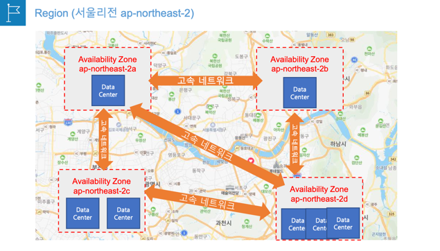

#  AWS 글로벌 인프라의 이해

AWS 글로벌 인프라에는 리젼(Regions), 가용 영역(Availability Zones), 엣지 로케이션(Edge Location) 세 가지 개념이 존재한다.

## 리전(Region)

* 전세계에 분산된 물리적 위치를 의미한다.(서울리전, 홍콩리전 등)
* 전세계 주요국가에 위치
* 1개 AWS 리전 = **2개이상의 가용영역으로 구성된다.**
* 대부분의 AWS 서비스는 리전을 선택하여 시작한다.
* 리전을 선택하지 않는 글로벌 서비스도 존재한다.(예, IAM 서비스)
* 재해복구(DR) 설계 = 2개 이상의 리전에 시스템을 배치

## 가용 영역(Availability Zone - AZ)

* 가용영역 = **하나 이상의 개별 데이터 센터의 모음이다.**
* 1개의 리전은 2개이상의 가용영역으로 구성한다.
* 가용영역끼리는 물리적으로 떨어져 있고 고속 네트워크로 연결된다.
* 고가용성 설계 = 다중 AZ(Multi-AZ), 2개이상의 가용영역에 시스템 배치하는 것
  * (예: EC2-A는 ap-northeast-2a에 배치하고, EC2-B는 ap-northeast-2b에 배치한다.)

## 엣지 로케이션(Edge Location)

* 엣지 로케이션에 데이터를 캐싱하여 사용자에게 더 짧은 지연 시간으로 데이터를 전송하는 것을 의미한다.
* 글로벌 배포서비스인 AWS CloudFront, Global Accelerator에서 대표적으로 사용한다.
* 전 세계에서 수백개의 엣지 로케이션을 운영 중에 있다.
* 엣지 로케이션과 AWS 리전, 가용영역끼리는 고속 네트워크로 연결되어 있다.

> 1. 사용자가 데이터를 처음 요청하면 서버가 있는 리전의 오리진에서 사용자와 가까운 Edge Location으로 전송한다.
> 2. 사용자는 지리적으로 가까운 Edge Location에서 데이터를 응답 받는다.
> 3. 사용자가 이후 동일헌 데이터를 요청하면 Edge Location에서 바로 응답 받는다.

## Reference
[AWS Certified Cloud Practitioner 자격증 준비하기](https://www.inflearn.com/course/aws-%EC%9E%90%EA%B2%A9%EC%A6%9D-%ED%81%B4%EB%9D%BC%EC%9A%B0%EB%93%9C-%EA%B8%B0%EC%B4%88/dashboard)

