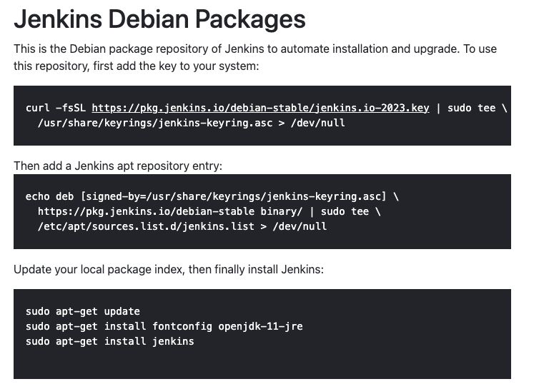

# Jenkins 설치하기

EC2를 Ubuntu OS로 구매하고 나서 [Jenkins Docs]를 확인하며 명령어를 통해 Jenkins를 설치하자.

## PORT 변경
https://jh-labs.tistory.com/386

## Referece

* [Jenkins + Github 연동하기](https://kitty-geno.tistory.com/88)
* 