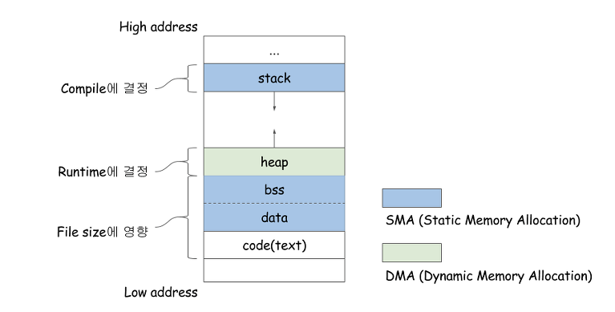

# Process Structure

## 프로세스는 어떤 구조를 가지고 있을까?

Process는 크게 4개의 영역으로 나뉜다.

1. Stack영역
2. Heap영역
3. Data영역
4. Code(text)영역

# Stack 영역

- 함수 호출 시 생성되는 지역 변수와 매개변수가 저장되는 영역
- 함수가 종료되면 해제 됨.
- **컴파일 시에 크기가 결정됨.**

  → 일반적으로 컴파일러 기본 설정은 **1MB**로 제한되어 있다. 즉, 우리가 작성한 코드가 스택 영역을 1MB 이상 할당하려고 하면 "Stack Overflow" 에러를 발생시킨다.

- Stack 영역의 크기는 컴파일러 환경 설정에서 변경이 가능하지만, 변경하지 않는 것을 추천한다. 덩치가 큰 메모리는 Heap 영역에 할당해서 사용하면 되기 때문.

## Heap 영역

- 프로그램 내에서 사용자가 자유롭게 할당하고 헤제할 수 있는 영역이다.
- 할당 가능한 크기는 OS환경에 따라 차이가 있지만, 32bit 운영체제 에서는 일반적으로 약 **2GB**의 힙 영역을 할당할 수 있다. 이러한 제한이 생기는 이유는 32bit(4byte)의 메모리 주소 체계에서 약 4GB의 메모리를 표현 할 수 있는데, OS, 드라이버 등이 고정적으로 사용하는 영역이 있기 때문에 실질적으로 응용 프로그램에서 사용 가능한 영역은 2GB 정도이다.
- 64bit 운영체제는 이론상 한계치가 있긴 하지만 사실상 제한이 없다고 봐도 된다.
- 힙 영역은 스택 영역에 비해 굉장히 큰 사이즈 또는 많은 양의 데이터 역시 적재 가능하다. 이를 활용해서 **대량의 데이터는 힙 영역에 할당하고 데이터를 가리키는 포인터 변수를 스택영역에 지역변수로 할당해서 사용하는 것이 일반적이다.**

## Data 영역

- bss, data영역을 묶어서 data영역이라고 한다.
- 전역변수, 정적(static)변수, 배열, 구조체 등이 저장되는데, 프로그램이 실행될 때 할당 되고 종료될 때 해제 된다.
- 초기화 된 데이터는 data영역에 저장되고, 초기화 되지 않은 데이터는 bss(Block Stated Symbol) 영역에 저장된다.

## Code(text) 영역

- 코드영역에는 실제 프로그램 동작을 수행하는 명령어(Instruction)와 전역 상수가 저장된다.
- 명령어는 CPU에서 순차적으로 실행되는 함수와 연산 구문 등이 해당되고, 전역 상수는 " "로 선언된 문자열 상수나 const 접두어가 붙은 변수 등이 해당 된다.

_참고: [https://gracefulprograming.tistory.com/22](https://gracefulprograming.tistory.com/22)_
