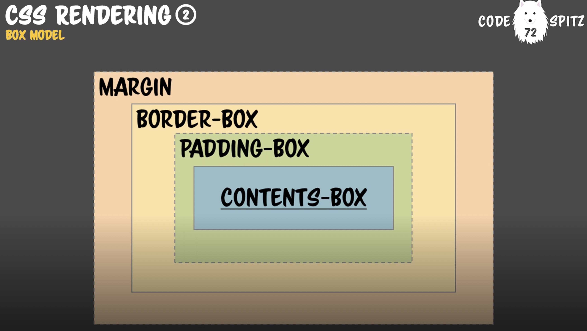

# Box Model

### Box Model의 구성

- CSS 2.1에 규정되어 있는 모델
- 박스 모델은 총 4가지 영역으로 구성
  - Margin, Border, Padding, Contents

### CSS 속성:Box Sizing
- 기본 속성은 content-box로 되어져 있다.
- padding-box: padding 크기 포함
- border-box: padding + border 포함

### Box-Shadow
- Box-Shadow는 Fragment Fill 단게에서 이뤄진다. 따라서 크기를 차지하지 않음.

### CSS 속성:Outline
- border-box 바깥에 또 다른 외곽선을 줄 수 있는 속성
- box-shadow 위에 그려진다

### Reference

- [Box Model](https://www.edwith.org/codespitz-css-rendering/lecture/18258)