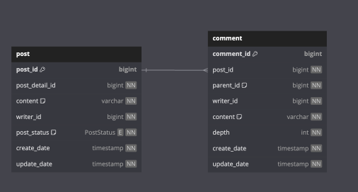

# Foreign Key

## 📗 실무에서 프로젝트 진행시 Foreign Key값을 설정을 해야할까?

프로젝트를 시작하기 이전에 Foreign Key값을 설정하지 말지에 대해서 고민을 하고 있다.
Foreign Key를 사용하는 이유와 사용하지 않는 이유에 대해서 생각해보자.

### Foreign Key를 사용하는 이유

외래키를 사용하는 이유는 단연코 **참조 무결성(Referential Integrity)를 통해 데이터의 정합성을 지키기 위해서**이다.
제약 조건을 통해 write(insert, update, delete)시에 작업이 가능한지 여부를 체크를 하기 때문에 데이터의 정합성을 지킬 수 있게 된다.

### Foreign Key를 사용하지 않는 이유

#### 1. 성능

외래키를 설정하게 되면 DB 단에서 따로 무결성이 보장되는지를 체크하게 된다.

a. 자식 릴레이션에 Insert시 참조키가 부모 릴레이션에 있는지 여부 
b. 자식 릴레이션에서 참조키를 update할 때, 변경후 값이 부모 릴레이션에 있는지 여부 
c. 부모 릴레이션에서 delete할 때 자식 릴레이션에서 참조하고 있는지 여부 

["OLTP System에서 Foreign Key는 DML(데이터 조작어) 작업간 Validation 검사부하의 성능 오버헤드가 있지만 무시할만한 정도이다."](https://engineering-skcc.github.io/oracle%20tuning/foreign_key_%EC%97%86%EC%9D%B4_%EA%B5%AC%EC%B6%95%ED%95%98%EB%8A%94_DB/)
라고 표현한다.

#### 2. 개발할 때 Foreign Key가 있으면 불편하다.

1. 테스트 시에 Foreign Key가 설정되어 있으면 부모 릴레이션에 먼저 row를 생성한 이후에 자식 릴레이션에 row를 생성해줘야 하는 번거로움이 존재한다.
2. 트랜잭션 안에서 부모 릴레이션과 자식 릴레이션의 관계에 따라 DML 작업의 순서를 지켜야 하기 때문에 번거롭다. 예를 들어서 insert 작업이라면 부모 row 먼저 자식 row를 다음 순서로 작업해야 하고,
delete라면 자식 row 먼저 부모 row를 이후의 순서로 작업해야 한다.

### 내 생각 정리

나는 프로젝트 진행 시에 Foreign Key를 설정하는 것이 좋다고 생각한다.  
Foreign Key를 사용하지 않았을 때 얻을 수 있는 장점인 성능의 부분에서는 무시할만한 정도의 성능 오버헤드이고,  
개발할 때 불편하다의 이유 중에 첫 번째인 테스트 개발 중의 번거롭다는 부분은 테스트 코드 실행시에 Foreign Key를 disable 처리를 해놓고 작업하면 된다.
이유 중 두 번째는 내가 지금까지 경험해봤지만 순서를 지키면서 개발을 하는 일에 대한 불편함은 없었어서 아직 와닿지 않는 것 같다.  
이 이유 때문에 데이터의 무결성을 깨뜨릴 수 있는 상황을 만드는 것이 오히려 위험하다고 생각한다. 

## 📗 Foreign Key란?

상단의 이미지는 post 릴레이션과 comment 릴레이션의 관계를 나타낸다. 여기서 post 릴레이션은 **부모 릴레이션**을 의미하고, comment 릴레이션은 **자식 릴레이션**을 의미한다.

 
Foreign Key는 RDBMS에서 관계를 지정할 때 사용한다.
Foreign Key를 사용하지 않더라도 관계를 표현할 수 있다. 그럼에도 Foreign Key를 사용하는 이유는 
**참조 무결성을 보장**하기 위함이다.

## 📗 참조 무결성 제약조건(Referential Integrity Constraint)?

외래 키 제약(Foreign Key Contraint)라고도 불린다.  
릴레이션 R2(자식 릴레이션)의 외래 키(Foreign Key)가 릴레이션 R1(부모 릴레이션)의 기본 키를 참조할 때, 
참조 무결성 제약조건은 두 릴레이션의 연관된 튜플들 사이의 일관성을 유지하는데 필요하며 다음의 두 가지 조건 중 하나를 만족해야 한다. 
1. 외래 키의 값은 R1의 어떤 튜플의 기본 키 값과 같다.
2. 외래 키가 자신을 포함하고 있는 릴레이션의 기본 키를 구성하고 있지 않으면 null 값을 가진다.

즉, **Foreign Key값은 NULL이거나 참조하는 릴레이션의 Primary Key값과 동일해야 한다.**

### 무결성
* 여기서 무결성은 **데이터가 정확성과 일관성을 유지하고 있는 상태**를 의미한다.

### DELETE 수행 시, 참조 무결성 제약조건을 만족하기 위한 DBMS의 4가지 옵션

comment 릴레이션(자식 릴레이션)이 post_id를 외래키로 post 릴레이션(부모 릴레이션)을 참조하고 있고 부모 릴레이션에 DELETE 연산을 수행할 경우 
4가지 옵션 중에 한 가지 옵션으로 작업을 수행할 수 있다.

1. RESTRICTED: 자식 릴레이션에서 참조하고 있을 경우 부모 릴레이션의 삭제 작업을 거부한다.  즉, comment가 두개 달린 post일 경우 삭제작업을 할 수 없도록 거부한다.
2. CASCADE: 자식 릴레이션의 관련 투플을 같이 삭제 처리한다. 즉 post와 연관된 comment를 전부 삭제한다.
3. DEFAULT: 자식 릴레이션의 관련 투플을 미리 설정해둔 값으로 변경한다. 
4. NULL: 자식 릴레이션의 관련 투플을 NULL값으로 설정한다(NULL 값을 허용한 경우)

## 📗 Reference
* [[Database] 제약조건의 종류와 데이터의 삽입, 삭제, 수정 시 여러 가지 제약조건의 수행에 대해 알아보자](https://deftkang.tistory.com/52)
* [Foreign Key](https://velog.io/@destiny1616/Foreign-Key-07mrx6w4)
* [대용량 디비에서는 외래키를 안쓰나요?](https://okky.kr/questions/586565)
* [Foreign Key 없이 구축하는 관계형 데이터베이스 시스템에 대한 생각](https://engineering-skcc.github.io/oracle%20tuning/foreign_key_%EC%97%86%EC%9D%B4_%EA%B5%AC%EC%B6%95%ED%95%98%EB%8A%94_DB/)
* [[DB] 외래키 (foreign key) 사용을 하는게 좋을까?](https://juns-life.tistory.com/m/entry/DB-%EC%99%B8%EB%9E%98%ED%82%A4-foreign-key-%EC%82%AC%EC%9A%A9%EC%9D%84-%ED%95%98%EB%8A%94%EA%B2%8C-%EC%A2%8B%EC%9D%84%EA%B9%8C)