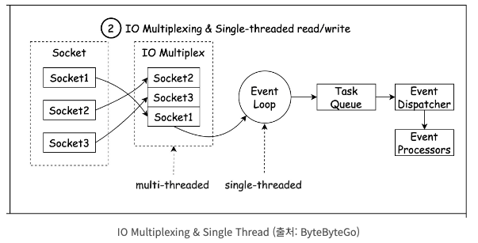
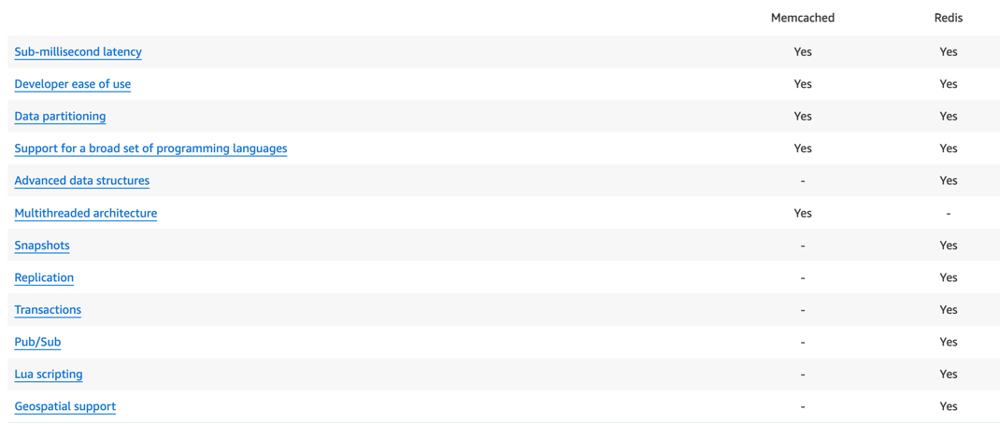

# Redis vs Memcached 

updated. 23.10.05

## 📗 Redis는 왜 빠를까?

Redis는 데이터를 하드 디스크가 아닌 메모리에 저장해서 read/write를 수행하기 때문에 빠른 이유도 있지만 이 것 뿐만이 아니다.
Redis는 싱글 스레드 Non Blocking I/O방식으로 데이터를 처리하기 때문에 여러 연산을 동시에 처리할 수 있다. 싱글스레드이기 때문에
Context Switching에 비용이 발생하지 않으며, 멀티스레드에서 동시성 문제를 처리하기 위해 락을 거는 비용 역시 발생하지 않는다.
뿐만아니라, I/O Multiplexing 기술을 통해 싱글 스레드에서 여러 소켓을 동시에 관리하면서 입출력 작업을 시스템 콜 기반으로 비동기적으로 처리한다.

### Redis와 Memcahced는 무엇이고 어떤 차이가 있을까?

Redis와 Memcached는 `인메모리 데이터 외부 저장소`를 의미한다.

Redis와 Memcached는 데이터를 메모리에 저장한다는 것에서 공통점이 있지만 다양한 차이점이 존재한다.

우선 스레드 갯수 관련이다. Memcached의 경우 Multi Thread를 지원해준다. 반면에 Redis는 싱글 스레드로 관리된다.

두 번째로는 각 key와 value마다 저장할 수 있는 데이터 용량의 공간에 차이가 있다. Memcached는 key는 250byte, value는 1MB의 최대 저장 공간을 가질 수 있다. 반면에 
Redis에서는 key와 value 각각 512MB의 저장 공간을 가질 수 있다.

세 번째로는 데이터 복구 여부이다. Memcached의 경우 memory에서만 데이터를 관리하기 때문에 장애가 발생했을 경우 데이터 자체가 휘발되고 복구를 할 수 없다.
반면에 Redis는 따로 Disk에도 데이터를 저장하기 때문에 장애가 발생하더라도 데이터를 복구할 수 있다.

네 번쨰로는 Redis와 Memcached에서는 지원하는 데이터 타입이 다르다. Memcached는 String에 한해서만 지원한다. 반면에 Redis는 String, Set, List, Hash등 다양한 데이터 타입을 지원해준다.
그리고 Memcached에서는 따로 지원을 하지 않지만 Redis에서는 지원해주는 부분들이 상당히 많다.
* 다양한 삭제(eviction) 정책 지원 
* 디스크 영속화(persistence) 지원
* 복제(replication) 지원
* 트랜잭션(Transaction) 지원

---
## 📗 Redis란?
> The open source, in-memory data store used by millions of developers as a database, cache, streaming engine, and message broker.
> [Redis Docs](https://redis.io/)

Redis란 **인메모리 데이터 저장소**이다. 

## 📗 Memcached란?

> Memcached is an in-memory key-value store for small chunks of arbitrary data (strings, objects) from results of database calls, API calls, or page rendering.
> [Memcached Docs](https://memcached.org/)

Memcached란 **인메모리 key-value 저장소**이다.

---

## 📗 Spring에서는 왜 Memcached 대신 Redis를 선택했을까?

AWS에서 Redis와 Memcached를 비교한 문서에서 발췌했다. 
직관적으로 봤을 떄, 멀티스레딩 아키텍처를 지원하는 것을 제외한 모든 것을 Redis에서 지원하는 것을 알 수가 있다.
이 중에 가장 눈에 들어온 것은 3가지이다.

1. 데이터 타입
Redis는 String, Set, SortedSet, Hash, List등 다양한 데이터 타입을 지원해준다.
반면에 Memcached는 String 데이터 타입만 지원해준다.

2. 저장 용량
Redis는 key와 value 각 512MB에 달하는 저장공간을 가질 수 있다.
반면에 Memcached는 key 250 byte, value 1MB로 상대적으로 데이터 저장 공간이 제한적이다.

3. 데이터 복구 여부
Redis는 서버 종료와 같은 돌발 상황에서 데이터를 Disk에도 저장하기 때문에 복구가 가능하지만  
Memcached는 메모리에만 저장되기 때문에 복구가 불가능하다.

Redis는 다양한 데이터 타입을 지원해주며, 저장 용량 역시 월등히 높으며, 데이터의 복구마저 가능하다.
때문에 Spring에서 Redis를 선택했다고 생각한다.

## 📗 Reference

* [Redis 를 실무에 사용하기 전 꼭 알아야 하는 전략](https://velog.io/@youngerjesus/Redis-%EB%A5%BC-%EC%8B%A4%EB%AC%B4%EC%97%90-%EC%82%AC%EC%9A%A9%ED%95%98%EA%B8%B0-%EC%A0%84-%EA%BC%AD-%EC%95%8C%EC%95%84%EC%95%BC-%ED%95%98%EB%8A%94-%EC%A0%84%EB%9E%B5)
* [[Spring] Spring은 왜 memcached 대신 Redis를 선택했을까?](https://deveric.tistory.com/65)
* [Comparing Redis and Memcached](https://aws.amazon.com/ko/elasticache/redis-vs-memcached/)
* [Redis는 왜 빠를까?](https://ryanpark.dev/24)