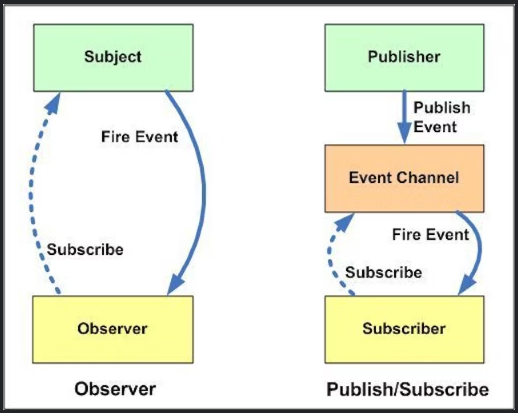

# Pub/Sub Pattern

## 정리해보기(23.10.11)
Pub/Sub Pattern은 서로 다른 컴포넌트들이 비동기적으로 상호작용할 수 있는 메시징 패턴을 의미한다.
Publisher 와 Subscriber가 존재하며 중간에 Message Queue나 Message Broker가 존재해서 Publisher가 제공한 메세지를 구독한 Subscriber가 가져가는 형태로 동작한다.
따라서 Publisher와 Subscriber가 서로간의 관계를 모르는 느슨한 결합을 특징적으로 가지고 있고, 비동기적으로 동작한다는 특징도 가지고 있다. 일반적으로 Message는 Queue에 보내지고, Subscriber가 가져가는 형태이지만, 
Redis Pub/Sub같은 경우는 자체적으로 메세지를 보내고 바로 보내고 메세지에 대해서 따로 보장해주지 않는다는 특징을 가지고 있다.

## 📗 Pub/Sub Pattern이란?

> Publish/subscribe is a flexible messaging pattern that allows disparate system components to interact with one another asynchronously. 
> [Event-Driven Architecture and Pub/Sub Pattern Explained](https://www.altexsoft.com/blog/event-driven-architecture-pub-sub/)

Pub/Sub Pattern이란, 서로 다른 컴포넌트들이 비동기적으로 상호 작용할 수 있는 메시징 패턴이다.

## 📗 Pub/Sub와 Observer Pattern

이 둘이 당연히 같다고 생각한 나를 반성하며.. 

* Observer Pattern에서 Observer들은 Subject에 대해서 알고 있으며, Subject역시 Observer들에 대해서 알고 있다. 
* 반면에, Pub/Sub Pattern에서 Publisher과 Subscriber들은 서로 알 필요가 없다. 간단하게 중간의 Message Queue 혹은 Message Broker의 도움을 받아 소통한다.
* Pub/Sub Pattern에서 Observer Pattern과 달리 느슨하게 결합되어 있다.(loosely coupled)
* Observer Pattern은 주로 동기적인 방식으로 구현된다. 반면에 Pub/Sub Pattern은 주로 비동기적 방식으로 구현된다.

## 📗 Redis Pub/Sub

Redis의 Pub/Sub는 단순한 구조로 되어 있다. 단순히 채널을 구독한 모든 Subscriber에게 메시지를 전달한다. 메시지를 **던지는** 시스템이기 때문에 **메시지를 따로 보관하지도 않는다.**  
즉, 메시지 전송을 보장하지 않는다. 
Redis에서의 Pub/Sub 기능은 주로 채팅이나, 푸시 알림등에 사용된다. 

## 📗 참고
* 
* [RabbitMQ와 Redis의 차이점은 무엇인가요?](https://aws.amazon.com/ko/compare/the-difference-between-rabbitmq-and-redis/)

