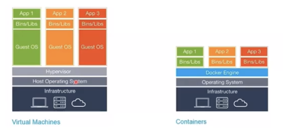

## 도커란?

- 리눅스 컨테이너를 기반으로 서비스를 **패키징**하고 **배포**하는데 유용한 오픈소스(무료) 프로그램

## 도커를 사용해야 하는 이유(WHY)

- 기존 서버의 사양을 늘리거나 서버를 한 대 더 구입하는 상황에 직면하면 다시 셋팅을 해줘야 한다. 이런 불편함을 해소하기 위해서 사용한다.
- Environment Disparity(개발 환경이 맞지 않는 상태)를 해결해준다.
  - (OS가 서로 다른 컴퓨터에서도 같은 환경으로 프로그램을 셋팅할 수 있게 해준다.)

## 도커 이미지란?

- 서비스에 필요한 서버, 코드, 라이브러리, 컴파일된 실행 파일이 **포장**된 형태
- 즉, 특정 프로세스(IDU 프로젝트의 Node.js)를 실행하기 위해 필요한 설정값을 지닌 것.
- EX) Ubuntu Image, MySQL Image, Node.js Image

1. 하나의 이미지는 여러 **컨테이너(Process)**를 생성할 수 있고, **컨테이너가 삭제되더라도 이미지는 변하지 않고 그대로 남아있다.**
2. 도커 이미지들은 GitHub과 유사한 서비스인 **DockerHub를 통해 버전관리 및 배포가 가능하다.**
3. 다양한 API가 제공되어 원하는 만큼 **자동화가 가능**하다.
4. **Dockerfile**이라는 파일로 이미지를 생성한다.

## 도커 컨테이너란?

- 이미지를 **실행한 상태**
- 각 프로세스(컨테이너)는 서로 격리된 공간에서 동작한다.

1. 종료되었다고 메모리에서 삭제되지 않고 남아있다.
   - 삭제하려면 직접 삭제해야 한다. 때문에 컨테이너가 종료되어도 메모리에 남아있는 컨테이너를 재가동할 수 있다.
2. **컨테이너를 삭제했다는 것은 컨테이너 안에서 생성한 파일이 사라진다는 것이다.**(종료는 상관X)
   - EX) 로그를 파일로 관리한다면, 컨테이너 내에 생성된 로그 파일이 모두 사라진다는 의미이다.
3. 한 서버는 여러 개의 컨테이너를 가져도 상관 없으며, 컨테이너는 각각 독립적으로 실행된다.
4. 컨테이너는 커널 공간과 호스트OS 자원을 공유한다.

## Reference

- [[Docker] 왕초보 가이드 (1/2) | 강의를 수십개 들어도 이해 못했던 나를 위한 강의](https://www.youtube.com/watch?v=v8UBRzhusG4)
- [[Docker] 왕초보 가이드 (2/2) | 강의를 수십개 들어도 이해 못했던 나를 위한 강의](https://www.youtube.com/watch?v=yhIWNF4m9w8)
- [[Docker] Docker는 무엇인가(Environment Disparity)](https://ebbnflow.tistory.com/200)
