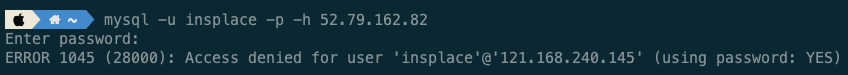

## Occured Error



- Mysql로 계정을 새로 생성했다.

```sql
 CREATE USER 'user-name'@'localhost' IDENTIFIED BY 'password';
 GRANT ALL PRIVILEGES ON *.* to 'user-name'@'localhost';
```

- 하지만 위의 이미지 처럼 1045번 Access denied 에러가 발생했다.

## Solution

- '%'를 사용하지 않았다.

```sql
 CREATE USER 'user-name'@'%' IDENTIFIED BY 'password';
 GRANT ALL PRIVILEGES ON *.* to 'user-name'@'%';
```

- 여기서 localhost 라는 의미는 외부 접속은 허용하지 않는다는 의미였다.
- 외부 접속을 허용 하기 위해서는 '%'로 계정을 생성해야했다.

## Reference

- [MySQL 유저 원격접속 허용하기](https://1mini2.tistory.com/87)
