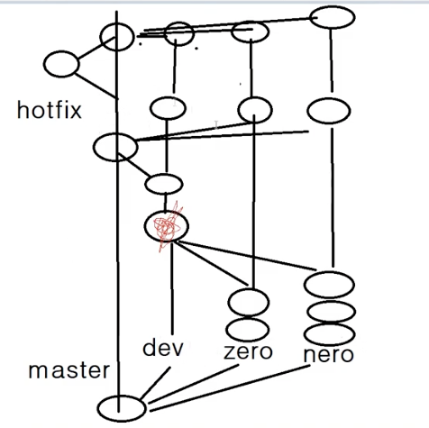

## 어떤 방식으로 협업을 진행할까?

한참, 실전 프로젝트를 진행하는 중 백엔드 팀원들과 통일성을 가지는게 중요하다고 생각했다. 지금은 Github에 대한 통일성을 갖출 때이다.
조현영님의 강의를 통해 이 방식이 맞다고 생각했고 적용하기로 결정했다.

## 하는 방법 정리

1. 협업을 처음 시작할 때, Main Branch에서 초기 셋팅을 한다.
2. 초기 셋팅을 완료한 후 develop(줄여서 dev), 각 팀원들의 닉네임으로 Branch를 딴다. 백엔드 팀원은 나 포함 3명으로(jongwan, TAE, mcc로 딴다.)
3. 각자의 Branch에서 작업해 나간 후에 작업이 완료된 부분은 dev Branch로 합치고 충돌난 부분이 있다면 해결 후 새롭게 커밋을 하며 Test후 문제가 없다고 판단이 되었을 때, main Branch로 합친다.
4. 혹시나 급하게 에러를 잡아야할 경우가 생겼을 때에는 main branch에서 hotfix Branch를 따서 에러를 해결한 후 hotfix Branch는 없앤다.

## Reference

[Git 무료 강좌 2-5. git flow전략](https://youtu.be/B__nZrx_kgQ)
