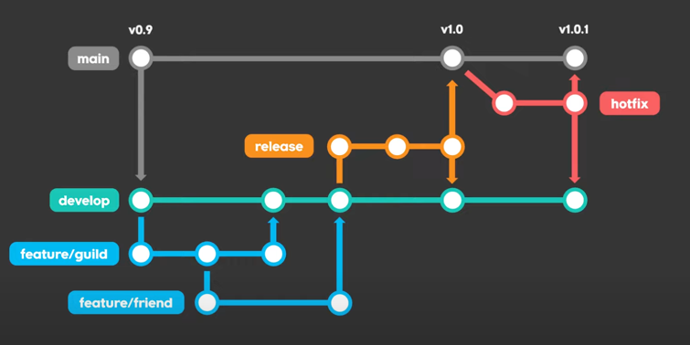
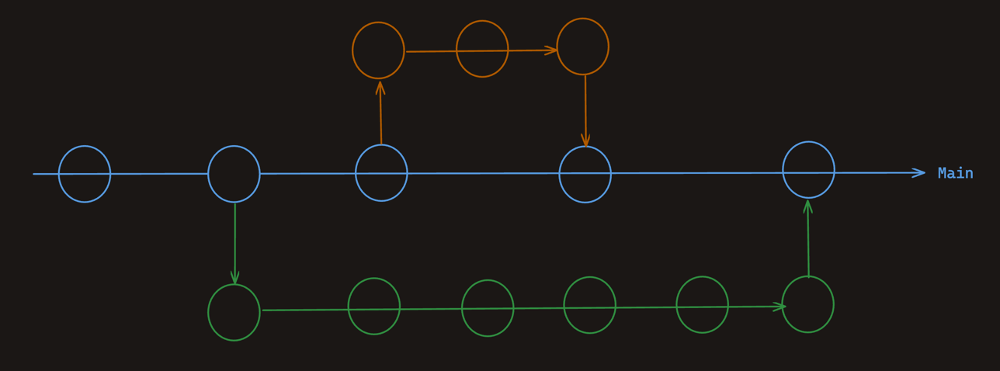

# Git Flow Or Github Flow

## 들어가기 전에

현재 프로젝트를 진행하기 전에 Git관련 전략을 어떻게 가져가는게 좋을지 고민하고 있다.
대표적인 두 가지 전략 Git Flow와 Github Flow에 대해서 비교해보고 어떤 전략을 사용할지 정해보려고 한다.

## 왜 규칙을 미리 정하려고 할까?
현재는 혼자서 개발을 진행하기 때문에 당연히 문제가 없다. 하지만 시간이 지남에 따라 같이 일을 하게 될 분들이 들어 오게 될 것이다. 
이런 상황에서 정해 놓은 규칙, 컨벤션, 이번에 고민하는 Git 전략 같은게 없다면 서로 간에 의미를 알 수가 없는 부분들 때문에 오해, 실수 등으로 인한 불필요한 커뮤니케이션을 하게 될 것이다.
또한 들어 오는, 같이 일을 하게 되는 모든 사람한테 설명을 해야하는 불상사가 벌어진다. 그 만큼 회사, 개인 입장에서 굉장한 손실이다.
~~(경험에서 울어나오는 이야기...)~~

그렇기 때문에 사전에 미리 규칙을 정하고 들어가고자 한다.

## Git Flow는 어떻게 동작할까?

Git Flow에서는 Branch는 총 5개이다. `Main`, `Develop`, `Release`, `HotFix`, `Feature`  
각 Branch마다 역할이 존재한다.

### 크게 총 5가지의 역할이 있는 Branch들이 존재한다.

main: 현재 출시 되어서 사용하는 Branch
develop: 다음 출시 버전을 개발하는 Branch
feature: 기능을 개발하는 Branch
release: 이번 출시 버전을 준비하는 Branch
hotfix: 현재 출시된 main branch에서 발생한 버그를 수정 하는 Branch

  참조: [(알아두면 개발팀장가능) GitFlow vs Trunk-based 협업방식](https://www.youtube.com/watch?v=EV3FZ3cWBp8)

### 설명해보자. 

처음 develop 브랜치가 없을 경우 먼저 main 브랜치로 부터 develop 브랜치를 생성한다.  
기능을 치게 될 경우 develop 브랜치로 부터 `feature/login`과 같은 feature 브랜치를 develop 브랜치로 부터 생성해서 작업을 진행한다.  
작업이 마무리 되었다면 pull request를 통해 develop branch에 합치게 된다.
개발이 완료가 되었다면 QA팀에서 확인할 수 있는 release 브랜치를 develop 브랜치로 부터 생성해서 진행한다.  QA팀으로부터 배포 사인이 떨어지면 main 브랜치와 develop 브랜치에 합쳐준 이후에 release 브랜치를 제거한다.
운영을 하고 있는 상황에서 갑작스럽게 버그가 발생한 경우 main 브랜치로 부터 hotfix 브랜치를 생성해서 작업을 진행한 이후에 main 브랜치에 merge한다. 

## Github Flow는 어떻게 동작할까?

[Github Docs](https://docs.github.com/ko/get-started/quickstart/github-flow)을 참조했다. 

### 1. Create a branch

Main Branch로 부터 Branch를 생성하는 단계이다. 
이 때, Branch Name은 짧으면서도 설명이 포함된 이름을 사용한다.  
예를 들어 `increase-test-timeout`, `add-like-feature`와 같은 Branch Name으로 생성한다.

### 2. Make changes
해당 Branch에서 관련된 작업을 진행한다. 진행을 마쳤다면 origin에 push한다.

### 3. Create a pull request/Address review comments
pull request(줄여서 'PR')을 생성한다. 그리고 같은 협업하는 분들과 해당 내용에 대해서 리뷰 및 논의를 진행한다.

### 4. Merge your pull request
리뷰와 논의가 성공적으로 마무리가 되었다면 해당 내용을 Main Branch에 합친다.

### 5. Delete your branch
합친 이후에 작업했던 브랜치는 지운다.

크게 보면 아래의 그림이 제일 유사하지 않을까..?

## 어떤 전략을 선택하는게 적합할까?

현재 나는 혼자 개발을 진행할 것이고, 멘토님에게 따로 리뷰를 받을 예정이다.  
이런 내 환경을 고려했을 때 main branch에서 개발을 진행할 브랜치를 파서 진행을 하고 Pull Request를 통해 리뷰를 받고 merge하는 Github Flow전략이 내 환경에서 적합하다고 판단이 들었다.

현재는 이와 같이 개발을 진행하지만 실제로 유저들이 사용하는 상황이 된다면 GitFlow 전략을 고려해 볼 것이다.  
전략을 바꾸는 기준은 같이 협업하는 인원 수와 실제 운영 중인지 여부에 따라 달라질 것 같다.

## Reference 
* [우린 Git-flow를 사용하고 있어요](https://techblog.woowahan.com/2553/)
* [[10분 테코톡] 렉스의 Git 브랜칭 전략](https://www.youtube.com/watch?v=wtsr5keXUyE)