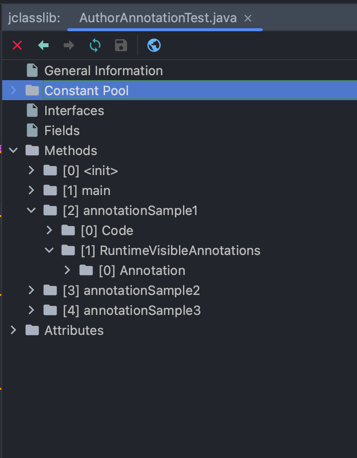

# Annotation

## Annotation이란?
Annotation은 작성한 코드에 대해 추가적인 정보를 제공하는 걸 넘어서 컴파일 시 혹은 런타임 시에 프로그램의 동작을 제어하는 메타 데이터의 일종이다.

## Annotation의 용도
* 컴파일/런타임 시에 프로그램의 동작을 제어하는데 사용된다.
  * @Override: super-class의 메서드를 sub-class에서 재정의 할 때 사용되며, 재정의를 재대로 하지 않았을 경우 컴파일 에러를 뱉는다.
  * @Valid: 데이터 유효성 검사에 사용되는 annotation으로, 주로 매개변수나 필드에 적용된다. 유효하지 않은 값을 넣었을 경우 예외를 발생시킨다.
  * @Transitional: 데이터 베이스의 트랜잭션을 관리하는데 사용되는 annotation으로 데이터의 무결성을 보장하는데 사용된다. @Transactional을 통해서, Commit, RollBack, Release등을 관리할 수 있다. 
  * ...
* 단순하게 반복적으로 작성해 왔던 boiler plate code들을 컴파일 시, 자동으로 생성하는 용도로 사용된다.
  * @Getter, @Setter, @EqualsAndHashCode, @NoArgsConstructor, @AllArgsConstructor ..
* 비즈니스 로직과 분리하여 부가적인 기능들을 처리하는데 사용된다.(관심사의 분리)
  * @Transitional, @Test, @Vaild
* 단순한 Marking 역할로 사용된다.
  * @Deprecated

  
## RunTime시 Annotation으로 설정된 method에 어떻게 접근할 수 있을까?
* Reflection Api를 활용해서 접근할 수 있다.
* 아래 코드는 접근을 시도해본 코드이다.

1. Author.java로 annotation을 만들자.

```java
import java.lang.annotation.ElementType;
import java.lang.annotation.Retention;
import java.lang.annotation.RetentionPolicy;
import java.lang.annotation.Target;

@Target({ElementType.METHOD})
@Retention(RetentionPolicy.RUNTIME)
public @interface Author {
  public String name();
}
```

2. Author Annotation을 메서드에 추가하자.

```java
public class AuthorAnnotationTest {
	
	public static void main(String[] args) {
		AuthorAnnotationTest sample = new AuthorAnnotationTest();
	}
	
	@Author(name = "D")
	public void annotationSample1() {
	}
	
	@Author(name = "C")
	public void annotationSample2() {
	
	}
	
	@Author(name = "B")
	public void annotationSample3() {
	
	}
}
```

3. Reflection Api를 활용해 annotation에 접근할 수 있는 file을 만들자.

```java
import java.lang.annotation.Annotation;
import java.lang.reflect.Method;

public class AuthorAnnotationCheck {
	public static void main(String[] args) {
		AuthorAnnotationCheck sample = new AuthorAnnotationCheck();
		sample.checkAnnotations(AuthorAnnotationTest.class);
	}
	
	private void checkAnnotations(Class<AuthorAnnotationTest> targetClass) {
        // AuthorAnnotationTest Class 내부에 getDeclaredMethods() 를 호출하면 관련 method들의 정보를 확인할 수 있다.
		Method[] methods = targetClass.getDeclaredMethods();
		for (Method tempMethod : methods) {
			// method Instance 안에 Annotation에 접근할 수 있는 getAnnotation() method를 호출해서 가져온다.
            Annotation annotation = tempMethod.getAnnotation(Author.class);
			if (annotation instanceof Author) {
				// 형 변환을 통해서 name() method를 호출해서 접근한다.
				String name = ((Author)annotation).name();
				System.out.println("name = " + name);
			}
		}
	}
}

```

AuthorAnnotationTest.class file의 byteCode를 보면, Methods 내부에 Annotation이 존재하는 걸 확인 할 수 있다.




## @Override의 용도?
부모 클래스에서 사용한 Method를 자식 클래스에서 재정의할 때 사용한다. 잘못 재정의를 했을 경우 Compiler가 에러를 뱉어준다.(RetentionPolicy.SOURCE)

## @SuppressWarnings의 용도?
경고가 나는 Class 혹은 Method의 경우 @SuppressWarnings를 사용해서 Compiler가 해당 경고를 무시할 수 있도록 해주는 Annotation이다.(RetentionPolicy.SOURCE)

## @Deprecated의 용도?
User와 Compiler에게 해당 Class 혹은 Method가 더이상 사용하지 않는다는 정보를 전달하는 목적이다.
User가 해당 Method를 호출 시 Compiler는 경고를 보여준다.(RetentionPolicy.RUNTIME)


## @Retention의 용도?
@Retention은 해당 annotation을 어느 시기까지 제공할지를 정하는 Meta-Annotation으로 총 3가지가 존재한다.
* RetentionPolicy.SOURCE
  * Compile전 까지 제공된다. 즉 .java 파일 까지
* RetentionPolicy.CLASS 
  * Complie시 까지 제공된다. 하지만, JVM에서는 사라짐. 즉, .class 파일 까지
* RetentionPolicy.RUNTIME
  * 실행시 제공된다. 즉, 프로그램 종료되기 전까지


## Reference
* 자바의 신(이상민 저)
* https://veneas.tistory.com/entry/Java-Annotation-%EB%A9%94%ED%83%80%EB%8D%B0%EC%9D%B4%ED%84%B0
* [저는 어노테이션이 처음이라니까요?](https://joel-dev.site/83)
* [[Java] 어노테이션 (+커스텀 어노테이션 만들기)](https://velog.io/@potato_song/Java-%EC%96%B4%EB%85%B8%ED%85%8C%EC%9D%B4%EC%85%98-%EC%BB%A4%EC%8A%A4%ED%85%80-%EC%96%B4%EB%85%B8%ED%85%8C%EC%9D%B4%EC%85%98-%EB%A7%8C%EB%93%A4%EA%B8%B0)