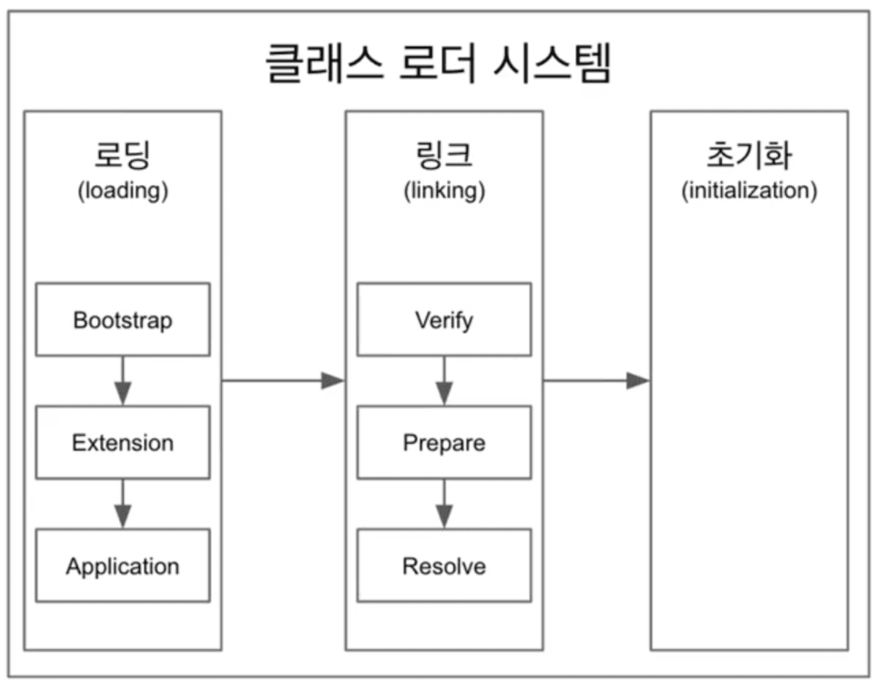

# ClassLoader



## Class Loader란?
* Class loaders are responsible for loading Java classes dynamically to the JVM (Java Virtual Machine) during runtime.
  * 클래스 로더는 런타임 동안에 JVM에 Java Class를 load하는 역할을 한다(역할을 하는 모듈이다).

## Class Loader의 종류
* Bootstrap ClassLoader
  * java.* 을 의미하는 *.class file을 load하는 역할
* Extension ClassLoader
  * 외부 라이브러리, 플러그인을 load하는 역할
* System/Application ClassLoader
  * 사용자 코드를 load하는 역할


## Class Loader의 동작 방식

### Loading
* 제일 먼저 method area에서 로드된 클래스가 있는지 여부를 파악한다.
* 없을 경우 System Class Loader -> Extension Class Loader -> Bootstrap Class Loader 순으로 위임된다. (recursivley 위임이 진행됨.)
* Bootstrap Class Loader -> Extension Class Loader -> System Class Loader 순으로 찾고자 하는 class가 있는지 여부를 체크 하며 내려 온다. 찾을 경우 해당 class가 load된다.
* 끝까지 찾지 못할 경우 ClassNotFoundException이 발생한다.

### Linking
* Linking은 3가지 단계로 동작한다.
* Verification(검증): 클레스 파일인지 유효한지 검증하는 단계이다.
* Preparation(준비): static field들을 위한 메모리 공간을 할당하고 초기 값으로 채우는 단계이다.(초기 값은 기본 값을 말한다.)
* Resolving(해결): class file을 요청한 class에서의 symbolic reference값을 실제 메모리 주소 값으로 변경하는 단계이다.


### Initialization
* static field들을 초기화 하고, static initialization block을 실행하는 단계 


## 내부 loadClass Method 살펴보기

```java
public class ClassLoader {
	
  // ...
  protected Class<?> loadClass(String name, boolean resolve)
          throws ClassNotFoundException // Class를 찾지 못할 경우 ClassNotFoundException발생 시킴
  {
    synchronized (getClassLoadingLock(name)) {
      // First, check if the class has already been loaded
      Class<?> c = findLoadedClass(name); // 기존 method area에 로드되었던 class였는지를 체크
      
      // 로드되어 있지 않은 경우
      // 로드가 되어 있는 경우의 클래스라면  resolve 체크 후, return c
      if (c == null) {
        long t0 = System.nanoTime();
        try {
          if (parent != null) {
            //  재귀적으로 상단의 loadClass 호출(?!)
            // System Class Loader -> Extension Class Loader 재귀적으로 호출 시 최상단에 null인 경우 아래 findBootstrapClassOrNull Method 호출
            c = parent.loadClass(name, false);
          } else {
            // Bootstrap Class Loader
            c = findBootstrapClassOrNull(name);
          }
        } catch (ClassNotFoundException e) {
        }

        if (c == null) {
          long t1 = System.nanoTime();
					
          // 최상단 까지 체크했음에도 없는 경우 ClassNotFoundException 발생
          c = findClass(name);

          // this is the defining class loader; record the stats
          PerfCounter.getParentDelegationTime().addTime(t1 - t0);
          PerfCounter.getFindClassTime().addElapsedTimeFrom(t1);
          PerfCounter.getFindClasses().increment();
        }
      }
      // linking 과정 중 마지막 단계인 resolve 실행 여부
      if (resolve) {
        resolveClass(c);
      }
      return c;
    }
  }
	
}
```

## Custom Class Loader를 사용했을 때 장점
* 클래스 파일을 수정했을 경우 즉시 리로딩할 수 있게끔 설정할 수 있다.(클래스 리로딩)
* 클래스 간 격리할 수 있다.
* default class path가 아닌 다른 path에서 Class File을 로드할 수 있다.
* 클래스 파일에 대한 Filtering 역할을 할 수 있다.
* 클래스 로딩 시에 클래스의 바이트코드를 변형해서 다양한 목적으로 사용할 수 있다.
  * 클래스 바이트 코드에 로깅 코드를 삽입하여 디버깅 이나 모니터링으로도 활용할 수 있다.
  * 보안 및 감사 기능을 적용할 수 있다.

## Custom Class Loader의 실제 사용 사례
* Hot Relaoding: 개발 중 코드 변경 사항을 감지하고, 변경된 코드를 리로딩해서 애플리케이션을 끄지 않고도 변경된 사항을 적용하는 기능을 제공
* AOP 구현
* 클래스 파일 보안 및 변조 방지: Spring은 클래스 파일의 변조를 막기 위해 클래스 파일의 해시 값 등을 사용하여 검증하는 기능을 제공한다.
* 자체 클래스 로딩 관리: Spring은 ApplicationContext를 통해 클래스 로딩을 관리하며, 이를 커스터 마이징 할 수 있다.


## Reference
* https://velog.io/@jifrozen/JVM-%EA%B5%AC%EC%84%B1%EC%9A%94%EC%86%8C-1-%ED%81%B4%EB%9E%98%EC%8A%A4-%EB%A1%9C%EB%8D%94
* https://www.baeldung.com/java-classloaders
* https://blog.naver.com/bumsukoh/110127431857
  * 어우.. 대박 상세하다..

