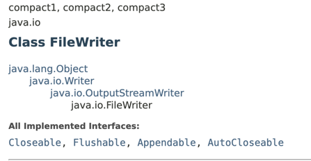

# The try-with-resources Statement

## 왜 try-with-resources문을 사용해야 할까?

```java
package error_and_exception;

import java.io.FileWriter;
import java.io.IOException;

// try-catch-finally statement
public class TryWithResourcesTest {
	public static void main(String[] args) {
		TryWithResourcesTest t = new TryWithResourcesTest();
		t.checkTryWithResources();
	}
	
	private void checkTryCatchFinally() {
		FileWriter fw = null;
		
		try {
			fw = new FileWriter("data.txt");
			fw.write("Hello");
		} catch (IOException e) {
			e.printStackTrace();
		} finally {
			if (fw != null) {
				try {
					fw.close();
				} catch (IOException e) {
					e.printStackTrace();
				}
			}
		}
	}
	
	// try-with-resources statement
	private void checkTryWithResources() {
		try (FileWriter fw = new FileWriter("data.txt")) {
			fw.write("Hello");
		} catch (IOException e) {
			e.printStackTrace();
			
		}
	}
	
}

```

위의 코드는 try-catch-fanally statement와 try-with-resources statement를 따로 적용한 `완전히 동일한 코드`이다.

### 1. 코드가 간결해지며 반복적으로 사용되는 보일러 플레이트를 없앨 수 있다.
위의 예시를 두고 비교를 해보면 모든 사람이 try-with-resources statement를 사용할 거라고 생각한다.
완전히 동일한 코드임에도 불구하고 눈으로 보기에 훨씬 간결하며 비즈니스 로직에 집중이 가능하다. 
또, FileWriter, SqlConnection 등 외부 자원을 사용하게 된다면 반드시 close() method를 호출해서 닫아줘야 했다.
닫아 줄때에는 null인지 여부를 체크해줘야 했고 close할 때 역시 try-catch statement로 한 번 더 감싸야하는 번거러움이 있었다.

### 2. Client의 실수를 최소화 할 수 있다.
나 역시 DB에서 데이터를 수정할 경우 connection pool에서 가져와서 사용하고 반환을 안 한 적이 꽤 빈번히 있었다.
누구나 할 수 있는 실수이다. 하지만 이렇게 실수를 하고 나면 어디서 connection 반환이 안되는지 찾기는 정말 쉽지 않다. 
이러한 실수를 방지하기 위해서도 try-with-resources statement를 사용해야 한다.


## try-with-resources statement를 사용하기 위해선 사용할 Class가 AutoCloseable 또는 Closeable Interface를 구현했는지 여부를 확인해야한다.

위에서 예시로 활용한 FileWriter Class를 java api docs에서 확인해보면,
AutoCloseable 또는 Closeable Interface를 구현 했음을 확인할 수 있다.




## 정리하며

> 꼭 회수해야 하는 자원을 다룰 때는 try-finally 말고, try-with-resources를 사용하자. 예외는 없다.
> 코드는 더 짧고 분명해지고, 만들어지는 예외 정보도 훨씬 유용하다. [Effective Java - item9, try-finally보다는 try-with-resources를 사용하라]()

자원을 사용해서 반환을 반드시 해줘야 하는 경우에 try-with-resources statement를 반드시 사용하자. 
그렇게 했을 경우 훨씬 간결하며, 실수를 최소화할 수 있는 코드를 작성할 수 있을 것이다.


## Reference 

* [Oracle - The try-with-resources Statement](https://docs.oracle.com/javase/tutorial/essential/exceptions/tryResourceClose.html)
* [Effective Java - item9, try-finally보다는 try-with-resources를 사용하라]()