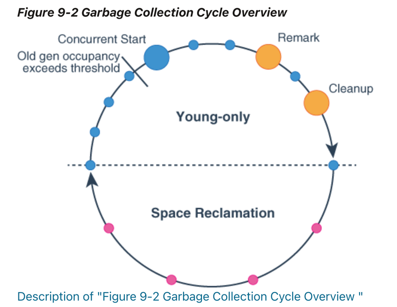

# Garbage First Collector

## G1 GC란?

## G1 GC의 장점

## G1 GC의 단점

## G1 GC에서는 Full GC가 언제 일어날까?

## G1 Cycle
(참고: https://docs.oracle.com/en/java/javase/12/gctuning/garbage-first-garbage-collector.html#GUID-F1BE86FA-3EDC-4D4F-BDB4-4B044AD83180)

위 이미지는 GC가 수행됨에 따라 발생하는 STW(Stop-the-world)를 나타낸 것이다. 크기에 따라  STW 시간이 비례하게 소요된다.
위 이미지에 대해서 대략적으로 보이는 부분에 대해서만 설명해 보자면,

* 우선 두 가지 단계가 존재한다. `Young Only Phase`, `Space Reclamation Phase` 
* 파란색 원은 Minor GC가 진행하면서 발생되는 STW를 나타낸다. 
* 주황색 원은 Major GC가 진행하면서 발생되는 STW를 나타낸다.
* 분홍색 원은 Mixed GC(Minor/Mager GC)가 진행하면서 발생되는 STW를 나타낸다.
* Old gen occupancy exceeds threshold / Concurrent Start
  * 언제 Full GC가 시작되는 시점이 언제일까?  
  * 초기에 지정한 `InitiatingHeapOccupancyPercent` 값을 초과했을 때 시작된다.(기본값: )  
  * Full GC가 시작하면서 Marking을 시작하게 되는데(Full GC의 동작 중 첫 번째 단계: Initial Mark) 이때 STW 소요 시간이 증가한다.   
* Remark
  * 
* Cleanup
  * 아래에서 설명

---

## Reference
* https://www.oracle.com/webfolder/technetwork/tutorials/obe/java/G1GettingStarted/index.html
* https://thinkground.studio/2020/11/07/%EC%9D%BC%EB%B0%98%EC%A0%81%EC%9D%B8-gc-%EB%82%B4%EC%9A%A9%EA%B3%BC-g1gc-garbage-first-garbage-collector-%EB%82%B4%EC%9A%A9/
* https://perfectacle.github.io/2019/05/11/jvm-gc-advanced/
* https://docs.oracle.com/en/java/javase/12/gctuning/garbage-first-garbage-collector.html#GUID-F1BE86FA-3EDC-4D4F-BDB4-4B044AD83180