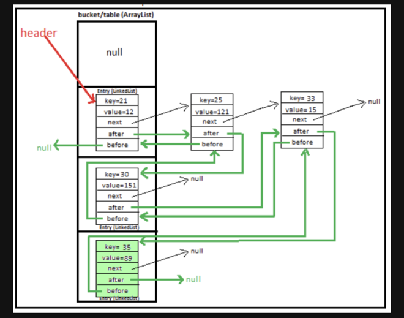

# LinkedHashMap

## LinkedHashMap이란?

linkedHashMap은 HashMap을 상속 받고 있으며, Map Interface의 구현체이다.

```java
public class LinkedHashMap<K,V>
    extends HashMap<K,V>
    implements Map<K,V>
{ }
```

## LinkedHashMap을 사용하는 이유?
LinkedHashMap은 HashMap과 다르게 순서를 보장해주기 때문에 순서의 보장이 필요한 시점에 사용하면 좋다.

## LRU Cache (Least Recently Used)

LinkedHashMap은 Cache를 구현할 때 사용하면 좋은데 특히 LRU Cache를 구현할 때 주로 사용되는 자료구조이다.
LRU Cache란 캐시의 공간이 가득 찼을 때, 가장 사용량이 적은 데이터를 먼저 삭제하자는 알고리즘이다.

아래와 같이 익명 클래스로 removeEldestEntry를 재정의 하고, limit 크기를 정해 주면 
해당 크기를 초과할 경우 입력 된지 가장 오래된 데이터 부터 삭제를 하게 된다.

```java
import java.util.LinkedHashMap;
import java.util.Map;

public class LinkedHashMapTest {
	public static void main(String[] args) {
		LinkedHashMapTest main = new LinkedHashMapTest();
		main.testLRUCache();
	}
	
	private void testLRUCache() {
		LinkedHashMap<Integer, String> lhm = new LinkedHashMap<>() {
			@Override
			protected boolean removeEldestEntry(Map.Entry eldest) {
				return this.size() >= 10_000;
			}
		};
		
		for (int i = 1; i <= 100_000; i++) {
			lhm.put(i, "a");
		}
		
		// output: 9999
		System.out.println(lhm.size());
	}
	
	
	
}

```

## 순서의 보장을 어떻게 해주고 있지?

LinkedHashMap의 Node의 구성은 아래와 같다.

```java

static class Entry<K,V> extends HashMap.Node<K,V> {
	Entry<K,V> before, after;
	Entry(int hash, K key, V value, Node<K,V> next) {
		super(hash, key, value, next);
	}
}
```

HashMap의 Node는 HashMap의 Node에서 
Entry<K,V> before, after; 가 추가된다.

아래의 이미지와 같이 Node들은 들어온 순서의 위치를 기억하고자 before에는 직전에 put된 Node를 참조하고 있고 
after에는 직후에 추가된 Node를 참조하고 있다. 즉 doubly-linked-list로 구현이 되어져 있다.



## 정리
* LinkedHashMap은 순서를 보장해주는 HashMap이라고 생각하면 좋다.
* Cache를 구현할 때 사용하면 좋다. (ex, LRU Cache)
* Node의 before, after가 추가된 만큼 HashMap에 비해 메모리를 더 필요로 한다.
* HashMap과 같이 Thread-Safe하지 않기 때문에 멀티 스레드 환경에서는 적합하지 않다.
