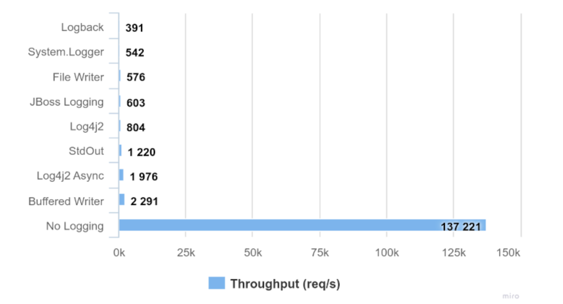

# System.out.println을 사용하면 왜 느릴까?

## 성능 비교

```java
public class LoggerPerformanceTest {
	private static final int DEFAULT_SIZE = 10_000;
	
	public static void main(String[] args) {
		LoggerPerformanceTest test = new LoggerPerformanceTest();
		int[] arr = new int[DEFAULT_SIZE];
		
		long includeSystemOutPrint = test.testArrayIncludeSystemOutPrint(arr);
		long notInclude = test.testArrayNotInclude(arr);
		System.out.println("include System.out.print: " + includeSystemOutPrint);
		System.out.println("not include System.out.print: " + notInclude);
		System.out.print("몇 배이상 차이가 날까?: " + (includeSystemOutPrint / notInclude));
		
	}
	
	private long testArrayNotInclude(int[] arr) {
		
		long start = System.nanoTime();
		for (int i = 0; i < DEFAULT_SIZE; i++) {
			arr[i] = 1;
		}
		long end = System.nanoTime();
		
		return end - start;
	}
	
	private long testArrayIncludeSystemOutPrint(int[] arr) {
		
		long start = System.nanoTime();
		for (int i = 0; i < DEFAULT_SIZE; i++) {
			arr[i] = 1;
			System.out.println(10);
		}
		long end = System.nanoTime();
		
		return end - start;
	}
}
```

위의 코드를 통해 System.out.println() method를 사용했을 때와 사용하지 않았을 때를 테스트 해보았다. 반복문의 갯수 만큼 out.println() method가 호출이 된다.

|    반복 수     | println method 포함 | println() method 미포함 | 몇 배 차이? |
|:-----------:|:-----------------:|:--------------------:|:-------:|
|   1,000번    |     11.235ms      |       0.011ms        |  1009배  |
|   10,000번   |     50.018ms      |       0.114ms        |  438배   |
|  100,000번   |     430.718ms     |       2.243ms        |  191배   |
| 1,000,000번  |    3697.961ms     |       4.623ms        |  799배   |
| 10,000,000번 |    33272.864ms    |       6.875ms        |  4839배  |


앞으로 절대 사용하지 말아야지..(왜 이렇게 느릴까?)🥹

## 내부 코드를 살짝 봐보자.

```java

// System.out에서 out은 PrintStream Class의 instance이다.
public class PrintStream extends FilterOutputStream
	implements Appendable, Closeable {
	
	public void println(String x) {
		// synchronized keyword를 사용하고 있다. 
		synchronized (this) {
			print(x);
			newLine();
		}
	}
	
	public void print(String s) {
		write(String.valueOf(s));
	}
	
	private void write(String s) {
		try {
			synchronized (this) {
				// PrintStream이 열려있는지 체크
				ensureOpen();
				
				// Buffer를 통해서 kernel 내부 console에 적기 시작..
				textOut.write(s);
				textOut.flushBuffer();
				charOut.flushBuffer();
				if (autoFlush && (s.indexOf('\n') >= 0))
					out.flush();
			}
		}
		catch (InterruptedIOException x) {
			Thread.currentThread().interrupt();
		}
		catch (IOException x) {
			trouble = true;
		}
	}
}
```

## 사용하면 안되는 이유
* System.out.println() method는 내부적으로 `Blocking I/O` 방식을 사용한다.
* console에 출력 작업이 완료되기 전까지 해당 스레드가 블로킹이 되어 멈춰 있어야 한다는 것을 의미한다.
  * console에 출력하는 동안 kernel의 CPU를 점유한다.


## 그러면 대안책은 (성능 방면에서만 고려해 보자)



[Logging Performance Comparison](https://blog.sebastian-daschner.com/entries/logging-performance-comparison) 글의 이미지를 발췌해서 가져왔는데,
Logger Class를 사용한다고 성능이 좋아진다거나 하지않았다. 이 중에서 System.out.print 보다 빠른 것은 총 2개
1. Log4j2 Async
2. Buffered Writer

로 보인다.


## Log4j2 Async?!


## Reference

* [Logging Performance Comparison](https://blog.sebastian-daschner.com/entries/logging-performance-comparison)