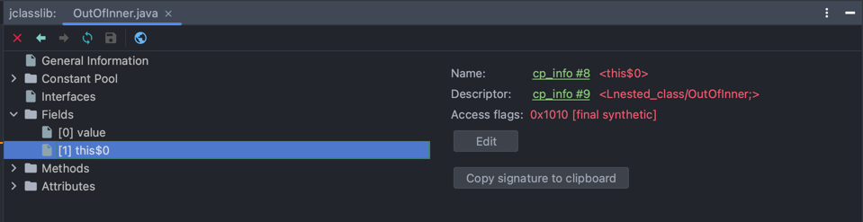

# NestedClass

## NestedClass란?
* Class 내부에 선언된 Class를 의미한다.

## Nested Class는 아래와 같은 구분을 가진다.
  * static Nested Class(inner class와는 static keyword 여부에 따라 구분된다.)
  * Inner Class
    * Local Inner Class
    * Annoymous Inner Class


## InnerClass가 GC에 방해되는 이유가 뭘까?

> 정적 멤버 클래스(Static Nested Class)와 비정적 멤버 클래스(Inner Class)의 구문상 차이는 단지 static이 붙어 있고 없고 뿐이지만, 의미상 차이는 의외로 꽤 크다. 
> 비정적 멤버 클래스의 인스턴스는 바깥 클래스의 인스턴스와 암묵적으로 연결된다.
    Effective Java - 아이템 24(멤버 클래스는 되도록 static으로 만들라)

### 비정적 멤버 클래스의 인스턴스는 바깥 클래스의 인스턴스와 연결된다?! 확인해보자.
```java
// InnerClass!
public class OutOfInner {
	class Inner {
		private int value = 0;
		
		public int getValue() {
			return value;
		}
		
		public void setValue(int value) {
			this.value = value;
		}
	}
}
```
위의 코드의 ByteCode를 확인해보자.



정말이다! Static Nested Class에서 보이지 않던, 또 내가 따로 추가한 적이 없던 Field인 `this$0`이 외부 클래스(OutOfInner)를 참조하고 있다.

다시 정리를 해보면, 외부 클래스의 인스턴스를 사용하지 않는 상황임에도 내부 클래스의 인스턴스가 참조하는 한 GC는 사용하지 않는 외부 클래스의 인스턴스를 수거하지 못한다.😆
이 점은 외부 클래스의 인스턴스를 사용하지 않음에도 불구하고 GC가 수거하지 못하기 때문에 `메모리 누수`라는 단점이 있다.


## 그렇다면 InnerClass 메모리 누수 대한 해결책은?!

> 멤버 클래스에서 바깥 인스턴스에 접근할 일이 없다면 무조건 static을 붙여서 정적 멤버 클래스로 만들자. 
> Effective Java - 아이템 24(멤버 클래스는 되도록 static으로 만들라)

### Static Nested Class를 이용하자.
Static Nested Class와 InnerClass의 차이점은 두 가지로 보인다.

1. 외부 클래스 참조 여부
2. 외부 인스턴스 멤버 접근 가능 여부

그렇기 때문에, 바깥 인스턴스에 접근할 일이 없다면 Static Nested Class를 이용하자.


