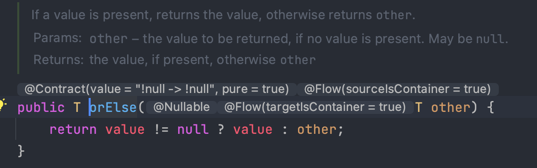
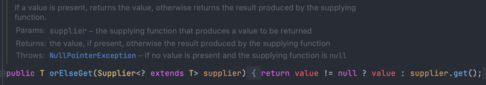

# Optional에서 OrElse and OrElseGet의 차이점?

## OrElse



orElse() method는 값을 parameter로 받는다.

## OrElseGet



orElseGet() method는 supplier를 parameter로 받는다.


## orElse() method는 null 여부에 상관없이 호출된다!

orElse()와 orElseGet() method의 차이는 parameter로 값을 받는지 아니면 supplier를 받는지의 차이로 보인다.
하지만 소름 돋는 부분이 있다하면 **orElse() method는 null값 여부에 상관없이 호출되는 것!**


```java
package optional;

import java.util.Optional;

public class OrElseAndAndElseGet {
	public static void main(String[] args) {
		OrElseAndAndElseGet main = new OrElseAndAndElseGet();
		String username = "myName";
		String result1 = Optional.ofNullable(username).orElse(main.getDefaultName("result1 name"));
		// System.out.println("result1 = " + result1);
		
		String result2 = Optional.ofNullable(username).orElseGet(() -> main.getDefaultName("result2 name"));
		// System.out.println("result2 = " + result2);
		
	}
	
	private String getDefaultName(String name) {
		System.out.print("호출된 이름: ");
		System.out.println("name = " + name);
		return name;
	}
}

/*
출력 내용
호출된 이름: name = result1 name
 */
```

보는 것과 같이 orElse() method는 null여부에 상관없이 parameter로 값을 받기 때문에 호출이 된다.
보통 프로젝트에서 사용 할 때 JPARepository에서 조회를 시도했을 때 Optional로 반환이 되고 그 이후에 후속 처리를 
orElse(), orElseGet(), orElseThrow() 중 선택해서 해주게 된다. orElse() method는 null여부에 상관없이 호출된다는 부분을 명심하고 
왠만하면 supplier를 통해 제공하는 orElseGet() method를 활용하자고 생각이 들었다.


