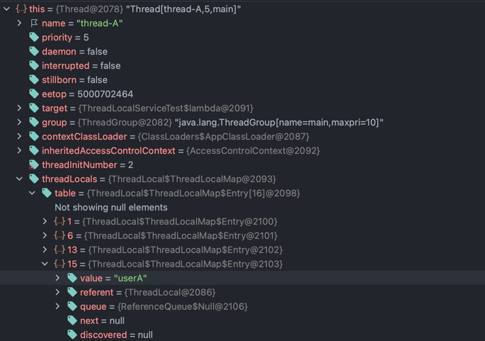

# ThreadLocal

자바에서는 동시성 제어한다는 부분이 굉장히 중요하다. 지금까지 동시성 제어를 하는 방법으로 `synchronized`, `atomic + CAS Algorithm`을 알고 있었다면, 이제 `ThreadLocal`을 통해서도 `동시성 제어`를
생각해 볼 수 있다.

## ThreadLocal?
ThreadLocal은 각 스레드 마다 독립된 저장소를 만들어 공유 자원을 별개의 저장소에서 따로 관리하는 방법을 의미한다.


## ThreadLocal을 왜 사용할까?

위에서 언급했던 대로 공유 자원에 대한 `동시성 제어`를 위해서 사용하게 된다.


## 직접 사용해 보자

Spring Boot를 이용해 프로잭트를 생성하고 직접 애플리케이션을 실행해서 확인 해보았다.

```java

import lombok.extern.slf4j.Slf4j;

@Slf4j
public class ThreadLocalService {
	private ThreadLocal<String> nameStore = new ThreadLocal<>(); // 공유 자원
	
	public String logic(String name) {
		log.info("저장 name={} -> nameStore={}", name, nameStore.get());
		nameStore.set(name);
		sleep(1000);
		log.info("조회 nameStore={}", nameStore.get());
		return nameStore.get();
	}
	
	private void sleep(int millis) {
		try {
			Thread.sleep(millis);
		} catch (InterruptedException e) {
			e.printStackTrace();
		}
	}
}

```

```java
import org.junit.jupiter.api.Test;

import hello.advanced.threadlocal.code.ThreadLocalService;
import lombok.extern.slf4j.Slf4j;

@Slf4j
public class ThreadLocalServiceTest {
	
	private ThreadLocalService threadLocalService = new ThreadLocalService();
	@Test
	void field () {
		log.info("main start");
		
		Runnable userA = () -> {
			threadLocalService.logic("userA");
		};
		
		Runnable userB = () -> {
			threadLocalService.logic("userB");
		};
		
		Thread threadA = new Thread(userA);
		threadA.setName("thread-A");
		Thread threadB = new Thread(userB);
		threadB.setName("thread-B");
		
		threadA.start();
		// sleep(2000); // 동시성 문제 발생 x
		sleep(100); // 동시성 문제 발생
		threadB.start();
		
		
		sleep(3000);
		log.info("main exit");
	}
	
	private void sleep(int millis) {
		try {
			Thread.sleep(millis);
		} catch (InterruptedException e) {
			e.printStackTrace();
		}
	}
	
}

```


단순하게 공유 자원인 nameStore에 여러 thread가 동시에 접근 하는 환경에서 ThreadLocal을 적용해 보았다.
테스트 코드에서는 threadA, threadB를 생성하여 nameStore에 각각 userA, userB를 넣어서 원자성이 보장되는지 확인해보았다. 

출력 결과는 아래와 같다.
```java
/*
02:39:19.963 [main] INFO hello.advanced.threadlocal.ThreadLocalServiceTest - main start
02:39:19.968 [thread-A] INFO hello.advanced.threadlocal.code.ThreadLocalService - 저장 name=userA -> nameStore=null
02:39:20.077 [thread-B] INFO hello.advanced.threadlocal.code.ThreadLocalService - 저장 name=userB -> nameStore=null
02:39:20.976 [thread-A] INFO hello.advanced.threadlocal.code.ThreadLocalService - 조회 nameStore=userA
02:39:21.079 [thread-B] INFO hello.advanced.threadlocal.code.ThreadLocalService - 조회 nameStore=userB
02:39:23.080 [main] INFO hello.advanced.threadlocal.ThreadLocalServiceTest - main exit  
*/
```

threadA와 threadB가 기대했던 값 그대로 저장되고 조회되는 것을 확인할 수 있었다.


## ThreadLocal의 데이터는 어디에 저장될까?



어디에 저장되는지 확인하기 위해서 디버깅을 해봤는데, 
thread instance 내부에 threadLocals.table에 map 자료구조로 저장 되는 것을 확인할 수 있었다.
궁금증 해결!


## ThreadLocal을 사용할 때는 무조건 적으로 다 사용하고 나서 remove() method를 쓰자.

웹 애플리케이션을 실행할 때 Tomcat WAS는 Thread Pool에서 정해진 갯수만큼 Thread를 생성해서 보관한다.
Http Request가 왔을 때 해당 Thread 기반으로 동작하지만 Thread를 매번 생성하는 것이 아닌 기존에 사용했던 Thread를 가져와서 반납하는 구조이기 때문에 
remove() method를 통해 ThreadLocals를 비워두지 않는다면, 다음 동일한 Thread를 가져간 요청에서 기존 값이 보이는 현상을 마주하게 된다.
그렇기 때문에 꼭 사용하고 나서 remove() method를 호출해서 비워주자.


