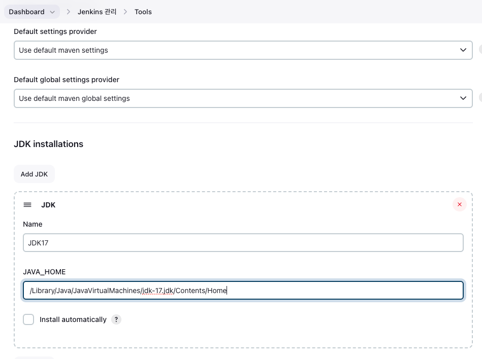

# Jenkins 설치(on Mac)


## Jenkins 설치 방법

### 1. Jinkins 설치
homebrew가 없다면 [여기](https://brew.sh/)에서 설치 하자.
```shell
brew install jenkins
```
### 2. Jenkins 시작하기

* Jenkins Start
```shell
brew services start jenkins  
```
### 추가 사항
* Jenkins Restart
```shell
brew services restart jenkins 
```
* Jenkins 종료
```shell
brew services stop jenkins
```

### 3. Jenkins 접속하기

http://lcoalhost:8080으로 접속하자.
접속한 이후에 각자의 경로에 맞는 곳으로 가서 초기 어드민 비밀번호를 가져와서 입력하자.

```shell
cat /Users/a./.jenkins/secrets/initialAdminPassword
```

### 4. Admin 계정 생성


### 5. 


### 6. Jenkins관리 -> Tools // JDK, Gradle 추가

* JDK 17


* Gradle 추가 

해당 프로젝트 내부에서 아래 명령어로 Gradle Version 확인해보자.

```shell
./gradlew -version
```


### Port 8080에서 변경하기
나는 다른 블로그 글과는 다르게 변경 위치를 찾기가 너무 어려웠다.<br> 
homebrew로 설치해서 그런가..? <br>
port번호를 변경할 수 있는 위치는, <br>

```shell
vi /opt/homebrew/Cellar/jenkins/2.424/homebrew.mxcl.jenkins.plist
```


## Reference 
* [[Jenkins] 젠킨스 Mac 으로 설치](https://co-de.tistory.com/16)
* [AWS EC2 램 늘리기(feat. 스왑)](https://velog.io/@shawnhansh/AWS-EC2-%EB%A9%94%EB%AA%A8%EB%A6%AC-%EC%8A%A4%EC%99%91)