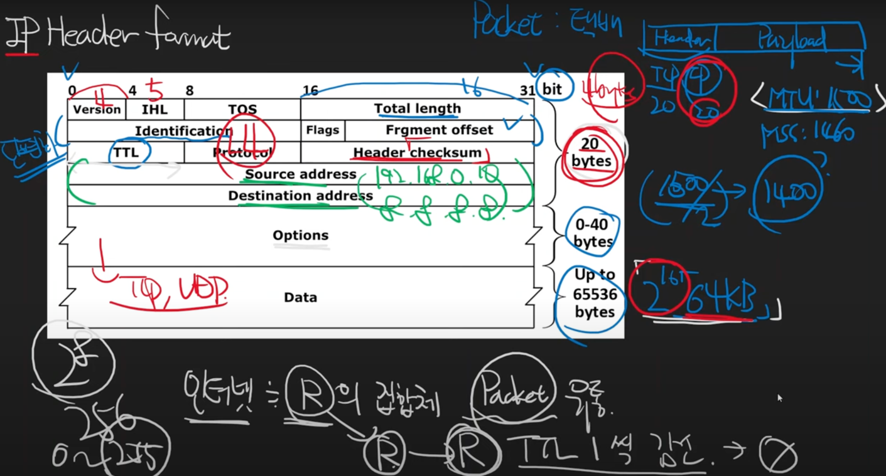

# IP헤더 형식과 의미 요약

* Packet은 Header와 Payload로 구성되어져 있다.
* Packet의 일반적인 MTU는 1500Byte이며, TCP Header 20Byte, IP Header 20Byte 그렇기 때문에 MSS는 1460Byte이다.

* Option: 최대 40Byte까지 있을 수 있다. 주로 Option은 사용되지 않는다.
* Data: 최대 65536Byte(2^16Byte) 하지만 여전히 MTU는 1500Byte가 일반적이다.

* Total length(16bit): data 전체 길이 -> 이론상 65536까지 가능하다.
* Version(4bit): IPv4, IPv6
* IHL(4bit, Internet Header Length): 주로 5이다.
  * 32bit -> 4Byte
  * 4Byte * IHL(5) = 20Byte로 일치한다.
* TOS(Type Of Service): 생략
* Identification, Flags, Fragment offset(32bit): 단편화와 관련되어 있다.
* TTL(8bit, Time To Live): 
  * Internet은 Router의 집합체이다.
  * Router들은 Packet을 유통한다
  * Router를 지나갈 때마다 TTL이 1씩 감소한다
  * 8bit여서 0 ~ 255
  * TTL이 0이되면 라우터가 패킷을 버린다.
* Protocol(8bit): 4L의 Header가 무엇인지에 대한 정보를 알 수 있다.
* Source address(32bit): 출발지 주소
* Destination address(32bit): 목적지 주소

--- 
## Reference 

* https://www.youtube.com/watch?v=9MPzEwZrRqo&list=PLXvgR_grOs1BFH-TuqFsfHqbh-gpMbFoy&index=16