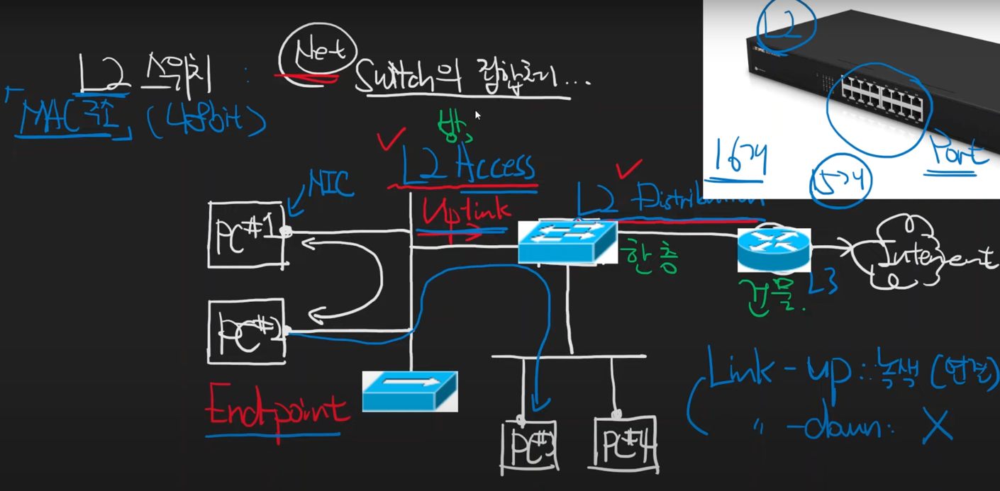

# L2 스위치에 대해서

* L2 스위치는 MAC 주소로 스위칭을 한다
* ipconfig / all -> 물리적 주소를 통해서 MAC 주소를 확인 가능하다 (Window)
* MAC 주소는 전세계에 한개라고 생각해도 무방
* MAC 주소는 48bit로 이루어져 있다. ex) d0:88:0c:68:4d:c3
* Network는 Switch의 집합체이다.
* L2 Switch는 크게 두 종류가 있다
  * L2 Access: EndPoint와 맞닿은 것을 말함.(EndPoint를 위한 스위치) - 방 1개 
  * L2 Distribution: Access와 맞닿은 것을 말함(Switch를 위한 스위치) - 한 층
* L2 Distribution을 통해서 게이트웨이 역할을 수행하는 Router로 가서 인터넷으로 연결된다 - 건물 1개
* 상위 계층 스위치로 연결되는 라인(Access Switch -> Distribution Switch) : Uplink 
* Router는 일반적으로 전체 피시들의 라우터 역할을 해준다.
* 주의!) Link-up 케이블이 연결됐다는 뜻, Link-down은 연결이 끊어졌다는 뜻

---
## Reference

https://www.youtube.com/watch?v=y8rPmcYRsrk&list=PLXvgR_grOs1BFH-TuqFsfHqbh-gpMbFoy&index=15