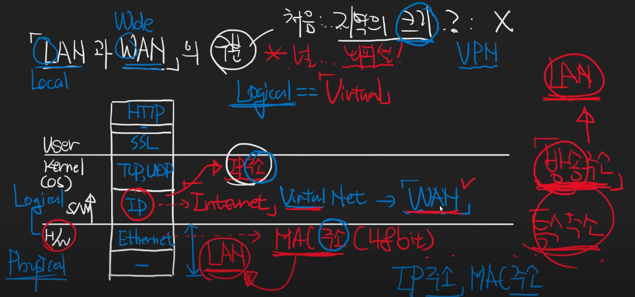

# LAN과 WAN을 구별하는 방법

* LAN: `Local` Area Network
* WAN: `Wide` Area Network

---
## 널널한 개발자의 뇌피셜

* 지역의 크기로 구분: X
* 논리적인지 물리적인지로 구분하는게 타당하지 않을까 생각

### LAN

* H/W 계층은 Physical(물리적인)이며, 물리적인 네트워크로 설명되는게 `LAN`이다.
* MAC주소(48bit) 로 접근한다.
* 특수주소인 방송주소의 범위가 `LAN`이다.

### WAN

* IP는 Logical(Virtual) Network이다
* S/W 계층은 Logical == `Virtual`(논리적인)이며, 논리적인 네트워크로 설명되는게 `WAN`이다.
* Virtual Network인 IP는 `WAN`이다.

---
## Reference
https://www.youtube.com/watch?v=N8pE-vDsJ38&list=PLXvgR_grOs1BFH-TuqFsfHqbh-gpMbFoy&index=13