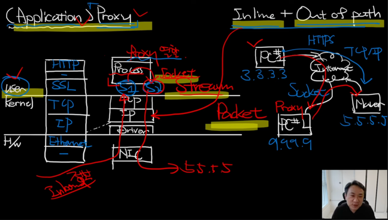

# Proxy

## Proxy의 구조와 작동원리

* Network를 이루고 있는 구조들은 3가지로 정리 가능하다
  * Inline
  * OutOfPath
  * (Application) Proxy

* Proxy는 `대리`이다.
* UserMode/Application/Proxy/Socket/Stream
* Inline/OutOfPath/Packet

## Proxy의 활용 첫 번째, 우회

* TorProject?!
* 우회 시 주의할 점
   * client의 모든 통신을 감청할 수 있다.

## Proxy의 활용 두 번째, 분석

## Reference
https://www.youtube.com/watch?v=dThqHi8-MiQ&list=PLXvgR_grOs1BFH-TuqFsfHqbh-gpMbFoy&index=20