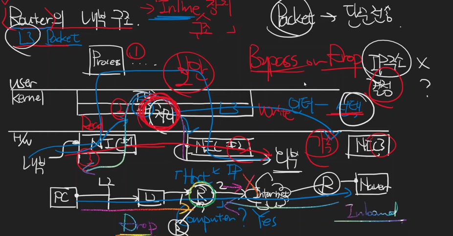
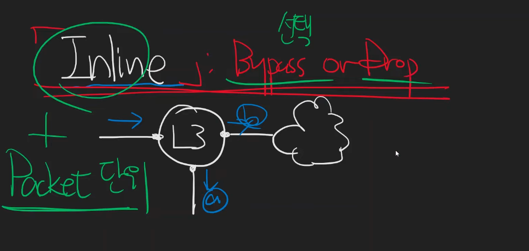

# Router의 내부 구조와 Inline

* Router는 L3 Switch중 하나이다.(Packet 기반)
* Router Interface는 최소 2개이다.
* Router역시 Host라고 할 수 있다.
* Router는 Computer이다.
* 계층을 이동할 때, 비용이 비싸고, 처리지원이 발생한다.
* Hardware 수준으로 처리 할 때 `가속했다` 표현
* Routing의 역할만 수행한다면 L3 Router 
* ByPass Or Drop을 역할 까지 수행한다면, 방화벽이 된다.

* Inline은 ByPass or Drop의 역할을 수행(Packet단위 처리)

---
## Reference
https://www.youtube.com/watch?v=kZia_C-YY2o&list=PLXvgR_grOs1BFH-TuqFsfHqbh-gpMbFoy&index=18