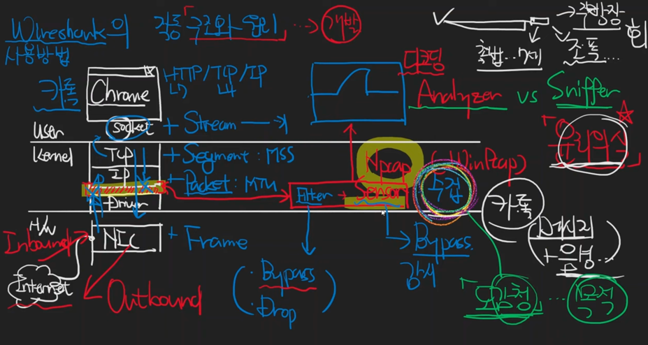

# Wireshark의 내부구조와 작동원리

* TCP/IP 이후에 약간 띄어놓은 이유
  * 띄어놓은 자리는 필터를 끼어놓을 수 있는 자리이다.
  * 필터를 통과시키는 경우: `ByPass`
  * 필터를 통과시키지 않은 경우: `Drop`

* Host에서 Network쪽으로(바깥쪽으로) 나가는 경우: `Outbound`
* Network쪽에서 들어오는 경우: `Inbound`

* Filter자리에서 들어오는지 여부만 파악하는 경우: `Sensor`
  * 역할적으로 얘기하면 `수집`

* Wireshark의 하는일
  * Npcap(Sensor 역할)을 통해서 데이터를 수집을 하고 분석해서 보여준다.