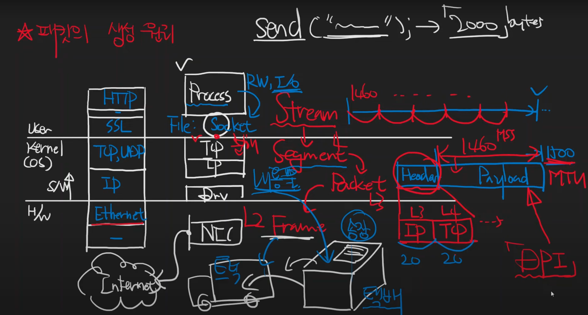

# 패킷의 생성 원리와 캡슐화

* Stream이 TCP 계층에서 데이터가 잘게 쪼개져 Segment가 된다.
* Segment는 L3 Internet Protocol에서 Packet으로 포장이 되는데, Packet의 주요 구성은 Header와 Payload이다.
* Header는 순차적으로 IP헤더(L3), TCP헤더(L4)로 구성되며, 일반적으로 각각 20바이트를 차지한다. 
* 그렇기 떄문에 보통 1500 바이트(MTU)를 하는 Packet의 내용물은 1460바이트이고 MSS(Maximum Segment Size)도 이 정도 크기로 추측된다.
* DPI(Deep Packet Inspection): Packet 내부의 Payload를 조사하는 것

## Reference
https://www.youtube.com/watch?v=Bz-K-DPfioE&list=PLXvgR_grOs1BFH-TuqFsfHqbh-gpMbFoy&index=14