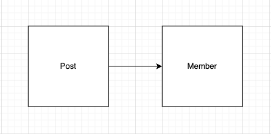

# Chapter01. 객체, 설계

윽.. 정말 어렵다..

## 책 내용 정리

> 가장 심각한 문제는 이것이 아니다. 그것은 Audience와 TicketSeller를 변경할 경우 Theater도 함께 변경해야 한다는 사실이다.  
> 오브젝트(16p)

* 프로세스와 데이터를 별도의 모듈에 위치시키는 방식을 절차적 프로그래밍(Procedural Programming)이라고 부른다.
  * 절차적 프로그래밍의 세상에서는 데이터의 변경으로 인한 영향을 지역적으로 고립시키기 어렵다.

* 데이터와 프로세스가 동일한 모듈 내부에 위치하도록 프로그래밍하는 방식을 객체지향 프로그래밍(Object-Oriented Programming)이라고 부른다.
  * 휼륭한 객체지향 설계의 핵심은 캡슐화를 이용해 의존성을 적절히 관리함으로써 객체 사이의 결합도를 낮추는 것이다.

> 여러분의 코드에서 데이터와 데이터를 사용하는 프로세스가 별도의 객체에 위치하고 있다면 절차적 프로그래밍 방식을 따르고 있을 확률이 높다.  
> 데이터와 데이터를 사용하는 프로세스가 동일한 객체 안에 위치한다면 객체지향 프로그래밍 방식을 따르고 있을 확률이 높다.

> 설계를 어렵게 만드는 것은 `의존성`이라는 것을 기억하라.  
> 해결 방법은 불필요한 의존성을 제거함으로써 객체 사이의 `결합도`를 낮추는 것이다.
> ...  
> 불필요한 세부사항을 캡슐화하는 자율적인 객체들이 낮은 결합도와 높은 응집도를 가지고 협력하도록 최소한의 의존성만을 남기는 것이 휼륭한 객체지향 설계다.
> 오브젝트(29p)

## 생각 정리

책에서는 1장부터 객체 지향적으로 프로그래밍하는 것에 대해 코드를 통해 예시를 들며 보여주었다.
절차 지향적 프로그래밍을 객체 지향적으로 변경하는 것을 보여주면서 문제점으로 가장 크게 지적한건 '변경' 되었을 때이다.

우리가 흔히 아는 `의존성(Dependency)`이라는 것은 객체들간의 협력의 관점에서는 당연하게 필요한 부분이지만, 결합도를 최소한으로 가져가야 한다.
그 이유는 의존하는 객체의 변경이 일어났을 때, 그 영향을 받기 떄문이다.  

Post가 Member를 의존하고 있다고 생각해보자.

여기서 Post는 Member에 의존하고 있다. 이럴 경우에 결합도가 높은 경우에 Member에서의 변경이 발생했을 때 Post에 변경을 발생 시킬 수 있다.  
상속 관계에서도 합성 관계에서도 마찬가지이다. 따라서 이러한 의존성을 낮추기 위해서 외부에서 직접 접근하여 상태를 변경하는 것이 아닌 상태의 내부에서 상태를 변경하고  
그런 행위에 대한 메서드를 최소화해서 접근할 수 있게 해야한다. 그럴 경우에 변경이 발생할 확률, 변경이 되었더라도 고치는 범위를 확연하게 줄일 수 있다.  
즉, 각 객체마다 자율성을 가지게 하여 응집도를 높이고 외부 객체들과의 결합도는 최소화 해야한다.

또한, 객체 지향 프로그래밍과 절차 지향 프로그래밍의 차이점을 느낄 수 있었는데,
객체 지향의 경우에는 데이터와 데이터를 사용하는 프로세스가 동일한 객체에서 발생한다. 즉, 자율적으로 객체들이 움직인다.  
반면에 절차 지향의 경우에는 데이터와 데이터를 사용하는 프로세스가 별도의 객체에 위치한다. 즉, 수동적으로 객체들을 움직이게 한다.

이 부분을 이 번장에서 배울 수 있었다.  

  
