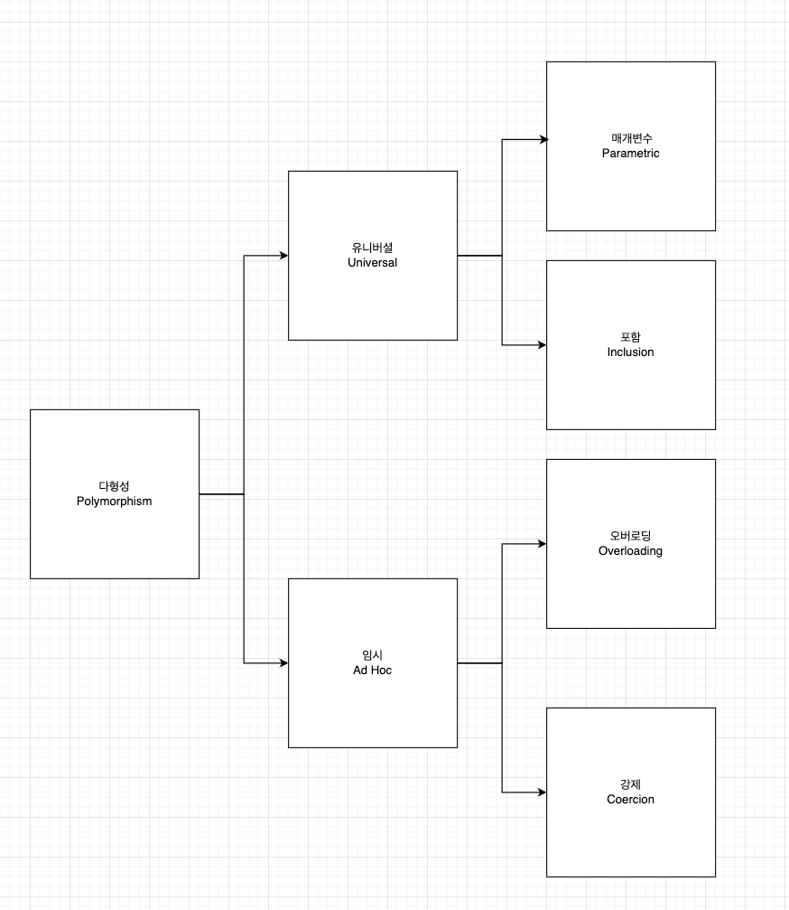

# Chapter12. 다형성

* 상속의 주된 용도는 `코드 재사용`이 아닌 `타입 계층의 구조화`이다.
* `코드 재사용`이 주된 목적이라면 사용하면 안 된다.
* 다형성은 런타임시 메시지를 처리하기 위해 동적으로 탐색해 나가는 과정을 통해 구현된다.
* 상속은 메시지를 처리할 수 있도록 혹은 메서드를 찾기 위한 탐색 경로를 클래스 계층의 형태로 구현하기 위한 방법이다. 

## 01. 다형성

* 다형성(Polymorphism)은 `많은 형태를 가질 수 있는 능력 혹은 성질`을 의미한다.  
* 다형성은 유니버셜 다형성과 임시 다형성으로 분류할 수 있다.
  * 유니버셜 다형성은 매개변수 다형성과 포함 다형성으로 분류할 수 있다.
  * 임시 다형성은 오버로딩 다형성과 강제 다형성으로 분류할 수 있다.




### Overloading Polymorphism
* 오버로딩 다형성은 하나의 클래스 내에서 동일한 반환값과 동일한 메서드 이름을 가지고 있지만 매개변수가 다른 경우의 다형성을 의미한다.

```java

@RequiredArgsConstructor
public class MemberService {
	private final MemberQueryRepository memberQueryRepository;
	
	
	public Member findBy(String email) {
        //...
    }

	public Member findBy(Long memberId) {
		//...
	}
}
```

findyByEmail, findById와 같이 구분을 주지 않고도 매개변수에 들어오는 타입에 따라 구분지을 수 있다.

### Coercion Polymorphism

* 강제 다형성은 동일한 연산자를 다양한 타입으로 사용할 수 있는 방식을 의미한다.
* 언어 자체에서 지원해주는 강제 다형성과, 사용자기 직접 구현한 강제 다형성도 존재한다.
* 강제 다형성은 **묵시적 형변환이 자동으로 발생하는 개념**으로 이해하면 좋다.
  * [Coercion in Java](https://www.javatpoint.com/coercion-in-java)

```java
public class PolymorphismTest {

	@DisplayName("강제 다형성을 테스트한다. 피연산자 중 하나가 문자열일 경우 문자열을 리턴한다.")
	@Test
	void coercionPolymorphism() {
		// given
		final Integer a = 10;
		final String b = "20";

		// when & then
		assertThat(a + b).isEqualTo("1020");
		assertThat((a + b) instanceof String).isTrue();
	}
}
```


