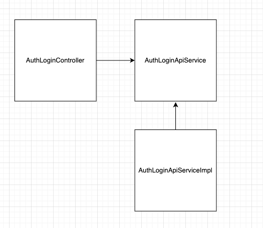

# Interface

## 📌 들어가기 전에

개발일을 하다보면 Interface란 용어를 자주 마주치게 된다. 학부생 시절부터 해당 용어를 이해하기에 개인적으로는 어려움이 있었다.😅  

* User Interface의 약어인 UI
* Application Programming Interface의 약어인 API
* Java에서 사용하는 Interface


여러 방면에서 사용되고 있는 Interface에 대해서 어떻게 받아들이면 좋을지 필자가 이해한 부분을 토대로 정리해보고자 한다.

## 📌 Interface란?

> 일반적으로 인터페이스란 어떤 두 사물이 마주치는 경계 지점에서 서로 상호작용할 수 있게 이어주는 방법이나 장치를 의미한다.  
> 객체지향의 사실과 오해. 162p


인터페이스에 대해서 가장 와닿았던 정의는 위와 같다.

좀 더 간략하게 정리해보면,  

`서로 다른 두 사물이 서로 상호작용할 수 있도록 이어주는 방법이나 장치.`


### 텔레비전 예시를 통해 이해 해보기


> 참고: https://www.instiz.net/name/36598496?1

위에 짱구 이미지에는 텔레비전과 짱구 그리고 리모컨이 등장한다. 여기서 Interface는 어떤 걸 가르킬까?  

**리모컨**이다. 서로 다른 사물인 짱구와 텔레비전을 이어주는 장치인 리모컨이 Interface이다.

우리는 리모컨에 대한 사용법만 알고 있어도 텔레비전의 동작 원리나, 내부 구조에 대해서 모르더라도 텔레비전을 과 상호작용할 수 있다.

### 자동차 예시를 통해 이해 해보기


> 참고: https://post.naver.com/viewer/postView.nhn?volumeNo=34914503&memberNo=2744973

또 다른 예시로 자동차를 들어보자.  
자동차와 사람을 상호작용할 수 있도록 이어주는 것은 무엇이 있을까?  

바로 엑셀이다. 사실 엑셀 말고도 여러가지가 있다. 핸들, 브레이크, 변속기 등등

우리는 자동차의 내부 동작 방식, 자동차 내부의 구조 등을 전혀 알지 못하고 단순히 인터페이스에 대한 사용법만을 익히더라도 자동차를 운전함에 있어서 
문제가 없다.

### API 예시를 통해 이해 해보기

좀 더 우리에게 필요한 상황으로 예시를 들어보자. 바로 Application Programming Interface이다. 
프론트엔드 개발자와 백엔드 개발자가 협업을 할 때 API 문서에 대한 이야기를 자주 하게 된다. 여기서 API는 서로 다른 어떤걸 상호작용할 수 있도록 이어주는 걸까?
바로 Client와 Server이다. API 문서대로 Client는 요청을 보내게 되고 Server 쪽에서 요청에 맞는 응답을 보냄으로써 서로 통신을 주고 받을 수 있게 된다.

## Java에서의 Interface

위 예시들을 통해서 대략적인 감을 잡을 수 있었다고 생각이 든다.

그렇다면 Java에서의 Interface는 어떨까? 이해할 수 있도록 아래의 예시를 가져와 봤다.

```java
@RestController
@RequiredArgsContructor
// ...
public class AuthLoginController {
	private final AuthLoginApiService authLoginApiService;

	@PostMapping("/login")
	@ResponseStatus(HttpStatus.OK)
	public AuthLoginResponse login(@RequestBody AuthLoginRequest request) {
		return authLoginApiService.login(request);
	}
}
```

```java
public interface AuthLoginApiService {
	void login(AuthLoginRequest request);
}
```


```java
@Service
@RequiredArgsConstructor
public class AuthLoginApiServiceImpl implements AuthLoginApiService {
	@Transactional
    @Override
	public AuthLoginResponse login(AuthLoginRequest request) {
		// ...
		return AuthLoginResponse.of();
	}
}
```




AuthLoginController는 interface인 AuthLoginApiService에 의존하고 있다.  
AuthLoginApiService를 구현한 구현 클래스는 AuthLoginApiServiceImpl이다.

여기서도 위의 정의를 적용해보면 아래와 같다.  

서로 다른 AuthLoginController와  AuthLoginApiServiceImpl을 상호작용할 수 있도록 이어주는 방법 혹은 장치는 AuthLoginApiService이다.

AuthLoginController는 "로그인 해줘"라는 메시지를 전송할 뿐 구현 클래스의 메서드가 어떻게 구현되어 있는지는 전혀 알지 못한다.
단지, AuthLoginApiService가 로그인을 할 수 있다는 사실 만을 알고 있을 뿐이다. 


