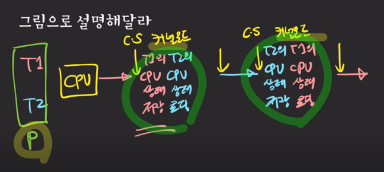
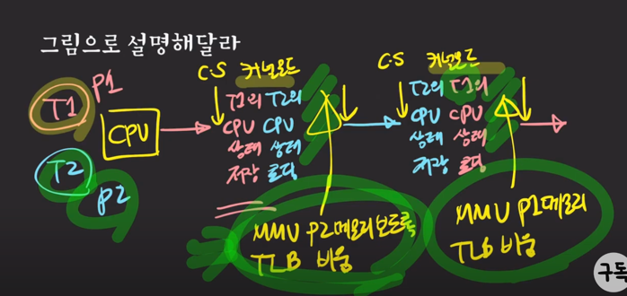

# Context Swtiching

## Program이란?
컴퓨터가 실행할 수 있는 명령어들의 집합이다.

## Process란?
* 컴퓨터에서 실행 중인 프로그램을 의미한다. 
* 각각의 프로세스는 `독립된 메모리 공간`을 할당 받는다.
* 명령어들과 데이터를 가짐

## CPU(Central Processing Unit)란?
* 연산과 제어를 수행하는 중앙처리 장치
  * 제어: 컴퓨터의 모든 장치의 동작을 제어한다.

## CPU? Processor? Core ?
* CPU는 Processor와 같은 개념이다.
* CPU와 Core는 동일 개념이 아니다.
    * CPU 한개에 1개 이상의 Core를 포함하고 있다.

## Main Memory란?
* 프로세서가 수행할 프로그램과 데이터를 저장하는 공간.

## I/O(Input/Output)
* 파일을 읽고 쓰는 것
* 네트워크의 어딘가와 데이터를 주고 받는 것
* 입출력 장치와 데이터를 주거나 받는 것

## 단일 프로세스 시스템
### 단일 프로세스 시스템이란?
* 한 번에 하나의 프로그램만 실행됨
### 단일 프로세스의 단점
* CPU 사용률이 좋지 않음
  * Process가 I/O작업을 하는 동안 CPU는 아무 것도 하지 않음

### 여기서 궁금증..! I/O작업을 하는 주체는 CPU가 아닌가?

I/O작업을 하는 주체는 CPU가 아닌 `입출력 장치`이다. CPU는 주로 연산을 처리하고 명령을 실행하는 역할을 수행하고
입출력 장치는 데이터를 읽거나 쓰는 작업을 수행한다. 예를 들어 하드 디스크에서 파일을 읽거나 쓰는 작업, 네트워크에서 데이터를 전송하거나 수신하는 작업, 키보드나 마우스의 입력을 처리하는 작업 등이 입출력 작업의 일부이다.
입출력 작업은 CPU의 명령에 의해 시작되지만, 실제 데이터 전송이나 처리는 해당 입출력 장치에서 이루어진다.

## 멀티 프로그래밍

### 단일 프로세스의 문제 해결책(멀티 프로그래밍의 등장과 배경)
* 여러 개의 프로그램을 메모리에 올려놓고 동시에 실행시키자!
* IO 작업이 발생하면 다른 프로세스가 CPU에서 실행됨.

### 멀티 프로그래밍의 목적
* CPU 사용률을 극대화 시키는데 목적이 있음

### 멀티 프로그래밍의 단점
* CPU 사용 시간이 길어지면 다른 프로세스는 계속 대기를 해야 함.

## 멀티 태스킹

### 등장과 특징(멀티 프로그래밍의 해결책)
프로세스는 한 번 CPU를 사용할 때 아주 짧은 시간(=quantum)만 CPU에서 실행되도록 하자!

### 멀티 태스킹 목적
프로세스의 응답 시간을 최소화 시키는데 목적이 있음.

### 남아있는 아쉬움
1. 하나의 프로세스가 동시에 여러 작업을 수행하지는 못함.
2. 프로세스의 컨텍스트 스위칭은 무거운 작업
3. 듀얼 코어가 등장했는데 잘 쓰고 싶음

## 멀티 스레딩

### 멀티 스레딩의 목적

하나의 프로세스가 동시에 여러 작업을 실행하는데 목적을 가지고 있다.
### 특징
1. 프로세스는 한 개 이상의 스레드 가질 수 있다.
2. CPU에서 실행되는 단위(unit of execution)
3. 같은 프로세스의 스레드들끼리 컨텍스트 스위칭은 가볍다.
4. 스레드들은 자신들이 속한 프로세스의 메모리 영역을 공유한다.
    * 데이터 공유가 쉽다
    * 컨텍스트 스위칭이 가볍다.

### 확장된 멀티태스킹 개념
여러 프로세스와 여러 스레드가 아주 짧게 쪼개진 CPU time을 나눠 갖는 것

## 멀티 프로세싱?
두 개 이상의 프로세서나 코어를 활용하는 시스템

---
## Context Switching이란?

CPU/Core에서 실행 중이던 프로세스/스레드가 다른 프로세스/스레드로 교체되는 것

## Context란?

프로세스/스레드의 상태를 의미한다.

## Context Switching은 왜 필요할까?

여러 프로세스/스레드를 동시에 실행시키기 위해서 필요하다.

## Context Switching은 언제 발생할까?
* 주어진 time slice(quantum)를 다 사용했을 경우
* IO 작업을 해야하는 경우
* 다른 리소스를 기다려야 하는 경우
* ...

## Context Switching은 누구에 의해 실행되나?
* OS kernel(운영체제 내에서 가장 핵심적인 기능을 담당하는 존재)
  * 각종 리소스를 관리/감독하는 역할 => kernel

## Context Switching은 구체적으로 어떤 과정으로 일어나는가?
* 다른 프로세스 끼리의 스위칭 
  * Process Context Switching
* 같은 프로세스의 스레드들끼리의 스위칭인지에 따라 다르다.
  * Thread Context Switching

## 둘의 공통점은 무엇일까?
1. Kernel mode에서 실행
   * Context Switching은 커널에게 통제권이 넘어가고 커널에 의해서 실행된다(커널 모드라고 표현)   
2. CPU의 레지스터 상태를 교체

## 둘의 차이점은?
* Process Context Switching은 가상 메모리 주소 관련 처리를 추가로 실행해줘야 한다.
* MMU?
* TLB?

## Thread Context Switching

## Process Context Switching

## Theread Context Switching이 더 빠른 이유는?
* 메모리 주소 관련 처리는 하지 않기 때문

## 컨텍스트 스위칭이 미치는 간접적인 영향은?
* 캐시(cache) 오염(pollution)

## 유저 관점에서 Context Switcing?
* 순수한 오버헤드이다.

## Reference 
* [프로세스, 스레드, 멀티태스킹, 멀티스레딩, 멀티프로세싱, 멀티프로그래밍](https://www.youtube.com/watch?v=QmtYKZC0lMU)
* [컨텍스트 스위칭 뽀개기!](https://www.youtube.com/watch?v=Xh9Nt7y07FE&t=1s)