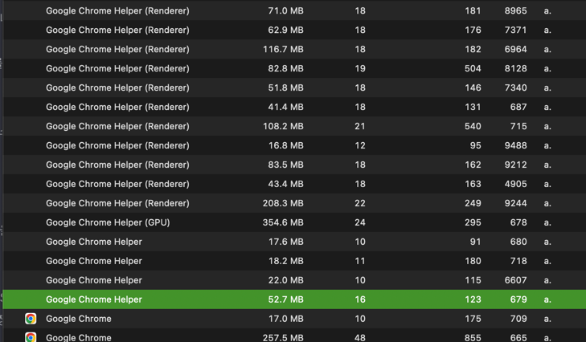

# Multi Process And Multi Thread

멀티 프로세스와 멀티 스레드는 하나의 애플리케이션에 대한 병렬 프로그래밍 기법을 나타낸다.

## Multi Process란?

하나의 애플리케이션에 대해서 동시에 2개 이상의 프로세스를 실행 시키는 걸 의미한다. 
각 프로세스는 독립적으로 실행되며 운영체제에 의해 별도의 메모리 공간을 할당 받는다.
멀티 프로세스 방식으로 처리하는 대표적인 사례로는 크롬 브라우저가 존재한다. 새 탭을 띄울 때마다 프로세스가 생성되는 것으로 보인다.

## Multi Thread란? 
하나의 프로세스 안에 2개 이상의 스레드를 동시에 실행 시키는 걸 의미한다. 
멀티 프로세스와 다르게 각 Thread는 Stack, Register, Program Counter를 제외한 나머지 영역인 코드, 데이터, 힙 영역 등에 대해서 공유한다.

## Multi Process의 장점?
Multi Process의 주요 특징으로, "각 프로세스는 독립적으로 실행되며 운영체제에 의해 별도의 메모리 공간을 할당 받는다" 가 있다.
그렇기 때문에 시스템을 확장을 하거나 문제가 생겼을 때 안전하다.

### 확장에 안전하다.

프로세스는 생성될 때 마다 독립적인 메모리 공간을 할당 받기 때문에 
멀티 스레드와 다르게 공유하는 자원이 존재하지 않는다. 그렇기 때문에 동일한 프로세스를 여러 개를 띄우더라도 안전성을 보장 받는다.
한 예시로 하나의 서버 내부에 여러 개의 동일한 프로세스를 생성해서 로드 벨런싱을 통해서 요청을 분산 시킬 수 있다.

### 문제가 생겼을 때 안전하다.
구글 크롬의 탭(프로세스) 중 하나가 문제가 생기더라도 다른 프로세스들에 영향이 없기 때문에 안전하다.

## Multi Process의 단점?

### 메모리 낭비
Multi Process는 각 프로세스 마다 독립적인 메모리 공간을 할당 받기 때문에 Multi Thread에 비해 메모리 공간 낭비가 심하다.

### Process Context Switching
프로세스 마다 Context Switching이 발생할 떄 Thread Context Switching에 비해 가상 메모리 관련 TLB(Translation Lookaside Buffer) 초기화, PTBR(Page Table Base Register) 변경 등 추가적인 처리를 필요로 하고 그 만큼 오버헤드가 발생한다.

## Multi Thread의 장점?

위에서 적었던 Multi Process의 단점과 같다.

### 메모리를 효율적으로 사용 가능
Thread는 다른 말로 경량 프로세스(Light Weight Process)라고 부르는 만큼 Thread 생성 시 메모리를 차지하는 용량은 1MB 정도라고 한다. 
Multi Process와 다르게 각 Thread마다 하나의 프로세스에서 코드, 데이터, 힙 영역 등을 공유하기 때문에 Multi Process에 비해 메모리를 효율적으로 사용 가능하다.

### Thread Context Switching
Context Switching이 발생할 때 공유 자원 즉, 가상 메모리 관련 작업을 제외하고 Switching이 일어나기 때문에 Process Context Switching에 비해 오버헤드가 덜 발생한다.

## Multi Thread의 단점?

### 문제가 생겼을 때 안전하지 않을 수 있다.
Process 내부 하나의 Thread에 문제가 생기면 프로세스 전체에 문제가 생길 수 있다. 모든 스레드는 프로세스의 자원을 공유하고, 하나의 스레드에 문제가 생기면 다른 스레드도 영향을 받기 때문이다.

### 동기화로 인한 성능 저하가 발생
Process 내부의 자원을 공유하다 보니 해당 공유 자원에 동시에 접근하는 Thread들에 대한 동시성 제어가 필수적으로 필요하다. 
동시성 제어를 위한 다양한 방법(synchronized, cas algorithm)이 존재하지만 병목현상으로 인한 성능 저하가 발생할 가능성이 크다.

