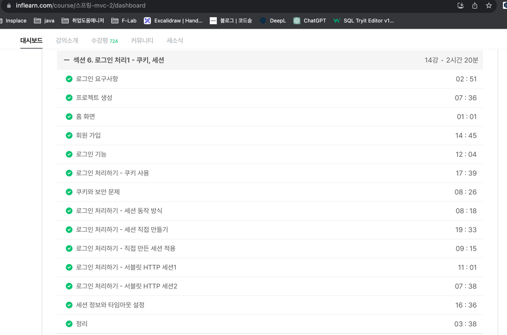

# [TIL] 23.09.14

* 알고리즘 풀기
  * [letter-combinations-of-a-phone-number](../java_algorithm/leetcode/src/letter_combinations_of_a_phone_number/Solution.java)
* 개인 공부
  * JSP & Servlet Chapter 10 
  * [Session 관련 공부](../web_study/session.md)
    * 스프링 MVC 2편 - 백엔드 웹 개발 활용 기술 강의를 통한 쿠키와 세션 관련 공부
    * 
  * [쿠키 보안 관련 공부(진행 중)](../web_study/cookie_security.md)