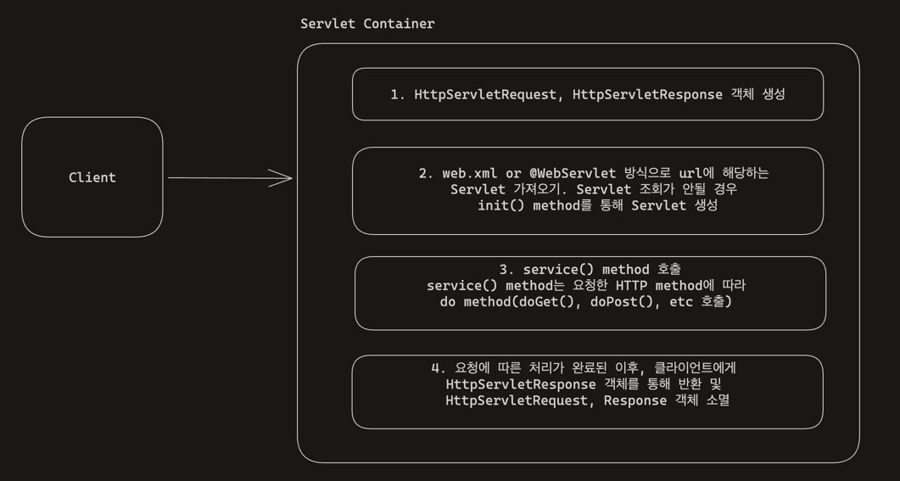

# Servlet

## Servlet?
클라이언트의 요청을 처리하고 처리한 요청에 대해서 응답을 수행 하는 클래스를 말한다.  
 
## Servlet이 없다면?
비즈니스 로직에만 집중할 수 없게 된다. 비즈니스 로직 전 후로 처리해야 할 작업을 나열해 보았다.

### 비즈니스 로직 전
* 서버 TCP/IP 연결 대기, 소켓 연결
* HTTP 요청 메세지를 파싱해서 읽기.
* POST 방식, /save URL 인지
* Content-Type 확인
* HTTP 메시지 바디 내용 파상
* 데이터를 사용할 수 있도록 파싱

### 비즈니스 로직 이후
* HTTP 응답 메시지 생성 시작
  * HTTP 시작 라인 생성
  * Header 생성
  * 메시지 바디에 HTML 생성해서 입력
* TCP/IP에 응답 전달, 소켓 종료


## Servlet Container?
* 톰캣처럼 서블릿을 지원하는 WAS를 서블릿 컨테이너라고 하며 Servlet을 관리하는 역할을 수행한다.
* 서블릿 컨테이너는 서블릿 객체를 생성, 초기화, 호출, 종료하는 생명주기를 관리한다.
* 서블릿 객체는 `싱글톤으로 관리`한다.
* JSP역시 서블릿으로 변환 되어서 사용
* `동시 요청을 위한 멀티 쓰레드 처리 지원을 해준다.`

## Servlet은 어떻게 동작할까?



1. 브라우저에서 Http 요청을 한다. 
2. Servlet Container는 각 요청마다 HttpServletRequest와 HttpServletResponse객체를 생성한다.(이 객체들은 http 요청과 응답에 관련된 모든 정보를 가지고 있다.)
3. Servlet Container는 요청된 url에 해당하는 서블릿을 찾는다. 이때 서블릿이 초기화 되지 않은 상태라면, init() method를 호출하여 서블릿을 초기화하게 된다. 초기화 과정은 애플리케이션 실행 동안 단 한 번만 수행된다.
4. 서블릿을 찾았다면 Servlet Container는 service() method를 호출합니다. service() method는 HTTP method( GET,POST, PATCH, ...)에 따라 doGet(), doPost() 를 호출한다. 
5. 이 메서드들은 실제 요청을 처리하고 응답을 생성한다.
6. 서블릿은 요청 처리 이후 HttpServletResponse 객체를 사용하여 응답을 클라이언트에게 반환한다.
7. 이후 HttpServletRequest 및 HttpServletResponse 객체는 소멸된다.

### 궁금증 ..! 
Servlet Container는 Servlet에 대한 조회를 어떻게 하는 걸까? web.xml 방식이 아닌 @WebServlet annotation을 통해서 등록을 하는 걸로 보이는데 해당 코드는 어디에 존재하는지 아직 찾지 못했다..
즉, 찾는 경우에 대한 이해도가 아직 필요하다. Servlet Container에서 HttpServletRequest와 HttpServletResponse객체를 생성한 이후에 url을 통해서 어떻게 관련된 servlet을 찾는지!


## Servlet 호출은 누가할까?
Thread이다. 정말 ?! 아래 코드를 통해 확인해보자. 

```java
package servlet_test.servlet.basic;
import java.io.IOException;
import javax.servlet.ServletException;
import javax.servlet.annotation.WebServlet;
import javax.servlet.http.HttpServlet;
import javax.servlet.http.HttpServletRequest;
import javax.servlet.http.HttpServletResponse;

@WebServlet(name = "helloServlet", urlPatterns = "/hello")
public class HelloServlet  extends HttpServlet {
	@Override
	protected void service(HttpServletRequest request, HttpServletResponse response) throws ServletException, IOException {
		System.out.println("currentThread Name: " + Thread.currentThread().getName());
		super.service(request, response);
	
	}
}

/*

currentThread Name: http-nio-8080-exec-2
currentThread Name: http-nio-8080-exec-3
currentThread Name: http-nio-8080-exec-4
currentThread Name: http-nio-8080-exec-5
currentThread Name: http-nio-8080-exec-6
currentThread Name: http-nio-8080-exec-7
currentThread Name: http-nio-8080-exec-8
currentThread Name: http-nio-8080-exec-9
currentThread Name: http-nio-8080-exec-10
currentThread Name: http-nio-8080-exec-1
currentThread Name: http-nio-8080-exec-2
currentThread Name: http-nio-8080-exec-3
currentThread Name: http-nio-8080-exec-4
currentThread Name: http-nio-8080-exec-5
currentThread Name: http-nio-8080-exec-6
currentThread Name: http-nio-8080-exec-7
currentThread Name: http-nio-8080-exec-8
...
*/
```

## 나는 Thread를 생성한 적이 없는데..?
Servlet Container는 멀티 스레딩을 지원해주는데 프로그램 실행 시 미리 thread들을 생성해서 pool에서 관리하고 있다.
그렇기 때문에 다양한 thread들이 요청 시에 thread pool에 IDLE 상태인 thread와 연결되어서 처리하고 반납되는 것이다.

## 요청 마다 Thread를 생성할 경우에는 어떻게 될까?
### 장점
* 동시 요청을 처리 할 수 있다.
* 리소스(CPU, 메모리)가 허용할 때 까지 처리가 가능하다.
* 하나의 쓰레드가 지연 되어도, 나머지 쓰레드는 정상 동작한다.

### 단점
* `쓰레드는 생성 비용이 매우 비싸다.`
  * 요청 시 마다 쓰레드를 생성하면, 응답속도가 늦어진다.
* 쓰레드가 많아질 수록 컨텍스트 스위칭 비용이 발생한다.
* 쓰레드 생성에 제한이 없다.
  * 요청이 너무 많이 들어올 경우, CPU, 메모리 임계점을 넘어서 서버가 죽을 수 있다.

## 요청 마다 쓰레드 생성의 대안으로 생겨난 쓰레드 풀
 
### 특징 
* 필요한 쓰레드를 쓰레드 풀에 보관하고 관리한다.
* 쓰레드 풀에 생성 가능한 쓰레드의 최대치를 관리한다. 톰캣은 max_connections default = 200

### 사용 
* 쓰레드가 필요하면, 이미 생성되어 있는 쓰레드를 쓰레드 풀에서 꺼내서 사용한다.
* 사용을 종료하면 쓰레드 풀에 해당 쓰레드를 반납한다.
* 최대 쓰레드가 모두 사용 중이어서 쓰레드 풀에 쓰레드가 없으면?
  * 기다리는 요청은 거절하거나 특정 숫자만큼만 대기하도록 설정이 가능하다.

### 장점 
* 쓰레드가 미리 생성되어 있으므로, 쓰레드를 생성하고 종료하는 비용(CPU)이 절약되고, 응답 시간이 빠르다.
* 생성 가능한 쓰레드의 최대치가 있으므로 너무 많은 요청이 들어와도 기존 요청은 안전하게 처리할 수 있다.
  
### max_connections를 너무 낮게 설정한다면?
한 예시로 max_connections를 10으로 설정하고 1000개의 요청이 들어왔다고 가정해보자.
당연히 WAS는 안전할 것이다. 왜냐하면 10개의 thread가 전부 active 상태이고 대기하는 요청 수도 초과하게 되면 요청 자체를 거절하기 때문이다.
음.. 이렇게 된다면 자원(CPU) 자체를 5% ~ 10% 정도로 사용한 채로 클라이언트의 요청에는 지연되거나 거절하게 되는 상황이 되어버린다.

### max_connections를 너무 높이 설정한다면?
max_connections를 1000으로 설정하고 요청이 1000개 들어왔다고 가정해 보자.
이럴 경우에도 역시 장애로 이어질 수 있다. 왜냐하면 너무 많은 요청이 들어왔는데 해당 요청들을 전부 수용하게 되고, 리소스들의 임계치 초과로 결국 서버가 다운 될 것이다.

### 관련 설정 방법
```properties
# 쓰레드 최대 개수
server.tomcat.threads.max=100
# thread 활성화 상태로 유지할 최소 쓰레드 개수
server.tomcat.threads.min-spare= 100
# thread가 전부 사용 중일 경우 요청 대기 queue size 의미
server.tomcat.threads.accept-count=100
```

## Reference
* []()
* [Introduction to Java Servlets](https://www.baeldung.com/intro-to-servlets)