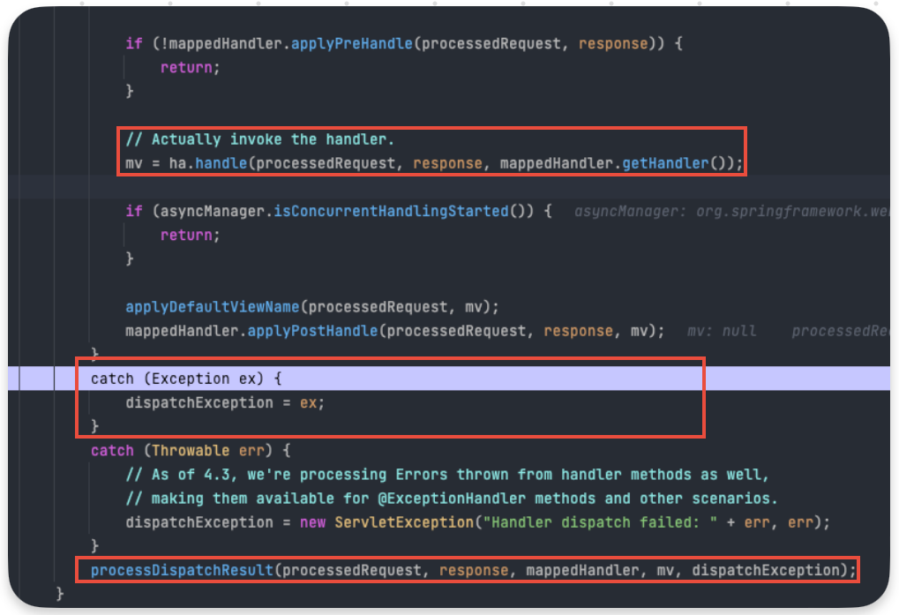
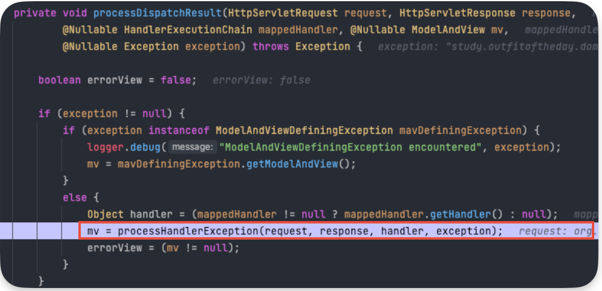
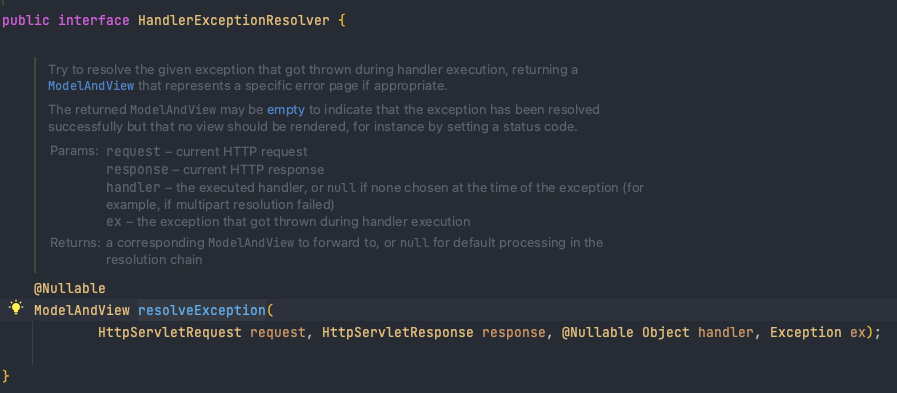
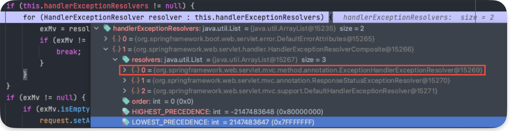

# @ExceptionHandler와 @ControllerAdvice


## @ExceptionHandler 어노테이션은 뭘까?

@ExceptionHandler 어노테이션이란, @Controller/@RestController 어노테이션이 붙어있는 클래스 내에서 발생하는 예외를 메서드에서 따로 처리할 수 있는 기능을 제공한다.
아래와 같이 memberService.findMemberByLoginId() method에서는 유저가 조회되지 않을 때 NotFoundMemberException 예외가 발생하는데,
해당 예외를 @ExceptionHandler 어노테이션을 붙인 메서드에서 처리할 수 있다.

```java

package study.outfitoftheday.web.member.controller;

import static study.outfitoftheday.global.util.UriPrefix.*;

import org.springframework.http.HttpStatus;
import org.springframework.web.bind.annotation.DeleteMapping;
import org.springframework.web.bind.annotation.ExceptionHandler;
import org.springframework.web.bind.annotation.GetMapping;
import org.springframework.web.bind.annotation.PathVariable;
import org.springframework.web.bind.annotation.PostMapping;
import org.springframework.web.bind.annotation.RequestBody;
import org.springframework.web.bind.annotation.RequestMapping;
import org.springframework.web.bind.annotation.ResponseStatus;
import org.springframework.web.bind.annotation.RestController;

import jakarta.validation.Valid;
import lombok.RequiredArgsConstructor;
import study.outfitoftheday.domain.member.entity.Member;
import study.outfitoftheday.domain.member.exception.NotFoundMemberException;
import study.outfitoftheday.domain.member.service.MemberService;
import study.outfitoftheday.global.annotation.LoginMember;
import study.outfitoftheday.global.annotation.RequiredAuth;
import study.outfitoftheday.global.response.ApiResponse;
import study.outfitoftheday.web.member.controller.request.MemberSignUpRequest;
import study.outfitoftheday.web.member.controller.response.MemberGetByLoginIdResponse;

@RestController
@RequiredArgsConstructor
@RequestMapping(MEMBER_URI_PREFIX)
public class MemberController {
	private final MemberService memberService;
	
	@GetMapping("/{loginId}")
	public ApiResponse<MemberGetByLoginIdResponse> memberGetByLoginId(
		@PathVariable String loginId
	) {

		Member foundMember = memberService.findMemberByLoginId(loginId);
		return ApiResponse.ok(MemberGetByLoginIdResponse.from(foundMember));
	}

	@ExceptionHandler(NotFoundMemberException.class)
	public ApiResponse<Object> handleNotFoundMemberException(NotFoundMemberException e) {
		return ApiResponse.badRequest("hello~");
	}
}

```

```java

@RequiredArgsConstructor
@Service
@Transactional
public class MemberService {
	private final PasswordEncoder passwordEncoder;
	private final MemberRepository memberRepository;

	public Member findMemberByLoginId(String loginId) {
		return memberRepository.findByLoginIdAndIsDeletedIsFalse(loginId)
			.orElseThrow(() -> new NotFoundMemberException("로그인 정보가 일치하지 않습니다."));
	}
}
```

## @ExceptionHandler 어노테이션은 어떻게 동작할까?

디버깅을 통해서 어떻게 동작하는지 체크해보자.



DispatcherServlet의 doDispatch() method에서 handle() method를 호출하면서 Controller를 통해 Service 로직을 가게 된다. 거기서 `NotFoundMemberException` 예외가 발생한다. 그리고 doDispatch() method 내부의 catch 문으로 빠지게 된다.
 예외에 대한 내용을 `processDispatchResult() method`에 전달한다.




processDispatchResult() method 내에서는 processHandlerException() method를 호출한다.
processHandlerException() method에서 중요하게 봐야할 부분은 2가지 이다.
resolver.resolveException() method와 request.setAttribute() method이다. 
method 네이밍에서 알 수 있다시피, 예외를 resolveException() method에서 해결하고 예외를 request의 속성값에  추가하고 마무리하게 된다.



DispatcherServelet 내부에 `handlerExceptionResolvers` 가 존재하는데 Spring에서는 에외 처리를 할 수 있도록 스프링에서 기본적으로 다양한 전략들을 제공해주고 있고 그 중에 세 개는 디폴트로 등록되도록 설정되어 있다.<br>
그 중에 @ExceptionHandler 어노테이션이 붙은 method를 찾아 예외 처리를 할 수 있도록 도와주는 구현체는  `ExceptionHandlerExceptionResolver`이다. 



ExceptionHandlerExceptionResolver 구현체를 통해서 Controller의 ExceptionHandler로 처리가 가능한지 검사하게 된다.ExceptionHandler를 Reflection API를 통해서 조회하게 되고 예외를 반환한다.


## @ControllerAdvice 어노테이션은 뭘까?

@ExceptionHandler 어노테이션을 활용해서 위에서 지역적으로 예외 처리를 해보았다. <br>
@ControllerAdvice 어노테이션은 대상으로 지정한 컨트롤러에(대상을 지정하지 않으면 모든 컨트롤러에 적용) @ExceptionHandler 기능을 제공하는 역할을 한다.


