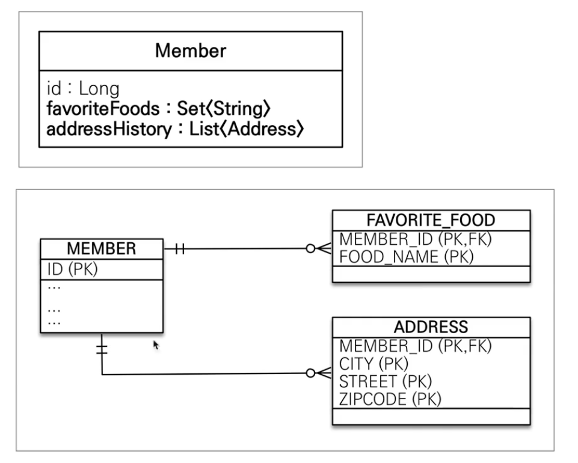

# JPA 값 타입

## 📗 기본값 타입

### JPA의 데이터 타입 분류

* 엔터티 타입
  * @Entity로 정의하는 객체
  * 데이터가 변해도 식별자로 지속해서 추적 가능
  * 예) 회원 엔터티의 키나 나이 값을 변경해도 식별자로 인식 가능
* 값 타입
  * int, Integer, String처럼 단순히 값으로 사용하는 자바 기본 타입이나 객체
  * 식별자가 없고 값만 있으므로 변경시 추적 불가
  * 숫자 100을 200으로 변경하면 완전히 다른 값으로 대체

### 값 타입 분류
* 기본값 타입
  * 자바 기본 타입(int, double)
  * 래퍼 클래스(Integer, Long)
  * String
* 임베디드 타입(embedded type, 복합 값 타입)
* 컬렉션 값 타입(collection value type)

### 기본값 타입 특징
* 생명주기를 엔터티에 의존
  * 예) 회원을 삭제하면 이름, 나이 필드도 함께 삭제된다.
* 값 타입은 공유하면 안된다.
  * 예) 회원 이름 변경시 다른 회원의 이름도 함께 변경되면 안된다.
  * int, double과 같은 기본 타입(primitive type)은 공유가 안된다.
  * 기본 타입은 항상 값을 복사함.
  * Integer같은 래퍼 클래스나 String같은 특수한 클래스는 공유 가능한 객체이지만 변경이 안된다.(불변 객체)


## 📗 임베디드 타입

### 임베디드 타입(복합 값 타입)

* 새로운 값 타입을 직접 정의할 수 있다.
* JPA는 임베디드 타입(Embedded type)이라고 한다.
* 주로 기본 값 타입을 모아서 만들기 때문에 복합 값 타입이라고도 함
* int, String과 같은 값 타입

### 임베디드 타입 사용법
* @Embeddable: 값 타입을 정의하는 곳에 표시
* @Embedded: 값 타입을 사용하는 곳에 표시
* 기본 생성자 필수

### 임베디드 타입 장점
* 재사용이 가능하다.
* 높은 응집도를 가진다.
* Period.isWork() 처럼 해당 값 타입만 사용하는 의미 있는 메서드를 만들 수 있다.
* 임베디드 타입을 포함한 모든 값 타입은 값 타입을 소유한 엔터티에 생명주기를 의존한다.


### 임베디드 타입과 테이블 매핑

* 임베디드 타입은 엔터티의 값일 뿐이다.
* 임베디드 타입을 사용하기 전과 후에 **매핑하는 테이블은 같다.**
* 객체와 테이블을 아주 세밀하게 매핑하는 것이 가능하다.
* 잘 설계한 ORM 애플리케이션은 매핑한 테이블의 수보다 클래스의 수가 더 많다.

### AttributeOverrides
* 한 Entity에서 같은 Embedded Type을 사용하고 싶으면?
  * Address Embedded Type인데, workAddress, homeAddress로 사용하고 싶다면?
  * @AttributeOverrides({@AttributeOverride(name="city", column=@Column("WORK_CITY")), ...}) 와 같이 컬럼 명 속성을 재정의 하면 사용 가능하다.

### 임베디드 타입과 null
* 임베디드 타입의 값이 null이면 매핑한 컬럼 값은 전부 null이다.


## 📗 값 타입과 불변 객체

> 값 타입은 복잡한 객체 세상을 조금이라도 단순화하려고 만든 개념이다. 따라서 값 타입은 단순하고 안전하게 다룰 수 있어야 한다.

### 값 타입 공유 참조
* **임베디드 타입 같은 값 타입을 여러 엔터티에서 공유하면 위험하다.**
* Side Effect 발생

### 값 타입 복사
* 값 타입의 실제 인스턴스인 값을 공유하는 것은 위험하다. 
* 대신에 값(인스턴스)을 복사해서 사용

### 객체 타입의 한계
* 항상 값을 복사해서 사용하면 공유 참조로 인해 발생하는 부작용을 피할 수 있다.
* 문제는 **임베디드 타입처럼 직접 정의한 값 타입은 자바의 기본 타입이 아니라 객체 타입**이다.
* 자바 기본 타입에 값을 대입하면 값을 복사한다.
* 객체 타입은 참조 값을 직접 대입하는 것을 막을 방법이 없다.
* 객체의 공유 참조는 피할 수 없다.

### 불변 객체

* 객체 타입을 수정할 수 없게 만들면 부작용을 원천 차단한다.
* 값 타입은 불변 객체(immutable object)로 설계해야함
* 불변 객체: 생성 시점 이후에 절대 값을 변경할 수 없는 객체
* 생성자로만 값을 설정하고 수정자를 만들지 않으면 된다.
* Integer, String은 자바가 제공하는 대표적인 불변 객체이다.

> 불변이라는 작은 제약으로 부작용이라는 큰 재앙을 막을 수 있다.
> 값 타입은 깔끔하게 전부 불변 객체로 만들자.

## 📗 값 타입의 비교

값 타입은 인스턴스가 달라도 그 안에 값이 같으면 같은 것으로 봐야 한다.(동등성)

* 동일성(identity) 비교: 인스턴스의 참조 값을 비교, == 사용
* 동등성(equivalence) 비교: 인스턴스의 값을 비교, equals() method ㅏㅅ용
* 값 타입의 equals() method를 적절하게 재정의 해주자.

## 📗 값 타입 컬렉션



```java
//...

@ElementCollection
@CollectionTable(name="FAVORITE_FOOD", joinColumns = @JoinColumn(name="MEMBER_ID"))
@Column(name="FOOD_NAME")
private Set<String> favoriteFoods = new HashSet<>();

@ElementCollection
@CollectionTable(name="ADDRESS", joinColumns = @JoinColumn(name="MEMBER_ID"))
private List<Address> addressHistory = new ArrayList<>();

//...

```
* 값 타입을 하나 이상 저장할 때 사용한다.
* @ElementCollection, @CollectionTable을 사용
* 데이터베이스는 컬렉션을 같은 테이블에 저장할 수 없다.
* 컬렉션을 저장하기 위한 별도의 테이블이 필요하다.

### 값 타입 컬렉션 사용
* 값 타입 컬렉션도 **지연 로딩 전략을 사용**한다.

### 값 타입 컬렉션의 제약사항
* 값 타입은 엔터티와 다르게 식별자 개념이 없다.
* 값은 변경하면 추적이 어렵다.
* **값 타입 컬렉션에 변경 사항이 발생하면, 주인 엔터티와 연관된 모든 데이터를 삭제하고, 값 타입 컬렉션에 있는 현재 값을 모두 다시 저장한다.**
* 값 타입 컬렉션을 매핑하는 테이블은 모든 컬럼을 묶어서 기본키를 구성해야 한다: **null 입력 X, 중복 저장 X**

### 값 타입 컬렉션 대안

* 실무에서는 상황에 따라 값 타입 컬렉션 대신에 **일대다 관계를 고려**
* 일대다 관계를 위한 엔터티를 만들고, 여기에서 값 타입을 사용한다.

### 정리

* 엔터티 타입의 특징
  * 식별자가 존재
  * 생명 주기 관리
  * 공유
* 값 타입의 특징
  * 식별자가 없음
  * 생명 주기를 엔터티에 의존
  * 공유하지 않는 것이 안전
  * 불변 객체로 만드는 것이 안전

>  값 타입은 정말 값 타입이라 판단될 때만 사용하자. 엔터티와 값 타입을 혼동해서 엔터티를 값 타입으로 만들면 안된다. 식별자가 필요하고, 지속해서 값을 추적 변경해야 한다면 그것은 값 타입이 아닌 엔터티를 활용하자.

## 참고
* [자바 ORM 표준 JPA 프로그래밍 - 기본편, 섹션-9](https://www.inflearn.com/course/ORM-JPA-Basic/dashboard)