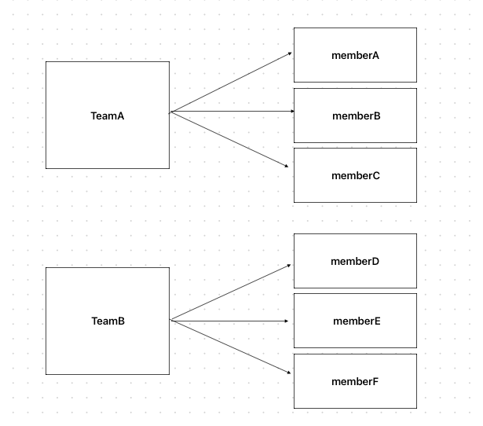
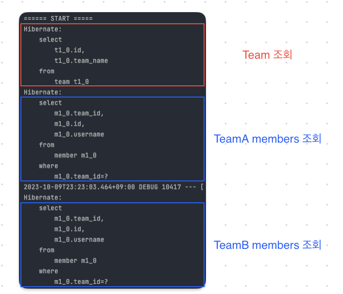

# N+1 문제

## N+1 문제란?
**1개의 Query로 수행되길 기대했는데 N개의 추가 쿼리가 발생한 현상**을 N+1문제라고 한다.<br>

## N+1문제는 언제 발생할까?
해당 객체만 조회되기를 기대했지만, 객체들 간의 연관 관계로 인해서 해당 객체와 연관된 다른 객체도 같이 조회되면서 발생한다.
따라서 2가지 경우에 발생하게 된다.

### 1. 즉시로딩(FetchType.EAGER)
연관관계가 FetchType.EAGER로 되어 있는 경우 해당 객체를 조회 시 JPA에서 즉시 연관된 객체도 조회하는 로딩 방식을 의미한다.
member:team = N:1인 것을 가정해보자. 

class Team의 내부에 member와의 연관관계를 아래와 같이 정의했다.

```java
@Entity
@Getter
@Setter
@NoArgsConstructor
public class Team {
	@Id
	@GeneratedValue
	private Long id;

	private String teamName;

	// Test를 위해서 기본 FetchType은 LAZY 지만 EAGER로 설정했다.
	@OneToMany(mappedBy = "team", fetch = FetchType.EAGER)
	private List<Member> members = new ArrayList<>();

	public Team(String teamName) {
		this.teamName = teamName;
	}

	@Override
	public String toString() {
		return "Team{" +
			"id=" + id +
			", teamName='" + teamName + '\'' +
			'}';
	}
}
```
그리고, 아래와 같이 테스트 코드를 작성헀다.

```java
@SpringBootTest
@Transactional
@Rollback(value = false)
@Slf4j
class TeamTest {
	@Autowired
	private EntityManager em;
	@Autowired
	private TeamRepository teamRepository;
	@Autowired
	private MemberRepository memberRepository;

	@Test
	void testNPlusOne() throws Exception {
		// given
		Team savedTeamA = teamRepository.save(new Team("teamA"));
		Team savedTeamB = teamRepository.save(new Team("teamB"));
		Member savedMemberA = memberRepository.save(new Member("memberA", savedTeamA));
		Member savedMemberB = memberRepository.save(new Member("memberB", savedTeamA));
		Member savedMemberC = memberRepository.save(new Member("memberC", savedTeamA));
		Member savedMemberD = memberRepository.save(new Member("memberD", savedTeamB));
		Member savedMemberE = memberRepository.save(new Member("memberE", savedTeamB));
		Member savedMemberF = memberRepository.save(new Member("memberF", savedTeamB));

		em.flush();
		em.clear();
		// when
		List<Team> all = teamRepository.findAll();

	}
}
```


TeamA에 memberA,B,C, teamB에 memberD,E,F가 포함되어 있다.
여기서 team에 대해 전체 조회를 할 경우에 쿼리문은 어떻게 발생할까?



위와 같이 처음 쿼리는 모든 team을 조회하는 걸로 의도한 대로 쿼리가 수행된다.
하지만 그 이후에 연관관계로 매핑되어 있는 members들을 JPA에서 fetchType.EAGER임을 감지하고 따로 team의 갯수만큼 추가 members 조회 쿼리를 발생 시킨다.
팀을 조회하는 쿼리 1개 + 팀 각각 members들을 조회하는 쿼리 N번이 수행된다.

**즉시로딩은 N+1문제를 일으키는 원인이기 때문에 절대 사용해서는 안된다.**

### 2. 지연로딩(FetchType.LAZY)
모든 관계에 대한 FetchType을 LAZY로 적용해야한다. 그렇다면 FetchType.LAZY에서는 N+1문제가 발생하지 않을까?<br>
team을 전체 조회했을 경우에는 발생하지 않고, proxy 객체로 생성된다. 하지만 members안의 field에 접근하는 순간에 또 다시 N+1문제가 발생하게 된다.


```java
@Entity
@Getter
@Setter
@NoArgsConstructor
public class Team {
	@Id
	@GeneratedValue
	private Long id;

	private String teamName;

	//FetchType을 LAZY로 설정한다.
	@OneToMany(mappedBy = "team", fetch = FetchType.LAZY)
	private List<Member> members = new ArrayList<>();

	public Team(String teamName) {
		this.teamName = teamName;
	}

	@Override
	public String toString() {
		return "Team{" +
			"id=" + id +
			", teamName='" + teamName + '\'' +
			'}';
	}
}
```


```java
@SpringBootTest
@Transactional
@Rollback(value = false)
@Slf4j
class TeamTest {
	@Autowired
	private EntityManager em;
	@Autowired
	private TeamRepository teamRepository;
	@Autowired
	private MemberRepository memberRepository;

	@Test
	void testNPlusOne() throws Exception {
		// given
		Team savedTeamA = teamRepository.save(new Team("teamA"));
		Team savedTeamB = teamRepository.save(new Team("teamB"));
		Member savedMemberA = memberRepository.save(new Member("memberA", savedTeamA));
		Member savedMemberB = memberRepository.save(new Member("memberB", savedTeamA));
		Member savedMemberC = memberRepository.save(new Member("memberC", savedTeamA));
		Member savedMemberD = memberRepository.save(new Member("memberD", savedTeamB));
		Member savedMemberE = memberRepository.save(new Member("memberE", savedTeamB));
		Member savedMemberF = memberRepository.save(new Member("memberF", savedTeamB));

		em.flush();
		em.clear();
		// when
		System.out.println("==== START ====");
		List<Team> all = teamRepository.findAll();
		System.out.println("==== END ====");
		
		// output
		/*
            ==== START ====
            Hibernate: 
                select
                    t1_0.id,
                    t1_0.team_name 
                from
                    team t1_0
            ==== END ====
        */

	}
}
```
Test 코드를 위와 같이 수행한다면 출력은 우리가 원한 대로 연관관계 조회를 제외한 team만을 조회한다.
하지만 안에 members fields에 접근을 한다면 N+1문제가 발생한다.

```java

@SpringBootTest
@Transactional
@Rollback(value = false)
@Slf4j
class TeamTest {
	@Autowired
	private EntityManager em;
	@Autowired
	private TeamRepository teamRepository;
	@Autowired
	private MemberRepository memberRepository;

	@Test
	void testNPlusOne() throws Exception {
		// given
		Team savedTeamA = teamRepository.save(new Team("teamA"));
		Team savedTeamB = teamRepository.save(new Team("teamB"));
		Member savedMemberA = memberRepository.save(new Member("memberA", savedTeamA));
		Member savedMemberB = memberRepository.save(new Member("memberB", savedTeamA));
		Member savedMemberC = memberRepository.save(new Member("memberC", savedTeamA));
		Member savedMemberD = memberRepository.save(new Member("memberD", savedTeamB));
		Member savedMemberE = memberRepository.save(new Member("memberE", savedTeamB));
		Member savedMemberF = memberRepository.save(new Member("memberF", savedTeamB));

		em.flush();
		em.clear();
		// when
		System.out.println("==== START ====");
		List<Team> teams = teamRepository.findAll();
		for (Team team : teams) {
			team.getMembers().size();
		}
		System.out.println("==== END ====");

		/*

		==== START ====
		Hibernate:
			select
				t1_0.id,
				t1_0.team_name
			from
				team t1_0
		Hibernate:
			select
				m1_0.team_id,
				m1_0.id,
				m1_0.username
			from
				member m1_0
			where
				m1_0.team_id=?
		Hibernate:
			select
				m1_0.team_id,
				m1_0.id,
				m1_0.username
			from
				member m1_0
			where
				m1_0.team_id=?
		==== END ====


		*/

	}
}
```

즉시로딩은 절대 사용해서는 안되고, 지연로딩을 했다고해서 N+1문제에서 안전할 수 없다.