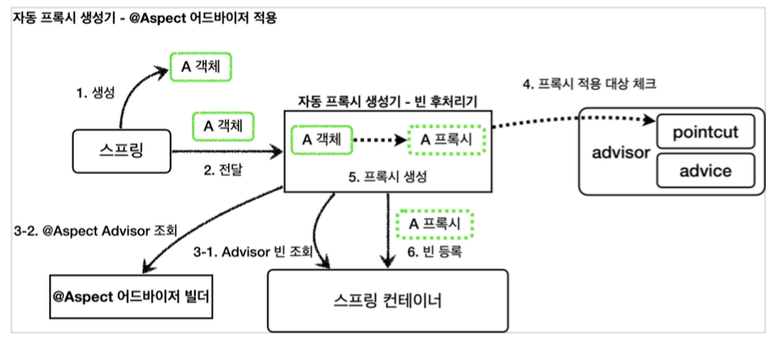

# Aspect Oriented Programming

## 관점 지향 프로그래밍이란?

AOP란, 부가 기능을 핵심 기능에서 분리하고 한 곳에서 관리하도록 하는 프로그래밍 방식을 의미한다.
부가 기능은 어떤 것들이 있을까? 
가장 먼저 떠오르는 것은 Transaction 관련 코드이다. connection을 할당받아 transaction을 시작하고 성공하면 commit, 실패하면 rollback 마지막으로 연결을 끊는 코드가 
모든 Business Layer 각 Method에 포함된다. 이와 같이 각 method에 공통적으로 들어가는 부가 기능을 횡단 관심사(cross-cutting concerns)라고 한다.  

이와 같은 횡단 관심사가 존재한다면 어떤 단점이 있을까?

100개의 method가 존재한다면, 100군데에 추가해줘야 한다. 그런데 부가 기능의 변경이 필요하다면? 100군데를 전부 바꿔줘야 한다. 매우 번거롭고 반복되는 작업들이다. 결국 속된 말로 노가다 작업을 하게 될 것이다.

횡단 관심사를 따로 핵심 기능에서 분리하고 한 곳에서 관리하도록 하는 프로그래밍 방식을 관점 지향 프로그래밍이라고 한다.

## AOP vs OOP

주요 관심사가 다르다. OOP는 객체 마다의 책임, 역할 그리고 객체 간의 협력에 관심사를 두고 있다. 반면에 AOP는 핵심 기능에서 트랜잭션, 로깅 추적과 같은 부가 기능울 분리하는 데 관심사를 두고 있다.
 
관점 지향 프로그래밍이 나왔기 떄문에 OOP는 대체되는 걸까?  
그렇지 않다. AOP는 OOP를 대체하기 위한 것이 아닌 횡단 관심사를 깔끔하게 처리하기 어려운 OOP의 부족한 부분을 해결려는 목적으로 개발되었다.

## Spring AOP는 어떻게 동작할까?

Spring AOP는 Proxy 기반 runtime weaving 방식으로 동작한다.

1. 생성: 스프링 빈 대상이 되는 객체를 생성한다. ( @Bean , 컴포넌트 스캔 모두 포함)
2. 전달: 생성된 객체를 빈 저장소에 등록하기 직전에 빈 후처리기에 전달한다.
   (이 때 빈 후처리기는  AnnotationAwareAspectJAutoProxtCreator class로 두 가지 일을 한다. -> 1. @Advisor -> Advisor로 변환/ 어드바이저 기반으로 프록시를 생성한다.)
3-1. Advisor 빈 조회: 스프링 컨테이너에서 Advisor 빈을 모두 조회한다. 
3-2. @Aspect Advisor 조회: @Aspect 어드바이저 빌더 내부에 저장된 Advisor 를 모두 조회한다.  
4. 프록시 적용 대상 체크: 앞서 3-1, 3-2에서 조회한 Advisor 에 포함되어 있는 포인트컷을 사용해서 해당 객체가 프록시를 적용할 대상인지 아닌지 판단한다.
5. 프록시 생성: 프록시 적용 대상이면 프록시를 생성하고 프록시를 반환한다. 프록시 적용 대상이 아니라면 원본 객체를 반환한다.
6. 빈 등록: 반환된 객체는 스프링 빈으로 등록된다.

## 참고
* [스프링 핵심 원리 - 고급편 섹션 08](https://www.inflearn.com/course/%EC%8A%A4%ED%94%84%EB%A7%81-%ED%95%B5%EC%8B%AC-%EC%9B%90%EB%A6%AC-%EA%B3%A0%EA%B8%89%ED%8E%B8/dashboard)
* [Spring AOP의 원리 - CGlib vs Dynamic Proxy](https://huisam.tistory.com/entry/springAOP)