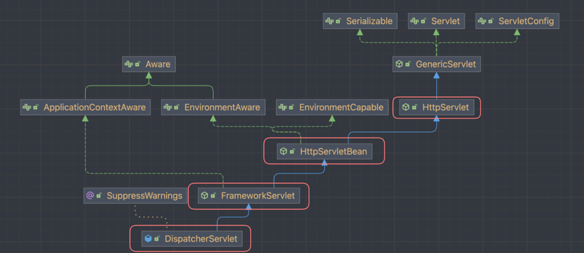
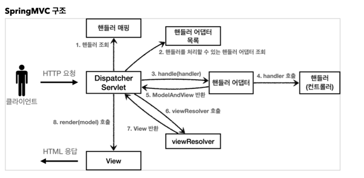

# DispatcherServlet

## DispatcheraServlet 이란?

스프링 기반 웹 어플리케이션에서 Front Controller 역할을 수행하는 Servlet을 의미한다.

## Front Controller Pattern이란?

Client로 부터 들어오는 모든 요청을 가장 먼저 받아서 적합한 Controller에게 위임하는 패턴이다.
모든 요청의 들어오는 입구를 막는 문지기 역할을 하기 때문에 공통된 로직 처리를 가능하게 하고 Front Controller를 제외한 나머지 Controller는 Servlet을 사용하지 않아도 된다.
스프렝 웹 MVC는 Front Controller Pattern으로 구현이 되어 있으며, Front Controller 역할을 수행 하는 것이 **DispatcherServlet**이다.


## DispatcherServlet 구조



DispatcherServlet -> FrameworkServlet -> HttpServletBean -> HttpServlet


## 요청 흐름은 어떻게 될까?

Client로 부터 요청이 들어오면,
<br/>HttpServlet이 제공하는 service() method가 호출된다.
<br/>(Spring MVC는 DispatcherServlet의 부모인 FrameworkServlet에서 service() method를 재정의 해두었다.)
<br/>FrameworkServlet.service() method를 시작으로 여러 method가 호출되면서 DispatcherServlet.doDispatch()가 호출된다.




```java

class DispatcherServlet extends HttpServlet {
	protected void doDispatch(HttpServletRequest request, HttpServletResponse response) throws Exception {
		// ...
		try {
			try {
				// 1. 핸들러를 조회한다.
                // 핸들러 매핑을 통해 Client로 부터 요청 받은 url에 매핑된 핸들러를 조회한다.
				mappedHandler = getHandler(processedRequest);
				if (mappedHandler == null) {
					noHandlerFound(processedRequest, response);
					return;
				}
				
				// 2. 핸들러 어댑터 조회
                // 핸들러를 실행할 수 있는 핸들러 어댑터를 조회한다.
				HandlerAdapter ha = getHandlerAdapter(mappedHandler.getHandler());
				
				// ...
				
				// 3. 핸들러 어댑터를 실행한다.
                // 4. 핸들러 어댑터가 실제 핸들러(컨트롤러)를 실행한다.
                // 5. 핸들러 어댑터는 핸들러가 반환하는 정보를 ModelAndView로 변환해서 반환한다.
				mv = ha.handle(processedRequest, response, mappedHandler.getHandler());
				
				if (asyncManager.isConcurrentHandlingStarted()) {
					return;
				}
				
				applyDefaultViewName(processedRequest, mv);
				mappedHandler.applyPostHandle(processedRequest, response, mv);
			}
			catch (Exception ex) {
				dispatchException = ex;
			}
			catch (Throwable err) {
				dispatchException = new NestedServletException("Handler dispatch failed", err);
			}
			//  ...
			processDispatchResult(processedRequest, response, mappedHandler, mv, dispatchException);
		}
		catch (Exception ex) {
			triggerAfterCompletion(processedRequest, response, mappedHandler, ex);
		}
		catch (Throwable err) {
			triggerAfterCompletion(processedRequest, response, mappedHandler,
				new NestedServletException("Handler processing failed", err));
		}
		finally {
			if (asyncManager.isConcurrentHandlingStarted()) {
				// Instead of postHandle and afterCompletion
				if (mappedHandler != null) {
					mappedHandler.applyAfterConcurrentHandlingStarted(processedRequest, response);
				}
			}
			else {
				// Clean up any resources used by a multipart request.
				if (multipartRequestParsed) {
					cleanupMultipart(processedRequest);
				}
			}
		}
	}
}
```

1. 핸들러 조회: 핸들러 매핑을 통해 요청 URL에 매핑된 핸들러(컨트롤러)를 조회한다.
2. 핸들러 어댑터 조회: 핸들러를 실행할 수 있는 핸들러 어댑터를 조회한다.
3. 핸들러 어댑터 실행: 핸들러 어댑터를 실행한다.
4. 핸들러 실행: 핸들러 어댑터가 실제 핸들러를 실행한다.
5. ModelAndView 반환: 핸들러 어댑터는 핸들러가 반환하는 정보를 ModelAndView로 변환해서 반환한다.
6. viewResolver 호출: 뷰 리졸버를 찾고 실행한다.
7. View 반환: 뷰 리졸버는 뷰의 논리 이름을 물리 이름으로 바꾸고, 렌더링 역할을 담당하는 뷰 객체를 반환한다.
8. 뷰 렌더링: 뷰를 통해서 뷰를 렌더링 한다.


## Reference 
* [스프링 MVC 1편 - 백엔드 웹 개발 핵심 기술](https://www.inflearn.com/course/%EC%8A%A4%ED%94%84%EB%A7%81-mvc-1/dashboard)