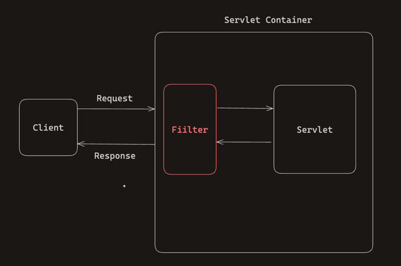
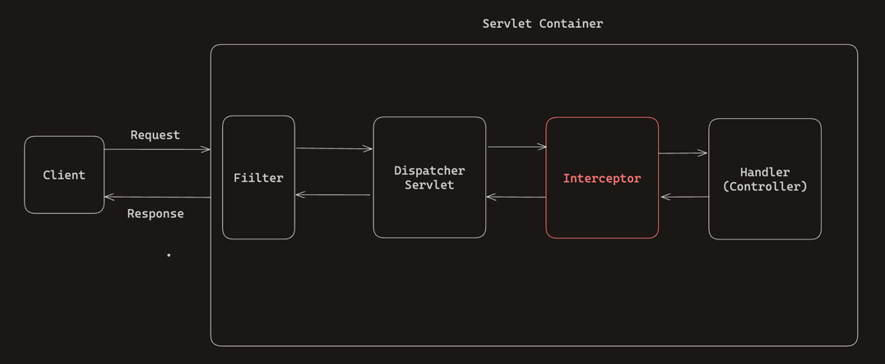
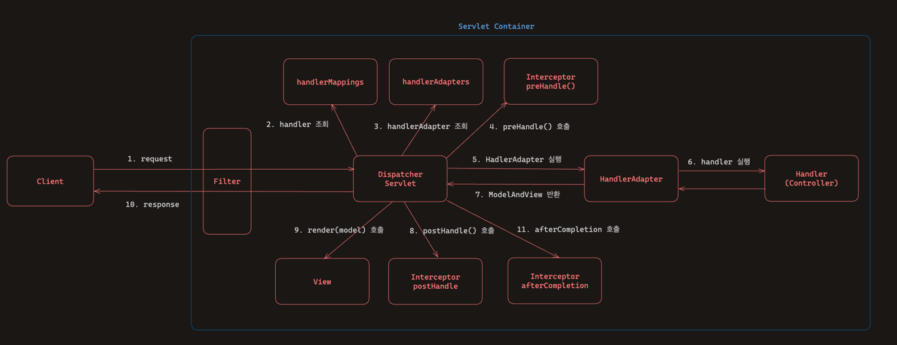

# Filter & Interceptor

## Filter & Interceptor 왜 사용할까?
**공통 관심 사항을 한 공간에서 처리하기 위해서 사용한다.**<br> 
공통 관심 사항이라고 한다면 대부분의 Controller에 들어가는 인증 체크 관련 로직, 요청과 응답에 대한 로깅 등이 존재한다.


## Servlet Filter란?



Servlet이 지원하는 수문장이다.<br>
Servlet Filter는 Client로 부터 요청이 들어오면, Servlet이 실행되기 전/후로 어떠한 작업 혹은 가공을 하는 역할을 수행한다.<br>
Interceptor와 같이 **공통 관심 사항을 처리하기 위해서** 사용한다.<br>


## Servlet Filter 사용해보기


### Filter Interface 구현

```java

@Slf4j
public class LogFilter implements Filter {

    @Override
    public void init(FilterConfig filterConfig) throws ServletException {
        log.info("log filter init");
    }

    @Override
    public void doFilter(ServletRequest request, ServletResponse response, FilterChain chain) throws IOException, ServletException {
        log.info("log filter doFilter");

        HttpServletRequest httpRequest = (HttpServletRequest) request; // Down Casting
        String requestURI = httpRequest.getRequestURI();

        String uuid = UUID.randomUUID().toString();

        try {
            log.info("REQUEST [{}][{}]", uuid, requestURI);
            chain.doFilter(request, response); // chain.doFilter() method를 반드시 호출해줘야 한다. 호출하지 않을 시, 다음 단계로 진행되지 않는다.
        } catch (Exception e) {
            throw e;
        } finally {
            // 항상 호출
            log.info("RESPONSE [{}][{}]", uuid, requestURI);
        }
    }

    @Override
    public void destroy() {
        log.info("log filter destroy");
    }
}
```

필터를 사용하기 위해서는 Filter interface를 구현해야 한다. <br>
Filter Interface에는 3가지 method init, destory, **doFilter** method가 존재하지만 <br>
init, destroy는 default method여서 따로 구현해주지 않아도 무방하다. doFilter() method는 반드시 구현해줘야 한다.


### WebConfig안에 Filter 등록

```java

@Configuration
    public class WebConfig {
        @Bean
        public FilterRegistrationBean logFilter() {
            FilterRegistrationBean<Filter> filterRegistrationBean = new
    FilterRegistrationBean<>();
            filterRegistrationBean.setFilter(new LogFilter());
            filterRegistrationBean.setOrder(1);
            filterRegistrationBean.addUrlPatterns("/*");
            return filterRegistrationBean;
    } 
}

```

* 스프링 부트를 사용한다면 FilterRegistrationBean을 사용해서 등록하면 된다.
* setFilter(new LogFilter()): 등록할 필터를 지정한다.
* setOrder(1): 필터는 체인으로 동작하기 때문에 어떤 순서를 동작할지 지정해줘야 한다. 낮을수록 먼저 동작한다.
* addUrlPatterns("/*"): 필터를 적용할 url pattern을 지정한다.

---

### Spring Interceptor

## Interceptor란?



Servlet Filter와 마찬가지로 **웹의 공통 관심 사항을 처리할 수 있는 기술**이다.

## Interceptor는 사용해보기

### HandlerInterceptor 구현하기

```java
@Slf4j
public class LogInterceptor implements HandlerInterceptor {

    public static final String LOG_ID = "logId";

    @Override
    public boolean preHandle(HttpServletRequest request, HttpServletResponse response, Object handler) throws Exception {

        String requestURI = request.getRequestURI();
        String uuid = UUID.randomUUID().toString();

        request.setAttribute(LOG_ID, uuid);

        //@RequestMapping: HandlerMethod
        //정적 리소스: ResourceHttpRequestHandler
        if (handler instanceof HandlerMethod) {
            HandlerMethod hm = (HandlerMethod) handler;//호출할 컨트롤러 메서드의 모든 정보가 포함되어 있다.
        }

        log.info("REQUEST [{}][{}][{}]", uuid, requestURI, handler);
        return true;
    }

    @Override
    public void postHandle(HttpServletRequest request, HttpServletResponse response, Object handler, ModelAndView modelAndView) throws Exception {
        log.info("postHandle [{}]", modelAndView);
    }

    @Override
    public void afterCompletion(HttpServletRequest request, HttpServletResponse response, Object handler, Exception ex) throws Exception {
        String requestURI = request.getRequestURI();
        String logId = (String) request.getAttribute(LOG_ID);
        log.info("RESPONSE [{}][{}][{}]", logId, requestURI, handler);
        if (ex != null) {
            log.error("afterCompletion error!!", ex);
        }

    }
}
```

스프링 인터셉터는 HandlerInterceptor를 직접 구현해서 사용한다.

HandlerInterceptor 내부에는 preHandle(), postHandle(), afterCompletion() method 3가지가 default로 정의되어 있다.
즉, 3가지 중 필요한 부분만 직접 구현하면 된다.

### WebConfig안에 Spring Interceptor 등록

```java
@Configuration
public class WebConfig implements WebMvcConfigurer {

    @Override
    public void addInterceptors(InterceptorRegistry registry) {
        registry.addInterceptor(new LogInterceptor())
                .order(1)
                .addPathPatterns("/**")
                .excludePathPatterns("/css/**", "/*.ico", "/error");
    }
}
```

구현한 Interceptor를 WebConfig 내부에 순서와 urlPatterns를 설정한 이후에 사용할 수 있다.


## Interceptor는 언제 호출될까?

DispatcherServlet에서 Interceptor의 각 method가 언제 호출되는지를 확인할 수 있다.

```java

public class DispatcherServlet extends FrameworkServlet {
	protected void doDispatch(HttpServletRequest request, HttpServletResponse response) throws Exception {
		HttpServletRequest processedRequest = request;
		HandlerExecutionChain mappedHandler = null;
		boolean multipartRequestParsed = false;
		
		WebAsyncManager asyncManager = WebAsyncUtils.getAsyncManager(request);
		
		try {
			ModelAndView mv = null;
			Exception dispatchException = null;
			
			try {
				processedRequest = checkMultipart(request);
				multipartRequestParsed = (processedRequest != request);
				
				mappedHandler = getHandler(processedRequest);
				if (mappedHandler == null) {
					noHandlerFound(processedRequest, response);
					return;
				}
				
				HandlerAdapter ha = getHandlerAdapter(mappedHandler.getHandler());
				
				String method = request.getMethod();
				boolean isGet = "GET".equals(method);
				if (isGet || "HEAD".equals(method)) {
					long lastModified = ha.getLastModified(request, mappedHandler.getHandler());
					if (new ServletWebRequest(request, response).checkNotModified(lastModified) && isGet) {
						return;
					}
				}
				
				// 1. Interceptor preHandle() method 호출
                // HandlerAdapter 조회 바로 뒤에 호출 한다.
				if (!mappedHandler.applyPreHandle(processedRequest, response)) {
					return;
				}
				
				mv = ha.handle(processedRequest, response, mappedHandler.getHandler());
				
				if (asyncManager.isConcurrentHandlingStarted()) {
					return;
				}
				
				applyDefaultViewName(processedRequest, mv);
				// 2. Interceptor postHandle() method 호출
                // ModelAndView를 반환한 이후에 호출한다.
				mappedHandler.applyPostHandle(processedRequest, response, mv);
			}
			catch (Exception ex) {
				dispatchException = ex;
			}
			catch (Throwable err) {
				dispatchException = new NestedServletException("Handler dispatch failed", err);
			}
            // 3. Interceptor afterCompletion() method 호출
            // processDispatchResult() method 내부에서 afterCompletion() method를 호출하고 있다.
            // 에러가 존재하든 존재하지 않든 항상 호출된다.
			processDispatchResult(processedRequest, response, mappedHandler, mv, dispatchException);
		}
		catch (Exception ex) {
			// 3. Interceptor afterCompletion() method 호출
			triggerAfterCompletion(processedRequest, response, mappedHandler, ex);
		}
		catch (Throwable err) {
            // 3. Interceptor afterCompletion() method 호출
			triggerAfterCompletion(processedRequest, response, mappedHandler,
				new NestedServletException("Handler processing failed", err));
		}
		finally {
			if (asyncManager.isConcurrentHandlingStarted()) {
				if (mappedHandler != null) {
					mappedHandler.applyAfterConcurrentHandlingStarted(processedRequest, response);
				}
			}
			else {
				if (multipartRequestParsed) {
					cleanupMultipart(processedRequest);
				}
			}
		}
	}

}
```

위에 주석에서 DispatcherServlet Class를 확인해 보면서 Interceptor가 언제 호출 되는지 확인 해봤다. <br>
정리 해보면

아래의 그림과 같다.



* preHandle() method는 handlerAdapter 조회 이후, handlerAdapter 실행 이전 단계에서 호출된다. 이 때 boolean값을 반환하는데 false일 경우 다음 단계로 이동하지 않는다.
* postHandle() method는 예외가 발생하지 않은 정상 흐름에서만 호출이된다. ModelAndView 객체를 반환 받은 이후에 postHandle() method를 호출한다.
* afterCompletion() method는 View가 렌더링 및 응답을 완료한 이후에 호출된다.


## Servlet Filter 보다 Spring Interceptor를 사용해야 하는 이유가 뭘까?

* Interceptor는 더욱 정교하게 urlPatterns를 관리할 수 있다.
* Servlet Filter의 경우에 구현하고 싶지 않음에도 실행 전, 실행 이후, 예외 처리 등 추가적인 작업 요소가 필요한 반면에, Interceptor는 구현하고 싶은 부분만 골라서 구현할 수 있다.
* Servlet Filter는 parameters ServletRequest or SevletResponse가 들어오기 때문에 따로 HttpServletRequest or HttpServletResponse를 DownCasting을 해줘야 한다.
* Servlet Filter는 자체적으로 chain.doFilter() method를 통해 연결해줘야하는 번거러움(공통 로직)이 있다.


## Reference
* [스프링 MVC 2편 - 백엔드 웹 개발 활용 기술 / Section 7장](https://www.inflearn.com/course/%EC%8A%A4%ED%94%84%EB%A7%81-mvc-2/dashboard)


