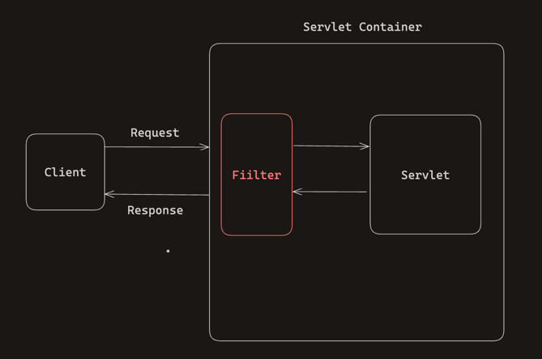

# Filter & Interceptor

## Filter & Interceptor 왜 사용할까?
**공통 관심 사항을 한 공간에서 처리하기 위해서 사용한다.**<br> 
공통 관심 사항이라고 한다면 대부분의 Controller에 들어가는 인증 체크 관련 로직, 요청과 응답에 대한 로깅 등이 존재한다.


## Servlet Filter란?



Servlet이 지원하는 수문장이다.<br>
Servlet Filter는 Client로 부터 요청이 들어오면, Servlet이 실행되기 전/후로 어떠한 작업 혹은 가공을 하는 역할을 수행한다.<br>
Interceptor와 같이 **공통 관심 사항을 처리하기 위해서** 사용한다.<br>


## Servlet Filter 사용해보기


### Filter Interface 구현

```java

@Slf4j
public class LogFilter implements Filter {

    @Override
    public void init(FilterConfig filterConfig) throws ServletException {
        log.info("log filter init");
    }

    @Override
    public void doFilter(ServletRequest request, ServletResponse response, FilterChain chain) throws IOException, ServletException {
        log.info("log filter doFilter");

        HttpServletRequest httpRequest = (HttpServletRequest) request; // Down Casting
        String requestURI = httpRequest.getRequestURI();

        String uuid = UUID.randomUUID().toString();

        try {
            log.info("REQUEST [{}][{}]", uuid, requestURI);
            chain.doFilter(request, response); // chain.doFilter() method를 반드시 호출해줘야 한다. 호출하지 않을 시, 다음 단계로 진행되지 않는다.
        } catch (Exception e) {
            throw e;
        } finally {
            // 항상 호출
            log.info("RESPONSE [{}][{}]", uuid, requestURI);
        }
    }

    @Override
    public void destroy() {
        log.info("log filter destroy");
    }
}
```

필터를 사용하기 위해서는 Filter interface를 구현해야 한다. <br>
Filter Interface에는 3가지 method init, destory, **doFilter** method가 존재하지만 <br>
init, destroy는 default method여서 따로 구현해주지 않아도 무방하다. doFilter() method는 반드시 구현해줘야 한다.


### WebConfig안에 Filter 등록

```java

@Configuration
    public class WebConfig {
        @Bean
        public FilterRegistrationBean logFilter() {
            FilterRegistrationBean<Filter> filterRegistrationBean = new
    FilterRegistrationBean<>();
            filterRegistrationBean.setFilter(new LogFilter());
            filterRegistrationBean.setOrder(1);
            filterRegistrationBean.addUrlPatterns("/*");
            return filterRegistrationBean;
    } 
}

```

* 스프링 부트를 사용한다면 FilterRegistrationBean을 사용해서 등록하면 된다.
* setFilter(new LogFilter()): 등록할 필터를 지정한다.
* setOrder(1): 필터는 체인으로 동작하기 때문에 어떤 순서를 동작할지 지정해줘야 한다. 낮을수록 먼저 동작한다.
* addUrlPatterns("/*"): 필터를 적용할 url pattern을 지정한다.

---

### Spring Interceptor


## Reference
* [스프링 MVC 2편 - 백엔드 웹 개발 활용 기술 / Section 7장](https://www.inflearn.com/course/%EC%8A%A4%ED%94%84%EB%A7%81-mvc-2/dashboard)


