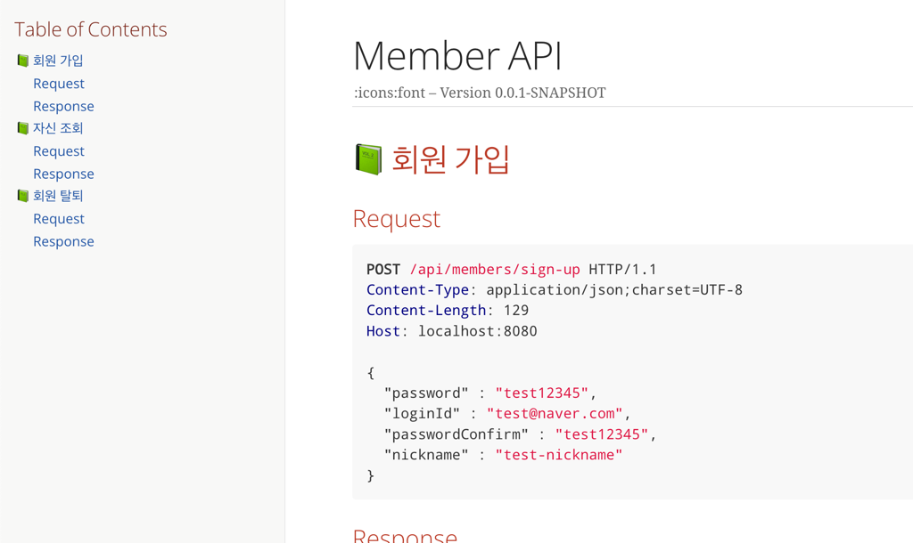

# RestDocs Vs Swagger

## 📗 들어가기 전에

Api 문서 작업을 자동화하는 방법으로 Spring에서는 Swagger와 RestDocs가 유명하다.
Swagger는 예전 express.js를 활용한 프로젝트를 할 때 적용해본 경험이 있다. spring에서는 어떻게 적용할 수 있는지
그리고 프로젝트를 진행할 때 swagger 혹은 RestDocs중에 어떤 걸 선택하는게 좋을지 정리해보려고 한다.

## Swagger

Swagger는 Api 문서를 자동화를 위해 만들어진 오픈소스 프레임워크이다.

코드단에서는 어떻게 적용할 수 있을까?
 
```java

//Controller
@Api(tags = "컨트롤러이름")
@RestController
public class SwaggerExample {
	
    @Operation(summary="요약", description="설명")
    @ApiResponse(code = 200, message="ok")
    @PostMapping("/ex/")
    public ResponseDto exampleMethod() {
    	return new ResponseDto();
    }   
 }
 
 //DTO
 @Data
 public class ResponseDto {
 	@ApiModelProperty(value="필드 값", example="예시", required=true)
    private String a1;
    
    @ApiModelProperty(value="필드 값", example="예시")
    private String a2;
}
```

Class, Field, Method에 Swagger에서 제공해주는 Annotation을 이용해서 작성하게 된다.
지금은 예시로서 간단하게 보여졌지만, 복잡한 Api 명세라면?


```java
@RestController
@RequiredArgsConstructor
public class DeleteMemberController {
 
    @Operation(summary = "회원 탈퇴 요청", description = "회원 정보가 삭제됩니다.", tags = { "Member Controller" })
    @ApiResponses({
            @ApiResponse(responseCode = "200", description = "OK",
                    content = @Content(schema = @Schema(implementation = DeleteMemberResponse.class))),
            @ApiResponse(responseCode = "400", description = "BAD REQUEST"),
            @ApiResponse(responseCode = "404", description = "NOT FOUND"),
            @ApiResponse(responseCode = "500", description = "INTERNAL SERVER ERROR")
    })
    @DeleteMapping("/v1/member/{id}")
    ResponseEntity<DeleteMemberResponse> deleteMember(
            @Parameter(description = "회원 ID", required = true, example = "1") @PathVariable("id") Long id) {
        // 생략..
    }
}
```

하나의 Api에 대해서 성공 케이스, 실패 케이스 등에 대해 Swagger에서 제공해주는 annotation을 적용시키면, 위와 같이 메인 가독성이 떨어지며 메인 비즈니스 로직에 집중하기가 어렵다..


## RestDocs

Rest Docs란, 테스트 코드를 기반으로 Restful Api 문서 자동화 할 수 있는 툴이다.

```java
@DisplayName("로그인한 자신 조회")
	@Test
	void memberGetMySelfTest() throws Exception {
		// given
		memberService.signUp(LOGIN_ID, NICKNAME, PASSWORD, PASSWORD);
		doLogin();

		// when & then
		mockMvc.perform(MockMvcRequestBuilders.get(MEMBER_URI_PREFIX.getPrefix() + "/myself")
				.contentType(MediaType.APPLICATION_JSON)
				.session(httpSession)
			)
			// RestDocs를 만들기 위한 코드 추가 필요
			.andDo(MockMvcRestDocumentation.document("api/members/myself",
				preprocessRequest(prettyPrint()),
				preprocessResponse(prettyPrint())))
			.andDo(print())
			.andExpect(status().isOk());
	}
```

RestDocs는 MockMvc 기반 테스트 코드에 따로 추가하는 작업을 통해서 Api 문서를 자동화할 수 있다. 
추가하게 되면 아래와 같은 문서를 제공할 수 있다.




## 어떤 걸 사용하면 좋을까?

두 가지의 장점과 단점은 명확한 걸로 느껴진다.

### Swagger
* 장점 
  * 비교적 처음 설정하기 용이
  * Api 문서를 활용해 직접 Api 요청 및 응답에 대한 테스트 진행 가능
* 단점
  * 비즈니스 로직에 Swagger 관련 annotation이 들어가면서 코드가 번잡해진다.

### RestDocs

* 장점
   * Swagger와 달리 테스트 코드에 적용하기 때문에, 비즈니스 로직(코드)에 영향을 주지 않는다.
   * 테스트 코드 작성이 필수로 요구된다.
* 단점
  * 초기 셋팅이 비교적 어렵다.
  * Api 문서는 읽기만 가능하다.


위 두 가지의 장/단점을 비교해봤을 떄, 나는 RestDocs를 선택하게 되었다. 
그 중에 가장 마음에 들었던 것은 Test Code를 강제로 작성하게끔 해준다는 점이다. Test Code를 강제로 작성하기 때문에 보다 신뢰성 있는 검증된 API를
제공할 수 있게 된다는 추가적인 장점도 존재한다.

추가적으로 스프링 프로젝트를 진행하는 중에 내가 느낀 Spring은 단일 책임 혹은 역할에 대해서 굉장히 중요시 여긴다. (다른 객체 지향 프로그래밍 언어에서도 마찬가지일 것이다.)
이런 역할 관점에서 봤을 때 Swagger를 사용하게 되면 하나의 클래스에 다른 부가적인 역할을하는 Swagger 관련 코드를 추가할 수 밖에 없다. 이런 부분에서도 RestDocs를 사용하는게 좋겠다고 생각 했다.

## 참고

* [[Spring] API 문서 자동화를 위한 Swagger 3.0.0 적용](https://chanos.tistory.com/entry/Spring-API-%EB%AC%B8%EC%84%9C-%EC%9E%90%EB%8F%99%ED%99%94%EB%A5%BC-%EC%9C%84%ED%95%9C-Swagger-300-%EC%A0%81%EC%9A%A9)
* [Spring boot Swagger 3.0 적용하기](https://dev-youngjun.tistory.com/258)
* [[Spring] Rest Docs 빌드 부터 사용까지](https://me-analyzingdata.tistory.com/entry/Rest-Docs-%EC%82%AC%EC%9A%A9%ED%95%98%EA%B8%B0)