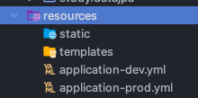
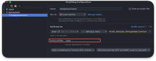

# Spring Profile

## 📗 Spring Profile이란?

Spring Framework에서 `Spring Profile`은 특정 환경 또는 조건에 따라 애플리케이션의 동작을 설정하는데 사용되는 기능을 의미한다.
즉, 로컬 환경, 테스트 환경, 개발 환경, 운영 환경과 같이 각각의 환경에 따라 애플리케이션을 동작시킬 수 있게끔 도와주는 기능을 의미한다.

## 📗Spring Profile환경을 어떻게 구성할 수 있을까?

우선 환경에 맞게 application.yml file을 만들어 준다.



test를 위해서 -dev.yml, -prod.yml 파일을 생성했다. 
Spring Boot에서는 -{environment} 명을 통해서 환경 정보를 파악할 수 있다.

### build한 jar 파일을 실행 시킬 때 옵션을 추가한다.

build를 시키면 jar 파일이 생성된다.

```shell
./gradle build
```


해당 빌드 파일을 실행시킬 때 아래의 옵션을 추가한다.

```shell
java -jar -Dspring.profiles.active=dev ./build/libs/datajpa-0.0.1-SNAPSHOT.jar
```
그러면, 아래와 같이 실행시킬 수 있다.


### 로컬 환경에서 active Profiles 세팅하기

1. Intellij 상단 탭에 Run -> Edit Configuration을 클릭한다.
2. Active profiles에 원하는 환경 정보를 입력하고 실행한다.




