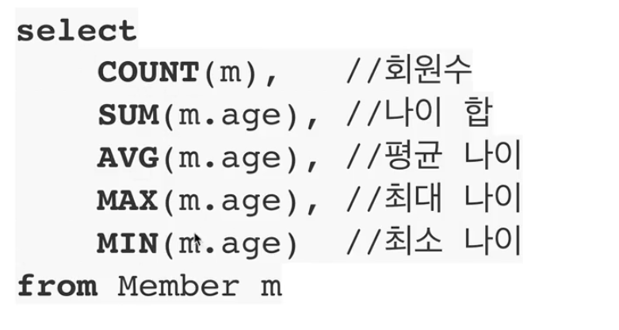

# 객체지향 쿼리 언어1 

## 📗 소개

### JPA는 다양한 쿼리 방법을 지원
* JPQL(Java Persistence Query Language)
  * 표준 문법
* JPA Criteria
* QueryDSL
* 네이티브 SQL
* JDBC API직접 사용, MyBatis, SpringJdbcTemplate 함께 사용

### JPQL 소개
* 가장 단순한 조회 방법
  * em.find()
  * 객체 그래프 탐색(a.getB().getC())
* 나이가 18살 이상인 회원을 모두 검색하고 싶을 경우?
* JPA를 사용하면 엔터티 객체를 중심으로 개발
* 문제는 검색 쿼리이다.
* 검색을 할 때도 테이블이 아닌 엔터티 객체를 대상으로 검색해야한다.
* 모든 DB 데이터를 객체로 변환해서 검색하는 것은 불가능하다.
* 애플리케이션이 필요한 데이터만 DB에서 불러오려면 결국 검색 조건이 포함된 SQL이 필요하다.
* JPA는 SQL을 추상화한 JPQL이라는 객체 지향 쿼리 언어 제공
* SQL과 문법 유사
  * SELECT, FROM, WHERE, GROUP BY, HAVING, JOIN 지원
* 가장 큰 차이
  * JPQL은 엔터티 객체를 대상으로 쿼리
  * SQL은 데이터 베이스 테이블을 대상으로 쿼리
* SQL을 추상화해서 특정 데이터베이스 SQL에 의존하지 않는다.
* JPQL을 한마디로 정의하면 객체 지향 SQL이다.

```java
String jpql = "select m From Member m where m.name like '%hello%'";
List<Member> result = createQuery(jpql, Member.class).getResultList();

```

--- 
## 기본 문법과 쿼리 API

### JPQL 소개
* JPQL은 객체지향 쿼리 언어다. 따라서 테이블을 대상으로 쿼리하는 것이 아니라 엔터티 객체를 대상으로 쿼리를 수행한다.
* JPQL은 SQL을 추상화해서 특정 데이터베이스 SQL에 의존하지 않는다.
* JPQL은 결국 SQL로 변환된다.

### JPQL 문법
* select m from Member as m where m.age > 18
* 엔터티와 속성은 대소문자 구분한다(Member, age)
* JPQL 키워드는 대소문자 구분 X(SELECT, select)
* 엔터티 이름 사용, 테이블 이름이 아님(Member)
* 별칭은 필수(m) (as는 생략 가능하다)

### 집합과 정렬




## 프로젝션(SELECT)

* SELECT 절에 조회할 대상을 지정하는 것
* 프로젝션 대상: 엔터티, 임베디드 타입, 스칼라 타입9숫자, 문자 등 기본 데이터 타입)
* select m from Member m => 엔터티 프로젝션
* select m.team from Member m -> 엔터티 프로젝션
* select m.address from Member m -> 임베디드 타입 프로젝션
* select m.username, m.age from Member m -> 스칼라 타입 프로젝션
* DISTINCT로 중복 제거


### 프로젝션 - 여러 값 조회
1. Query 타입으로 조회
2. Object[] 타입으로 조회
3. new 명령어로 조회
   * 단순 값을 DTO로 바로 조회
   * select new jpabook.jpql.UserDTO(m.username,m.age) from Member m 
   * 패키지 명을 포함한 전체 클래스 명 입력
   * 순서와 타입이 일치하는 생성자 필요

## 페이징

### 페이징 API
* JPA는 페이징을 다음 두 API로 추상화
* setFirstResult(int startPosition): 조회 시작 위치(0부터 시작)
* setMaxResults(int maxResult): 조회할 데이터 수

```java
// offset, limit으로 발생한다.
em.createQuery("select m from Member m order by m.age desc", Member.class)
    .setFirstResult(0)
    .setMaxResults(10)
    .getResultList();
```

## Join

### Join 예시
* 내부 조인
  * select m from Member m [inner] join m.team t
* 외부 조인
  * select m from Member m left [outer] join m.team t
* 세타 조인
  * select count(m) from Member m, Team t where m.username = t.name

### on 절

* ON절을 활용한 조인(JPA 2.1 부터 지원)
* 조인 대상 필터링
   * 예) 회원과 팀을 조인하면서, 팀 이름이 A인 팀만 조인
   * JPQL
     * select m, t from Member m left join m.team t on t.name = 'A'
   * SQL
     * select m.*, t.* from Member m left join team t on m.team_id = t.id and t.name = 'A'
* 연관관계 없는 엔터티 외부 조인(하이버네이트 5.1부터)
  * 예) 회원의 이름과 팀의 이름이 같은 대상 외부 조인
  * JPQL
    * select m, t from Member m left join team t on m.username = t.name
  * SQL
    * select m.*, t.* from Member m left join Team t on m.username = t.name

## 서브 쿼리

### 서브 쿼리
* 나이가 평균보다 많은 회원
  * select m from Member m where m.age > (select avg(m2.age) from Member m2)
* 한 건이라도 주문한 고객
  * select m from Member m where (select count(o) from Order o where m = o.member) > 0

### 서브 쿼리 지원 함수
* [NOT] EXIST: 서브쿼리에 결과가 존재하면 참
  * {ALL|ANY|SOME}(subquery)
  * ALL 모두 만족하면 참
  * ANY, SOME: 같은 의미, 조건을 하나라도 만족하면 참
* [NOT] IN (subquery): 서브쿼리의 결과 중 하나라도 같은 것이 있으면 참


### 서브 쿼리 - 예제

* 팀 A 소속인 회원
  * select m from Member m where exists (select t from m.team t where t.name = '팀A')
* 전체 상품 각각의 재고보다 주문량이 많은 주문들
  * select o from Order o where o.orderAmount > ALL(select p.stockAmount from Product p)
* 어떤 팀이든 팀에 소속된 회원
  * select m from Member m where m.team = ANY (select t from Team t)


### JPA 서브 쿼리 한계
* JPA는 where, having 절에서만 서브 쿼리 사용 가능(JPA 표준)
* select 절도 가능(하이버네이트에서 지원)
* **FROM 절의 서브 쿼리는 현재 JPQL에서 불가능**
  * 조인으로 풀 수 있으면 풀어서 해결


## JPQL 타입 표현과 기타식

### JPQL 타입 표현
* 문자: 'HELLO', 'SHE''S'
* 숫자: 10L(Long), 10D(Double), 10F(Float)
* Boolean: TRUE, FALSE
* ENUM: jpabook.MemberType.Admin(패키지명을 포함해야 함)
* 엔터티 타입: TYPE(m) = Member (상속 관계에서 사용)

## 조건식(CASE 등등)

### CASE 식

* 기본 CASE 식

```jpaql
select
    case when m.age <= 10 then '학생요금'
         when m.age >= 60 then '경로요금'
         else '일반요금'
    end
from Member m
```

* 단순 CASE 식

```jpaql
select
    case t.name
         when '팀A' then '인센티브110%'
         when '팀B' then '인센티브120%'
         else '인센티브105%'
    end
from Team t
```

### 조건식 - CASE 식
* COALESCE: 하나씩 조회해서 null이 아니면 반환
* NULLIF: 두 값이 같으면 null 반환, 다르면 첫번째 값 반환
---
* 사용자 이름이 없으면 이름 없는 회원을 반환

```jpaql
select coalesce(m.username, '이름 없는 회원') from Member m 
```

* 사용자 이름이 '관리자'면 null을 반환하고 나머지는 본인의 이름을 반환
* 관리자 이름을 숨겨라! 같은 기능
```jpaql
select NULLIF(m.username, '관리자') from Member m
```


## JPQL 함수

### JPQL 기본 함수
* CONCAT
  * 문자열 더하기
* SUBSTRING
  * 문자열 자르기
* TRIM
  * 공백 제거
* LOWER < UPPER
  * 대소문자 변경
* LENGTH
  * 문자열 길이
* LOCATE
  * 문자열 중 위치찾기
* ABS, SQRT, MOD
* SIZE
  * size: collection의 크기

### 사용자 정의 함수 호출
* 하이버네이트는 사용전 방언에 추가해야 한다.
* 사용하는 DB 방언을 상속 받고, 사용자 정의 함수를 등록한다.

## 참고
* [자바 ORM 표준 JPA 프로그래밍 - 기본편, 섹션-10](https://www.inflearn.com/course/ORM-JPA-Basic/dashboard)