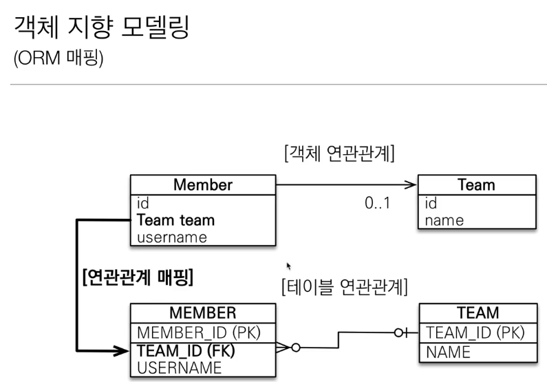
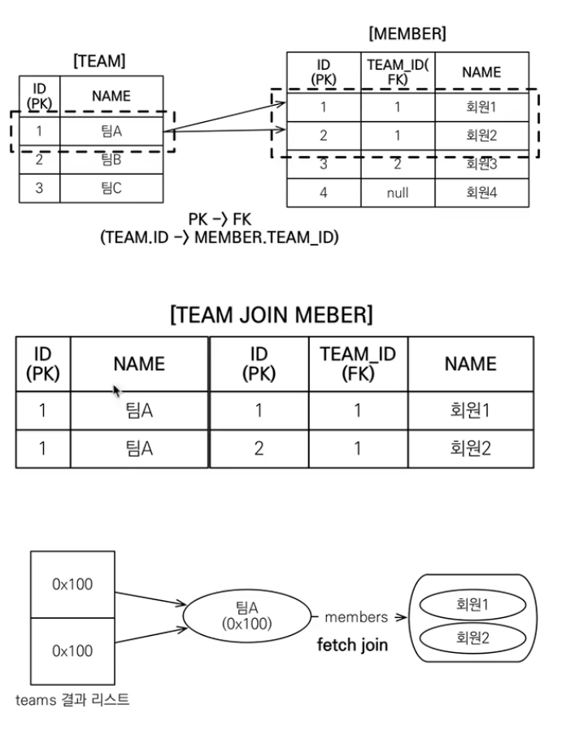

# 객체지향 쿼리 언어2 
## 경로 표현식

### 경로 표현식 특징
* 상태 필드: 경로 탐색의 끝, 탐색 X
* 단일 값 연관 경로: 묵시적 내부 조인(inner join) 발생, 탐색 O
```jpaql
// 묵시적 내부 조인 발생
select m.team from Member m
```

* 컬렉션 값 연관 경로: 묵시적 내부 조인 발생 탐색 X, size() method 정도만 사용 가능
  * From 절에서 명시적 조인을 통해 별칭을 얻으면 별칭을 통해 탐색 가능

```jpaql
// 묵시적 내부 조인 발생, 탐색 X
select t.members from Team t
```

> 실무에서는 묵시적 조인을 사용하지 말자!


### 명시적 조인, 묵시적 조인
* 명시적 조인: join keyword 직접 사용
* 묵시적 조인: 경로 표현식에 의해 묵시적으로 SQL 조인 발생(내부 조인만 가능)


## 페치 조인

**실무에서 엄청나게 중요하다.**

### 페치 조인(fetch join)
* SQL 조인 종류 X
* JPQL에서 성능 최적화를 위해 제공하는 기능
* 연관된 엔터티나 컬렉션을 SQL 한 번에 함께 조회하는 기능
* join fetch 명령어 사용

### 엔터티 페치 조인
* 회원을 조회하면서 연관된 팀도 함께 조회(SQL 한번에)
* SQL을 보면 회원 뿐만 아니라 팀(T.*)도 함께 SELECT
* [JPQL]
  ```jpaql
    select m from Member m join fetch m.team
  ```
* [SQL]
  ```sql
    SELECT M.*, T.* FROM MEMBER M
    INNER JOIN TEAM T ON M.TEAM_ID=T.ID
  ```

```java
public static void main(String[] args) {
		EntityManagerFactory emf = Persistence.createEntityManagerFactory("hello");
		EntityManager em = emf.createEntityManager();
		EntityTransaction tx = em.getTransaction();
		tx.begin();
		try {
			Team teamA = createTeam(em, "팀A");
			Team teamB = createTeam(em, "팀B");
			Team teamC = createTeam(em, "팀C");

			Member member1 = createMember(em, teamA, "회원1");
			Member member2 = createMember(em, teamA ,"회원2");
			Member member3 = createMember(em, teamB, "회원3");

			em.flush();
			em.clear();
			List<Member> members = em.createQuery("select m from Member m join fetch m.team", Member.class)
				.getResultList();

			for (Member member : members) {
				System.out.println("member = " + member);
			}

			tx.commit();
		} catch (Exception e) {
			tx.rollback();
		} finally {
			em.close();
		}
		emf.close();
	}
```

```jpaql
select m from Member m join fetch m.team
```



```jpaql
select t from Team t join fetch t.members
```



### fetch join과 distinct
* SQL의 DISTINCT는 중복된 결과를 제거하는 명령어
* JPQL의 DISTINCT는 2 가지 기능을 제공한다.
  * SQL에 DISTINCT 추가
  * 애플리케이션에서 엔터티 중복 제거

```jpaql
select distinct t from Team t join fetch t.members
```
### fetch 조인과 일반 조인의 차이

```jpaql
select t from Team t join t.members m 
```
* 일반 조인 실행시 연관된 엔터티를 함께 조회하지 않는다.
* JPQL은 결과를 반환할 때 연관관계를 고려하지 않는다.
* 단지 SELECT 절에 지정한 엔터티만 조회할 뿐이다.
* 여기서는 Team 만 조회하고, 회원 엔터티는 조회하지 않는다.
* 페치 조인을 사용할 때만 연관된 엔터티도 함꼐 조회(EAGER)
* **페치 조인은 객체 그래프를 SQL 한번에 조회하는 개념이다.**
* 페치 조인을 통해서 대부분의 N + 1 문제를 해결하게 된다.


## 페치 조인 한계

### 페치 조인의 특징과 한계
* 페치 조인 대상에는 별칭을 줄 수 없다.
  * 하이버네이트는 가능, 가급적 사용하지 말자.
  * join fetch를 몇 단계 가져갈 때를 제외해서는 가급적 사용하지 말자.
* 둘 이상의 컬렉션은 페치 조인 할 수 없다.
  * team안에 members 말고도 lockers도 있는 경우, 페치 조인은 무조건 1개의 collection에 대해서만 가능하다.
* 컬렉션을 페치 조인하면 페이징 API(setFirstResult, setMaxResults)를 사용할 수 없다.
  * 일대일, 다대일의 경우에는 페이징 가능하다.
  * 일대다의 케이스에서 페이징을 하면, 전체를 가져와서 메모리에서 페이징을 시도한다.
  * 일대다의 경우 방향을 뒤집어서 해결하거나 / 페치조인을 제거한 이후에 지연로딩으로 시도한다.
* @BatchSize(size=100)과 같이 필드에 사용하거나, 글로벌 세팅에 hibernate.default_batch_fetch_size를 적용해서 where in절을 통해 데이터를 가져올 수 있다.
* 최적화가 필요한 곳은 페치 조인을 적용해서 해결할 수 있다.

> 페치 조인을 100% 이해하자!

## Named 쿼리

### Named 쿼리 - Annotation
```java
@Entity
@NamedQuery(
	name="Member.findByUsername",
    query="select m from Member m where m.username = :username")
public class Member {
	//...
    public static void main(String[] args) {
        List<Member> resultList = em.createNamedQuery("Member.findByUseraname", Member.class)
                .setParameter("username", "회원1")
                .getResultList();
    }
}
```

* 미리 정의해서 이름을 부여해두고 사용하는 JPQL이다.
* 정적 쿼리
* 어노테이션, XML에 정의
* **애플리케이션 로딩 시점에 초기화 후 재사용**
  * 진짜 장점.. 로딩 시점에 SQL로 파싱해서 캐시해둔다. JPQL의 SQL 파싱 비용이 사라진다.
* **애플리케이션 로딩 시점에 쿼리를 검증**

## 벌크 연산

* 재고가 10개 미만인 모든 상품의 가격을 10% 상승하려면?
* JPA 변경 감지 기능으로 실행하려면 너무 많은 SQL을 실행한다.
  * 1. 재고가 10개 미만인 상품을 리스트로 조회한다.
  * 2. 상품 엔터티의 가격을 10% 증가한다.
  * 3. 트랜잭션 커밋 시점에 변경감지가 동작한다.
* 변경할 데이터가 100건이라면 100번의 UPDATE SQL 실행


### 벌크 연산 예제
* 쿼리 한 번으로 여러 테이블 로우를 변경한다.
* executeUpdate()의 결과는 영향받은 엔터티의 갯수를 반환
* UPDATE, DELETE 지원
* INSERT(insert into .. select, 하이버네이트 지원)

```java

public class Test {
  public static void main(String[] args) {
    String jpqlString = "update Propduct p set p.price = p.price * 1.1 where p.stockAmount < :stockAmount";
    em.createQuery(jpqlString)
            .setParameter("stockAmount", 10)
            .executeUpdate();
  }
}
``` 
### 벌크 연산 주의
* 벌크 연산은 영속성 컨텍스트를 무시하고 데이터베이스에 직접 쿼리
  * 벌크 연산을 먼저 실행
  * **벌크 연산 수행 후 영속성 컨텍스트를 초기화 무조건 하자.**

## 참고
* [자바 ORM 표준 JPA 프로그래밍 - 기본편, 섹션-11](https://www.inflearn.com/course/ORM-JPA-Basic/dashboard)