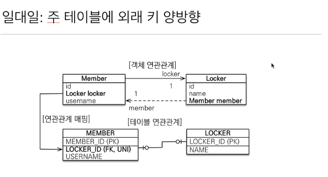

# 다양한 연관 관계 매핑
* **다대다는 실무에서 쓰지 말자.**
* **N:1 양방향 매핑을 사용하자!!**

## N:1

## 1:N
**해당 모델은 권장하지 않음.**

### 실무에서 권장하지 않는 이유

team: member = 1: N일 경우,
연관관계의 주인을 team으로 설정했을 경우 team을 통해서 member의 team_id를 업데이트해주게 된다.
관계도 파악하기 어려울 뿐더러, member가 연관관계의 주인일 경우 보다 업데이트 쿼리를 하나 더 필요로 하게 된다. 

또한 수 십개 테이블 사이에서의 연관관계를 가지는 실무에서 운영상 연관관계 파악의 어려움이 있다.

### 일대다 단방향 정리

* 일대다 단방향은 1:N에서 1이 연관관계의 주인이다.
* 테이블 일대다 관게는 **항상 N 쪽에 외래 키가 존재한다.**
* 객체와 테이블의 차이 때문에 반대편 테이블의 외래 키를 관리하는 특이한 구조가 된다.
* @JoinColumn을 꼭 사용해야 한다. 그렇지 않으면 JoinTable이 추가가 되게 된다.
* 단점
  * Entity가 관리하는 외래키가 다른 테이블에 있음.(어마어마한 단점)
  * 연관관계 관리를 위해 추가로 update sql을 실행
* 1:N 단방향 매핑보다는 **N:1 양방향 매핑을 사용하자!!**

## 1:1
* 1:1관계는 반대도 1:1이다.
* 주 테이블이나 대상 테이블 중에 외래키 선택 가능하다.
  * 주 테이블에 외래키
  * 대상 테이블에 외래키
* 외래키에 데이터베이스 유니크 제약조건 추가

### 1:1 -> 주 테이블에 외래 키 단방향

### 1:1 -> 주 테이블에 외래키 양방향

* 다대일 양방향 매핑 처럼 외래키가 있는 곳이 연관관계 주인이다.
* 반대편은 mappedBy 적용(읽기만 가능하도록)

### 1:1 -> 대상 테이블에 외래키 단방향

지원도 안되고 방법도 없음!

### 1:1 정리

* 주 테이블에 외래 키(주로 많이 access 하는 테이블)
  * 주 객체가 대상 객체의 참조를 가지는 것 처럼 주 테이블에 외래 키를 두고 대상 테이블을 찾는다. 
  * 객체 지향 개발자가 선호하는 방식
  * JPA Mapping 관리가 편리하다.
  * 장점: 주 테이블만 조회해다 대상 테이블에 데이터가 존재하는지 여부 확인이 가능하다.
  * 단점: 값이 없으면 외래 키에 null값을 허용한다.
* 대상 테이블에 외래 키
  * 대상 테이블에 외래키가 존재한다.
  * 전통적인 데이터베이서 개발자들이 선호하는 방식
  * 장점: 주 테이블과 대상 테이블을 일대일에서 일대 다 관계로 변경할 때 테이블 구조를 유지할 수 있다.
  * 단점: 프록시 기능의 한계로 **지연 로딩으로 설정해도 항상 즉시 로딩된다**

## N:M

* **@ManyToMany는 사용하지 말자**
* 관계형 DB는 정규화된 테이블 2개로 다대다 관계를 표현할 수 없다.
* 연결 테이블을 추가해서 일대다, 다대일 관계로 풀어내야한다.

* 객체는 컬렉션을 사용해서 객체 2개로 다대다 관계 가능하다.

### N:M 매핑의 한계

* 편리해 보이지만 실무에서 사용 X
* 연결 테이블이 단순히 연결만 하고 끝나지 않는다.
* 주문시간, 수량 같은 데이터가 들어올 수 있다.

### N:M 한계 극복

* 연결 테이블용 Entity를 추가한다.(연결 테이블을  Entity로 승격)
* @ManyToMany -> @OneToMany, @ManyToOne

## 참고
* [자바 ORM 표준 JPA 프로그래밍 - 기본편, 섹션-6](https://www.inflearn.com/course/ORM-JPA-Basic/dashboard)