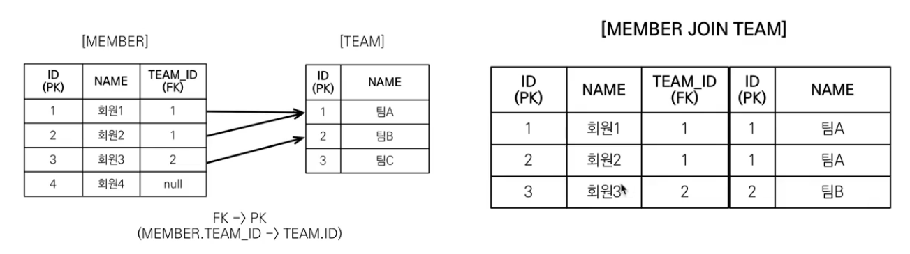
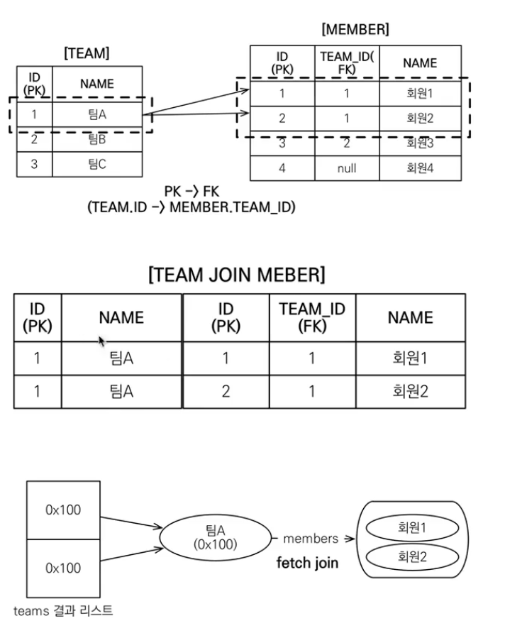
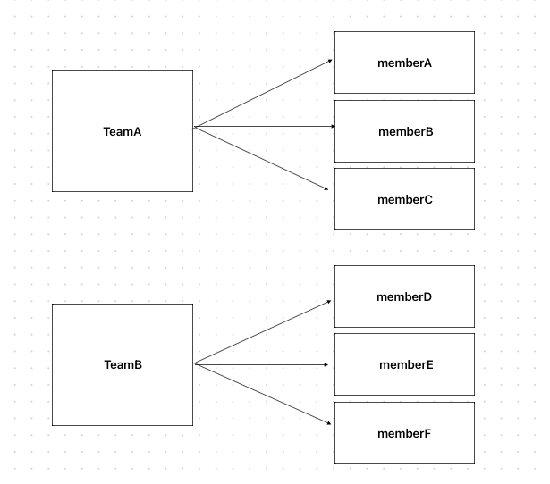
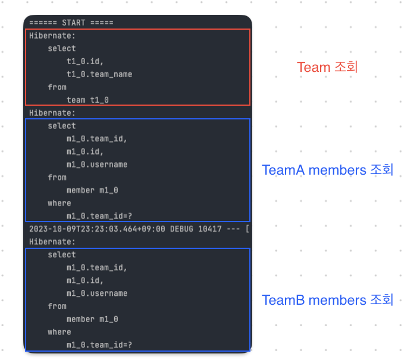

## 단방향 연관관계

객체를 테이블에 맞춰서 데이터 중심으로 모델링하면, 협력 관계를 만들 수 없다. 

* 테이블은 외래키로 조인을 사용해서 연관된 테이블을 찾는다.
* 객체는 참조를 사용해서 연관된 객체를 찾는다.
* 테이블과 객체 사이에는 이런 큰 간격이 있다.

## 양방향 연관관계와 연관관계의 주인

* **사실상 테이블의 연관관계에는 방향이란 것 자체가 없다.**

### 객체와 테이블이 관계를 맺는 차이

* 객체의 연관관계는 2개이다.
  * Member -> Team (단방향)
  * Team -> Member(단방향)
* 테이블 연관관계는 1개 이다.
  * Member <-> Team 1개 (양방향)

### 연관 관계의 주인

양방향 매핑 규칙
* 객체의 두 관계 중 하나를 연관관계의 주인으로 지정
* **연관관계의 주인만이 외래 키를 관리(등록, 수정)**
* **주인이 아닌쪽은 읽기만 가능**
* 주인은 mappedBy 속성 사용 X

### 누구를 주인으로?
* **외래 키가 있는 곳을 주인으로 정해라!!!**
* 여기서는 Members.team이 연관관계의 주인

### 왜 외래 키가 있는 곳을 주인으로?

1. Team에 있는 members를 업데이트 했는데, member Table이 업데이트가 된다. 그렇기 때문에 굉장히 헷갈린다.
2. 성능 이슈도 있다.
3. 설계가 깔끔해진다.

### 양방향 매핑시 가장 많이 하는 실수 

* 순수 객체 상태를 고려해서 항상 양쪽에 값을 설정하자.
* **연관관계 편의 메서드를 생성하자. **
  * 편의 메서드는 setter가 아닌 다른 메서드 명을 주의할 수 있도록 부여하자! ( changeTeam())
  * 연관관계 편의 메서드를 Member에 넣을지 Team에 넣을지는 상황을 고려해보고 한 곳에 두자~! 어디에둬도 상관없다.
* 양방향 매핑시에 무한 루프를 조심하자!
  * 예: toString(), lombok, JSON 생성 라이브러리
  * Entity를 절대 컨트롤러에서 반환하지 말자.
    * JSON 생성 라이브러리로 인한 무한 루프 발생
    * Entity는 변경될 수 있다. 그렇기 떄문에 변경되었을경우 API Spec자체가 바뀐다.

### 실무에서는 단방향 매핑만으로 설계를 끝내버리자!

* 객체 입장에서 고민거리만 많아진다. 양방향으로 하면 좋은 점이 없다.
* 단방향 매핑을 잘 하고 양방향 매핑은 필요할 때 추가하면됨. **테이블에 영향을 주지않는다.**
* 기본적으로 생각을 단방향 매핑으로 다 끝낸다., 1대 다에서 다에다가 연관관계 매핑을 해버리고 끝내버리자.
  * 양방향 매핑이 객체입장으로 봤을 때 이점이 크게 없다. 나중에 필요할 떄 추가하자.
* 연관관계의 주인은 외래 키의 위치를 기준으로 정하자!

[자바 ORM 표준 JPA 프로그래밍 - 기본편, 섹션-5](https://www.inflearn.com/course/ORM-JPA-Basic/dashboard)

